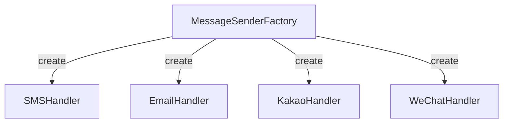

# 서비스가 커질수록 필요한 설계 패턴 – 메시징 시스템 예제 중심으로

현업의 시스템은 단순히 "돌아가기만" 해서는 안 됩니다.  
**확장 가능성**, **유지보수성**, **복잡도 관리**는 필수입니다.

---

## 메시징 시스템을 예로 들어보겠습니다
당신은 `메시징 시스템`을 담당하는 개발 설계 담당자입니다.
이때 당신은 최대한 **단순하게 설계**를 합니다.
&rarrw; 초기에는 아래와 같은 메시지 채널만 고려해도 충분할 수 있습니다.

```
- 문자 발송 (SMS, LMS, MMS)
- 이메일 발송 (EMAIL)
- 카카오 알림톡
```

따라서 인터페이스 명세는 다음과 같습니다.

```java
public interface MessageService {
    SendResult sendSms();
    SendResult sendLms();
    SendResult sendMms();
    SendResult sendEmail();
    SendResult sendKakao();
}
```

---

## 문제는 확장 이후부터 시작됩니다

**서비스가 성공**하거나 **해외 진출**을 계획하게 되면 상황은 복잡해집니다.  
예를 들어, 중국 시장에서는 WeChat, 베트남에서는 Zalo와 같은 메신저 연동이 필요해질 수 있습니다.

결국 아래처럼 메시징 채널이 확장됩니다:

```
- 문자 발송 (SMS, LMS, MMS)
- 이메일 발송 (EMAIL)
- 카카오 알림톡 (대한민국)
- WeChat (중국)
- Zalo (베트남)
- ... 그 외 다양한 채널들
```

그에 따라 명세도 점점 복잡해지게 됩니다:

```java
public interface MessageService {
    SendResult sendSms();
    SendResult sendLms();
    SendResult sendMms();
    SendResult sendEmail();
    SendResult sendKakao();
    SendResult sendWeChat();
    SendResult sendZalo();
    // ...
}
```

---

## 이쯤 되면 구조가 난잡해집니다

- 각 채널별 로직이 한곳에 **뭉쳐져** 있습니다.
- 새로운 채널이 추가될 때마다 **기존 코드를 수정**해야 합니다.
- 운영/기획 부서에서 요청하는 **통계, 정책, 조건** 변경 요청에 대응하기 어렵습니다.

즉, **응집도는 낮고 결합도는 높아지는 구조**로 가고 있습니다.  
이런 구조는 유지보수가 어렵고 확장이 까다롭습니다.

---

## 그래서 필요한 것이 디자인 패턴

이러한 상황에서 우리가 고려해야 할 것이 
바로 ✅ **디자인 패턴(Design Pattern)** 입니다.



특히 다음 두 가지 패턴이 유용하게 사용됩니다:

- **Factory Pattern**  
  전송 채널(SMS, EMAIL, KAKAO 등)에 따라 적절한 핸들러를 **동적으로 생성**합니다.

- **Strategy Pattern**  
  채널별 전송 전략을 **독립적인 방식으로 정의 및 분리**합니다.

---

## 디자인 패턴을 적용하면 어떤 점이 좋아질까요?

- 🔌 **새로운 채널 추가** 시 기존 코드에 영향을 주지 않습니다.
- ⚙️ **채널별 정책**을 명확하게 분리할 수 있습니다.
- 🧪 **테스트**를 개별 전략 단위로 작성할 수 있습니다.
- 🧹 전반적인 **유지보수성과 확장성**이 향상됩니다.

---

다음 글에서는 실제 코드 예제를 통해  
`Factory Pattern`과 `Strategy Pattern`을 조합하여  
**유연하고 확장 가능한 메시징 시스템**을 구현하는 방법을 알아보겠습니다.
