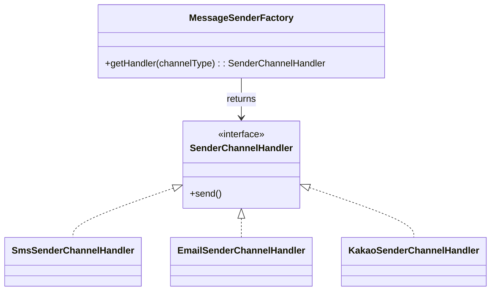
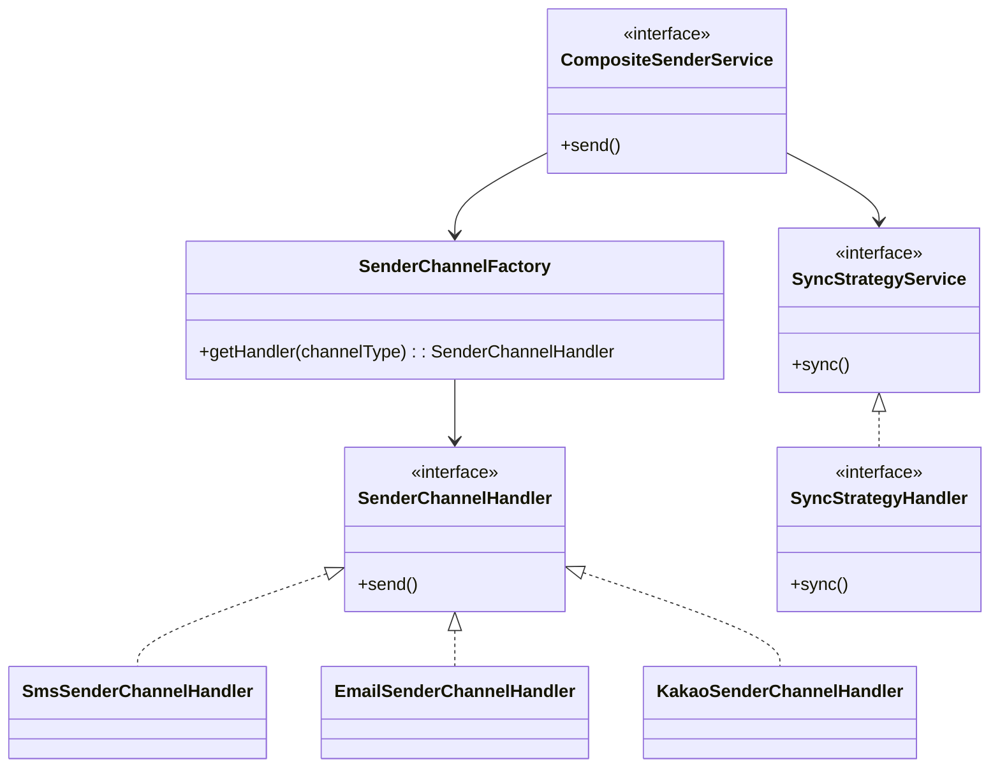

이전 글에서 `디자인 패턴`의 필요성과 중요성에 대해 이야기한 바 있습니다.  
- 👉 [서비스가 커질수록 필요한 설계 패턴 – 메시징 시스템 예제 중심으로](/posts/design-pattern-intro)

이번 글에서는 실제 **팩토리 패턴(Factory Pattern)**을 메시징 서비스에 어떻게 적용할 수 있는지를 소개하려 합니다.

---

## 서비스가 커지면 반드시 생기는 변화

당신은 메시징 플랫폼의 개발자입니다. 처음 요구사항은 이랬습니다:

```
- 문자 발송 (SMS, LMS, MMS)
- 이메일 발송 (EMAIL)
- 카카오 알림톡 (대한민국)
```

그래서 이렇게 인터페이스를 만들었죠:

```java
public interface MessageService {
    SendResult sendSms();
    SendResult sendLms();
    SendResult sendMms();
    SendResult sendEmail();
    SendResult sendKakao();
}
```

하지만 어느 날, 갑자기 기획자가 말합니다:

> “로재님! 해외 진출 때문에 WeChat, Zalo 같은 글로벌 채널도 빨리 붙여야 해요!”

결국 요구사항은 다음처럼 바뀌게 됩니다:

```
- WeChat (중국)
- Zalo (베트남)
- ... 기타 글로벌 채널 추가
```

---

## 팩토리 패턴 도입 – 객체 생성을 위임하자

기존의 `MessageService` 방식은 채널이 늘어날 때마다 코드 수정이 필요합니다.  
이를 해결하기 위해 우리는 **팩토리 패턴**을 도입합니다.

팩토리는 다음을 해줍니다:

- 구현체 생성 책임을 위임
- 클라이언트는 타입만 넘기면 적절한 구현체를 받음
- 코드 변경 없이도 새로운 채널 추가 가능

---

### 설계 다이어그램



---

### NotifyChannelType – 채널을 enum으로 관리

```java
@Getter
public enum NotifyChannelType {
    SMS("SMS", "SMS 문자"),
    LMS("LMS", "LMS 문자"),
    MMS("MMS", "MMS 문자"),
    EMAIL("EMAIL", "이메일"),
    KAKAO("KAKAO", "카카오"),
    WECHAT("WECHAT", "위챗"),
    ZALO("ZALO", "잘로");

    private final String code;
    private final String description;

    NotifyChannelType(String code, String description) {
        this.code = code;
        this.description = description;
    }
}
```

---

### SenderChannelFactory – 전략 반환

```java
@Component
public class SenderChannelFactory {
    private final Map<NotifyChannelType, SenderChannelHandler> handlerMap = new EnumMap<>(NotifyChannelType.class);

    public SenderChannelFactory(
        SmsSenderChannelHandler smsHandler,
        LmsSenderChannelHandler lmsHandler,
        MmsSenderChannelHandler mmsHandler,
        EmailSenderChannelHandler emailHandler,
        KakaoSenderChannelHandler kakaoHandler,
        WechatSenderChannelHandler webchatHandler,
        ZaloSenderChannelHandler zaloHandler
    ) {
        handlerMap.put(NotifyChannelType.SMS, smsHandler);
        handlerMap.put(NotifyChannelType.LMS, lmsHandler);
        handlerMap.put(NotifyChannelType.MMS, mmsHandler);
        handlerMap.put(NotifyChannelType.EMAIL, emailHandler);
        handlerMap.put(NotifyChannelType.KAKAO, kakaoHandler);
        handlerMap.put(NotifyChannelType.WECHAT, webchatHandler);
        handlerMap.put(NotifyChannelType.ZALO, zaloHandler);
    }

    public SenderChannelHandler getChannel(NotifyChannelType type) {
        SenderChannelHandler handler = handlerMap.get(type);
        if (handler == null) {
            throw new IllegalArgumentException("지원하지 않는 채널 타입입니다: " + type);
        }
        return handler;
    }
}
```

---

### SenderChannelHandler – 공통 인터페이스

```java
public interface SenderChannelHandler {
    NotifyChannelType getType();
    ResponseEntity<SendResponse> send(SendRequest request);
}
```

---

### SmsSenderChannelHandler – 구현 예시

```java
@Component
@RequiredArgsConstructor
public class SmsSenderChannelHandler implements SenderChannelHandler {

    private final NotifySenderClient notifySenderClient;

    @Override
    public NotifyChannelType getType() {
        return NotifyChannelType.SMS;
    }

    @Override
    public ResponseEntity<SendResponse> send(SendRequest request) {
        return notifySenderClient.sendSms(
            new SmsSendRequest(request.getPhoneNumber(), request.getTitle(), request.getContents())
        );
    }
}
```

> 📌 Mms, Lms, Email, Kakao, Zalo 등은 유사한 방식으로 구현하시면 됩니다.

---

### 호출 예시

- 클라이언트는 `알림타입`만을 통해서 내부 구현체 (`Factory` > `Handler`)를 받아서 처리합니다.

- 각각의 채널 구현체(`Handler`)는 별도로 존재하므로, 확장하더라도 기존 부분을 수정할 필요가 없습니다.

```java
SenderChannelHandler channel = senderChannelFactory.getChannel(request.getNotifyChannelType());
ResponseEntity<SendResponse> response = channel.send(form);
```

---

## 한번 더 확장하자 – 전략 패턴과의 융합

팩토리 패턴을 통해 우리는 채널 추가에 유연하게 대응할 수 있게 되었습니다.  

- 확장성과 유지보수성을 높이고  
- 비즈니스 로직과 기술 구현을 분리하며  
- 팀 협업에 유연성을 제공합니다.

**하지만** 실무에서는 메시지 발송이 끝이 아닙니다.  
**결과 저장, 실패 재시도, 로그 기록 등 후처리**가 필요합니다.
_(ex. outbox pattern)_

이를 위해 다음 글에서는 **전략 패턴(Strategy Pattern)** 을 통해 `CompositeSenderService` 구조를 설계하고  
발송 후처리(`SyncStrategyService`)까지 확장해보겠습니다.

---

#### CompositeSenderService (Factory Pattern + Strategy Pattern)

