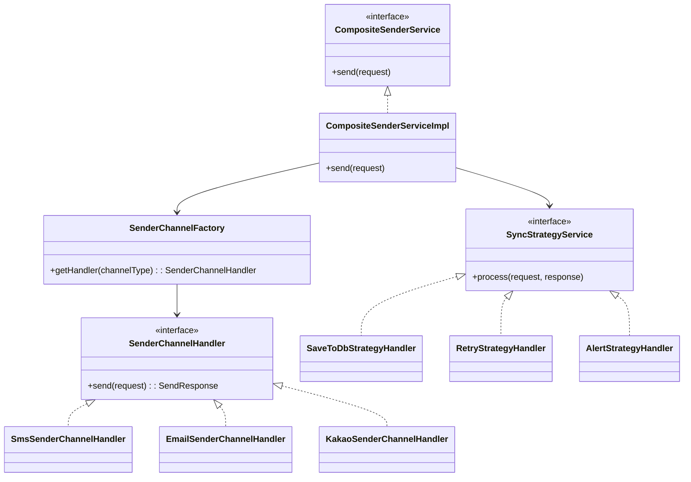

이전 글에서 팩토리 패턴을 활용해 다양한 메시지 발송 채널(`SMS`, `EMAIL`, `KAKAO` 등)을  
유연하게 처리할 수 있는 구조를 소개했습니다.

- 👉 [서비스가 커질수록 필요한 설계 패턴 – 메시징 시스템 예제 중심으로](/posts/design-pattern-intro)
- 👉 [Factory Pattern - 슬쩍 팩토리에서 처리하기](/posts/2025-05-31-factory-pattern)

이번 글에서는 그 다음 단계로, **발송 이후의 후처리 로직**까지 통합하는 설계를 소개합니다.  
바로 `CompositeSenderService`입니다.

---

## 실무에서 필요한 후처리 로직

메시지 발송 이후에는 보통 다음과 같은 후처리가 필요합니다:

- 발송 결과 DB 저장
- 실패 시 재시도 예약
- 장애 알림 전송 (Slack, Email)
- 모니터링 시스템 연동

이런 로직은 채널과 무관하게 공통적으로 반복되며,  
**전략 패턴(Strategy Pattern)**을 통해 유연하게 처리할 수 있습니다.

---

## 구조 구성도

이전 글까지에서, 발송 팩토리 구조에 대해서 설명했습니다. (`SenderFactory`)



---

## 핵심 인터페이스

### SenderChannelHandler.java

```java
public interface SenderChannelHandler {
    NotifyChannelType getType();
    ResponseEntity<SendResponse> send(SendRequest request);
}
```
> 이전 글에서 설명했기 때문에 **생략**하겠습니다.

### SyncStrategyService.java

```java
public interface SyncStrategyService {
    void process(SendRequest request, SendResponse response);
}
```

---

## CompositeSenderService 구현

```java
@Service
@RequiredArgsConstructor
public class CompositeSenderServiceImpl implements CompositeSenderService {

    private final SenderChannelFactory senderChannelFactory;
    private final List<SyncStrategyService> strategies;

    @Override
    public ResponseEntity<SendResponse> send(SendRequest request) {
        // 1. 채널별 Sender 선택
        SenderChannelHandler handler = senderChannelFactory.getChannel(request.getNotifyChannelType());

        // 2. 메시지 발송
        ResponseEntity<SendResponse> response = handler.send(request);

        // 3. 후처리 전략 실행 (중요한 부분)
        strategies.forEach(strategy -> strategy.process(request, response.getBody()));

        return response;
    }
}
```

여기에서 `후처리 전략 실행` 부분을 통해서, 모든 전략을 시도할 수 있습니다. (DB 저장, 재시도, 장애알림 등등)

### 후처리 전략 실행 부분

```java
strategies.forEach(strategy -> strategy.process(request, response.getBody()));
```

---

## 전략 구현 예시

### SaveToDbStrategyHandler.java

```java
@Component
public class SaveToDbStrategyHandler implements SyncStrategyService {
    @Override
    public void process(SendRequest request, SendResponse response) {
        // DB 저장 로직
        if (response != null) {
            // repository.save(...)
        }
    }
}
```

### RetryStrategyHandler.java

```java
@Component
public class RetryStrategyHandler implements SyncStrategyService {
    @Override
    public void process(SendRequest request, SendResponse response) {
        if (response != null && !response.success()) {
            // 재시도 예약 로직
        }
    }
}
```

---

## 호출 예시

```java
compositeSenderService.send(request);
```

> 외부에선 `CompositeSenderService` 하나만 호출하면,  
> 내부에서 **채널 선택 → 발송 → 후처리**가 일관된 흐름으로 실행됩니다.

---

## 장점 요약

- **Factory + Strategy 결합**으로 책임 분리 및 확장성 확보
- **단일 진입점**을 통한 호출 단순화
- 전략 추가/삭제가 쉬워 유지보수에 강함
- 테스트 용이 (각 전략 단위 테스트 가능)

---

## 마무리

`CompositeSenderService`는 **팩토리 패턴으로 확장 가능한 채널 발송 구조**와 **전략 패턴으로 유연한 후처리**를 통합한 설계입니다.

서비스가 점점 커지고 다양한 요구사항이 붙을수록, 이러한 구조적 설계는 개발자에게 큰 무기가 된다고 생각합니다.

> 다음 글에서는 **템플릿 메서드 패턴**을 활용한 후처리 로직의 중복 제거 방법을 예시를 들면서 소개하겠습니다.
