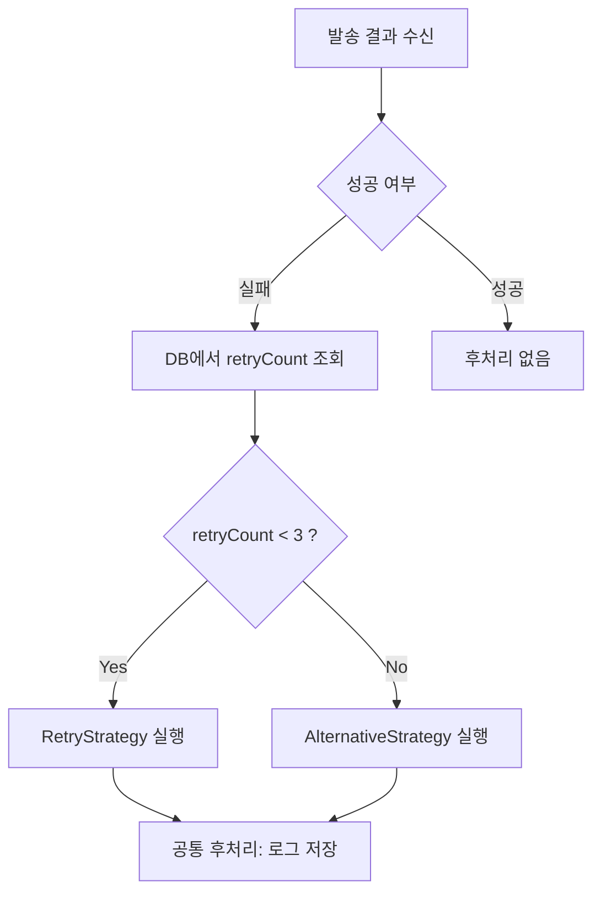

## 템플릿 메서드 패턴 - 후처리 로직의 중복을 제거해보자

이전 글에서는 [전략 패턴](https://rojae.github.io/posts/strategy-pattern/)을 통해, 발송 채널(SMS, EMAIL, KAKAO 등)에 따른 다양한 전략을 런타임에 유연하게 선택하는 구조를 설계해보았습니다.

하지만, 전략 패턴을 활용하다 보면 **공통적으로 반복되는 후처리 로직**이 생깁니다.  
예를 들어 발송 로그 저장, 발송 결과 상태 업데이트, 실패 시 재시도 플래그 처리 등은 대부분 채널에 상관없이 반복됩니다.

이번 글에서는 **템플릿 메서드 패턴**을 활용해 이러한 **후처리 로직의 중복을 제거**하는 방법을 소개합니다.

> 사실 `템플릿 메서드`라는 키워드가 익숙하시지 않은 분들은 '무슨 말이지?' 싶으실 수도 있습니다 <br/>
> 간단하게 설명하면, **"추상 클래스 기반의 공통 로직 추출"**라고 보면 되겠습니다.
{: .prompt-info }

---

## 통합 서비스 예시 (발송)

이전 글에서 설명했던 통합 발송 서비스를 기반으로 보겠습니다.

### CompositeSenderService

```java
@Service
@RequiredArgsConstructor
public class CompositeSenderServiceImpl implements CompositeSenderService {

    private final SenderChannelFactory senderChannelFactory;
    private final List<SyncStrategyService> strategies;

    @Override
    public ResponseEntity<SendResponse> send(SendRequest request) {
        // 1. 채널별 Sender 선택
        SenderChannelHandler handler = senderChannelFactory.getChannel(request.getNotifyChannelType());

        // 2. 메시지 발송
        ResponseEntity<SendResponse> response = handler.send(request);

        // 3. 후처리 전략 실행 (중요한 부분)
        strategies.forEach(strategy -> strategy.process(request, response.getBody()));

        return response;
    }
}
```

여기에서 `후처리 전략 실행` 부분을 통해서, 모든 전략을 시도할 수 있습니다. (DB 저장, 재시도, 장애알림 등등)

### 후처리 전략 실행 부분

```java
strategies.forEach(strategy -> strategy.process(request, response.getBody()));
```

### SaveToDbStrategyHandler.java

```java
@Component
public class SaveToDbStrategyHandler implements SyncStrategyService {
    @Override
    public void process(SendRequest request, SendResponse response) {
        // DB 저장 로직
        if (response != null) {
            // repository.save(...)
        }
    }
}
```

### RetryStrategyHandler.java

```java
@Component
public class RetryStrategyHandler implements SyncStrategyService {
    @Override
    public void process(SendRequest request, SendResponse response) {
        if (response != null && !response.success()) {
            // 재시도 예약 로직
        }
    }
}
```

## 문제점

만약에 데이터저장전략(`SaveToDbStrategy`)과 재시도전략(`RetryStrategy`)이 아닌
재시도전략(`RetryStrategy`)과 대체발송전략(`AlternativeStrategy`)라면 어떻게 될까요?

구체적으로 예시를 들어볼까요?

> 로재님, 3회까지는 `재시도` 하고, 이후의 발송은 `대체발송`으로 처리합시다. (이미 결정됐어요)

두 전략 모두 동일한 `조회문`을 사용해야 하는, `공통 로직`이 발생합니다.

### 문제점 - NotifycationRepository.java

```java
public interface NotifycationRepository {
    int getRetryCount(String messageId);
}
```

```java
@Repository
public class RetryHistoryRepositoryImpl implements RetryHistoryRepository {

    private final JdbcTemplate jdbcTemplate;

    @Override
    public int getRetryCount(String messageId) {
        String sql = "SELECT retry_count FROM notification.message_log WHERE message_id = ?";
        return jdbcTemplate.queryForObject(sql, Integer.class, messageId);
    }
}
```

### 문제점 - AlternativeStrategyHandler.java

```java
@Component
@RequiredArgsConstructor
public class AlternativeStrategyHandler implements SyncStrategyService {
    
    // notifycationRepository를 여기서도 사용하고
    private final NotifycationRepository notifycationRepository;
    
    @Override
    public void process(SendRequest request, SendResponse response) {
        if (!response.success() && notifycationRepository.getRetryCount() > 3L) {
            // 대체발송..
            notifycationRepository.saveForAlternative();

            // 로그 저장
            notifycationRepository.save();
        }
    }
}
```

### 문제점 - RetryStrategyHandler.java

```java
@Component
@RequiredArgsConstructor
public class RetryStrategyHandler implements SyncStrategyService {

    // notifycationRepository를 여기서도 사용한다
    private final NotifycationRepository notifycationRepository;

    @Override
    public void process(SendRequest request, SendResponse response) {
        if (!response.success() && && notifycationRepository.getRetryCount() < 3L) {
            // 재시도..
            notifycationRepository.saveForRetry();

            // 로그 저장
            notifycationRepository.save();
        }
    }
}
```

---

## 해결 방안: 템플릿 메서드 패턴을 적용한 공통 흐름 캡슐화

### 아이디어

- **공통 흐름** (`조회 → 조건 분기 → 전략 실행 → 후처리`)은 **상위 추상 클래스**에서 처리
- 각 전략은 **`doRetry()` / `doAlternative()`** 구현만 담당
- `retryCount` 판단도 상위에서 일괄 처리


---

### 구현 예시

#### 1. `AbstractAfterSendTemplateStrategy.java`

```java
public abstract class AbstractAfterSendTemplateStrategy implements SyncStrategyService {

    protected final NotifycationRepository notifycationRepository;

    protected AbstractAfterSendTemplateStrategy(NotifycationRepository notifycationRepository) {
        this.notifycationRepository = notifycationRepository;
    }

    @Override
    public final void process(SendRequest request, SendResponse response) {
        if (response.success()) return;

        int retryCount = notifycationRepository.getRetryCount(request.getMessageId());

        if (!shouldProcess(retryCount)) return;

        doProcess(request, response);               // 각 전략에 맞는 처리
        notifycationRepository.save();              // 공통 후처리
    }

    protected abstract boolean shouldProcess(int retryCount); // 처리 여부 판단

    protected abstract void doProcess(SendRequest request, SendResponse response); // 실제 로직
}
```

#### 2. `RetryStrategyHandler.java` - 재발송 정책

```java
@Component
public class RetryStrategyHandler extends AbstractAfterSendTemplateStrategy {

    public RetryStrategyHandler(NotifycationRepository notifycationRepository) {
        super(notifycationRepository);
    }

    @Override
    protected boolean shouldProcess(int retryCount) {
        return retryCount < 3;      // 최대 재시도 정책 (관리 포인트가 DB, yaml 일 수 있습니다.)
    }

    @Override
    protected void doProcess(SendRequest request, SendResponse response) {
        notifycationRepository.saveForRetry();
    }
}
```

#### 3. `AlternativeStrategyHandler.java` - 대체발송 정책

```java
@Component
public class AlternativeStrategyHandler extends AbstractRetryTemplateStrategy {

    public AlternativeStrategyHandler(NotifycationRepository notifycationRepository) {
        super(notifycationRepository);
    }

    @Override
    protected boolean shouldProcess(int retryCount) {
        return retryCount >= 3;     // 대체 발송 만족 정책 (관리 포인트가 DB, yaml 일 수 있습니다.)
    }

    @Override
    protected void doProcess(SendRequest request, SendResponse response) {
        notifycationRepository.saveForAlternative();
    }
}
```

#### 4. 사용 예시

기존과 동일합니다.
단순하게 공통로직을 분리하고 추상화를 했다는 점에서 의의가 있습니다.

```java
List<SyncStrategyService> strategies;

for (SyncStrategyService strategy : strategies) {
    strategy.process(request, response);
}
```

---

## 마무리

| 항목 | 내용 |
|------|------|
| 공통 로직 | `getRetryCount`, `save()` 후처리 |
| 조건 분기 | `shouldProcess()`로 분리 |
| 전략 처리 | `doProcess()`만 구현하면 됨 |
| 유연성 | 재시도 조건, 대체발송 조건이 바뀌어도 한 곳만 수정하면 됨 |

템플릿 메서드는 단순하지만 강력한 구조입니다.  
전략 패턴과 결합하면, **중복을 줄이면서도 유연한 로직 분기**가 가능합니다.

> 초기 설계가 탄탄해야 서비스도 견고해지고 높게 지을 수 있다고 생각하기 때문에
> 꼭 기록하고 싶은 내용이였습니다.
{: .prompt-tip }
