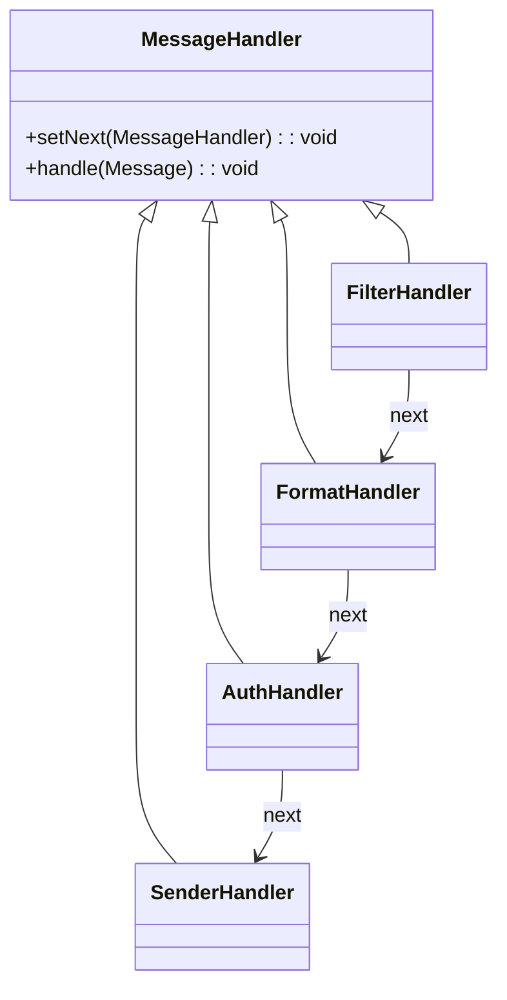

# Chain of Responsibility Pattern (책임 연쇄 패턴) - 발송 전처리 파이프라인 추가하기 

대규모 메시징 시스템을 운영하다 보면, 기획자나 매니저로부터 수많은 요구사항이 들어옵니다. 
발송 전에 처리해야 할 조건은 점점 늘어나고 복잡해지네요.

_개발자 입장에서는 이를 어떻게 "우아하게" 대응할 것인지 고민하게 됩니다._

---

## 요구사항의 확대

어느 날 기획자가 와서 말합니다:

- "휴대폰번호나 이름을 마스킹해주세요."
- "글자 수가 너무 많으면 발송을 제한해야 해요."
- "민감 단어가 들어간 메시지는 차단되어야 합니다."
- "발송 전에 메시지를 정제하고 서명을 붙여주세요."

초기에는 간단한 조건만 존재했기 때문에 `if-else`로도 충분했지만...

&rarr; 조건이 늘어나면서 다음과 같은 문제가 발생하게 됩니다.

> 단일 클래스에 로직이 집중되어 유지보수성이 떨어짐 <br/>
> 처리 순서를 코드로 관리해야 하므로 변경 시 리스크가 큼 <br/>
> 새로운 조건 추가가 쉽지 않음 <br/>
{: .prompt-warning }

이러한 문제를 해결하기 위해 **Chain of Responsibility Pattern** (책임 연쇄 패턴)을 적용할 수 있습니다.

---

## Chain of Responsibility, 책임 연쇄 패턴이란?

Chain of Responsibility Pattern(책임 연쇄 패턴)은 요청을 처리할 수 있는 **여러 객체(Handler)** 를 **체인으로 연결**해 순차적으로 요청을 처리할 수 있도록 하는 구조입니다. 

각 핸들러는 자신이 책임질 수 있는 요청을 처리한 뒤, 다음 핸들러로 넘깁니다.



---

## 메시지 전처리를 구현하자 (MessageHandler)

### 메시지 객체와 핸들러 인터페이스 정의

```java
public interface MessageHandler {
    void setNext(MessageHandler next);
    void handle(Message message);
}

public class Message {
    private String content;
    private Map<String, String> headers = new HashMap<>();
    private boolean blocked;

    // getter/setter 생략
}
```

---

### 금칙어 캐시 예시 (DB → In-memory)
`금칙어`를 보통 `하드코딩`해서 관리하지는 않기 때문에, `DB`를 통해서 끌고오는 샘플을 제작했습니다.

```java
@Component
public class ForbiddenWordCache {
    private Set<String> forbiddenWords;

    @PostConstruct
    public void init() {
        this.forbiddenWords = new HashSet<>(repository.findAllWords());
    }

    public Set<String> getAll() {
        return forbiddenWords;
    }

    public boolean contains(String word) {
        return forbiddenWords.contains(word);
    }
}
```

---

### 핸들러 구현 예시

**금칙어 필터링 핸들러**

```java
@RequiredArgsConstructor
public class FilterHandler implements MessageHandler {
    private final ForbiddenWordCache forbiddenWordCache;
    private MessageHandler next;

    public void setNext(MessageHandler next) {
        this.next = next;
    }

    public void handle(Message message) {
        for (String word : forbiddenWordCache.getAll()) {
            if (message.getContent().contains(word)) {
                message.setBlocked(true);
                System.out.println("금칙어 필터링 : " + word);
                return;
            }
        }
        if (next != null) next.handle(message);
    }
}
```

**포맷 핸들러 (Trim)**

```java
public class FormatHandler implements MessageHandler {
    private MessageHandler next;

    public void setNext(MessageHandler next) {
        this.next = next;
    }

    public void handle(Message message) {
        message.setContent(message.getContent().trim());
        System.out.println("메시지 트림 처리");
        if (next != null) next.handle(message);
    }
}
```

**서명 추가 핸들러**

```java
public class AuthHandler implements MessageHandler {
    private MessageHandler next;

    public void setNext(MessageHandler next) {
        this.next = next;
    }

    public void handle(Message message) {
        message.getHeaders().put("X-SIGNATURE", "abc123");
        System.out.println("서명 추가");
        if (next != null) next.handle(message);
    }
}
```

**최종 발송 핸들러**

```java
public class SenderHandler implements MessageHandler {
    private MessageHandler next;

    public void setNext(MessageHandler next) {
        this.next = next;
    }

    public void handle(Message message) {
        if (message.isBlocked()) {
            System.out.println("발송 차단됨");
            return;
        }
        System.out.println("메시지 발송: " + message.getContent());
    }
}
```

---

## 메시지 전처리기들을 하나로 묶자 (MessageFilter)
핸들러들을 묶는 체이닝 방식으로 구조화가 되면 유연한 관리가 가능할 것으로 생각하여
다음과 같은 체이닝을 고려했습니다.

```java
public class MessageFilter {
    private MessageHandler head;
    private MessageHandler tail;

    public MessageFilter add(MessageHandler handler) {
        if (head == null) {
            head = handler;
            tail = handler;
        } else {
            tail.setNext(handler);
            tail = handler;
        }
        return this;
    }

    public MessageHandler build() {
        return head;
    }
}
```

---

## 실행 예시

```java
// Message Handler를 묶는 필터 체인
MessageFilter filterChain = new MessageFilter()
    .add(new FilterHandler(forbiddenWordCache))
    .add(new FormatHandler())
    .add(new AuthHandler())
    .add(new SenderHandler());

MessageHandler handler = filterChain.build();

// 메시지
Message message = new Message();
message.setContent("  안녕하세요 금칙어 포함  ");

// 메시지 전처리
handler.handle(message);
```

출력 결과:

```
금칙어 필터링 : 금칙어
발송 차단됨
```

---

## 마무리
우리는 'chain of responsibility' (책임 연쇄 패턴)을 
목적과 구조에 맞춰서 메시징 '전처리'를 위해서 사용했습니다.

| 항목 | 설명 |
|------|------|
| 목적 | 사전 처리 단계별 책임 분리 |
| 구조 | 체인 구조로 동적으로 조립 가능 |
| 적용 위치 | 메시지 발송 전, 필터링/포맷팅/서명 등 |

상황에 따라 이 체인을 **전처리에도**, **후처리에도** 유연하게 활용할 수 있다는 점에서 확장성도 뛰어납니다.

이번 포스팅의 핵심은, 바로 이러한 **책임 연쇄 기반의 체인 설계**를 통해  
복잡한 조건을 **조합적으로 처리할 수 있는 유연한 구조**를 만들 수 있다는 가능성을 제시하고자 했습니다.

템플릿 메서드 패턴이 상속 기반의 흐름 제어라면,  
Chain of Responsibility는 **조립 가능한 방식으로 흐름을 제어**할 수 있다는 점에서  
**실무 환경에서는 훨씬 더 실용적인 설계 패턴**이 될 수 있습니다.