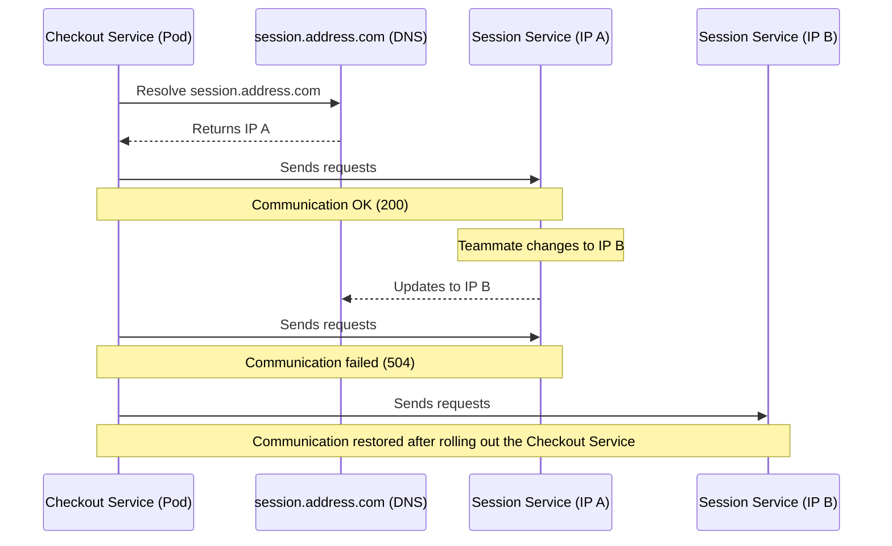
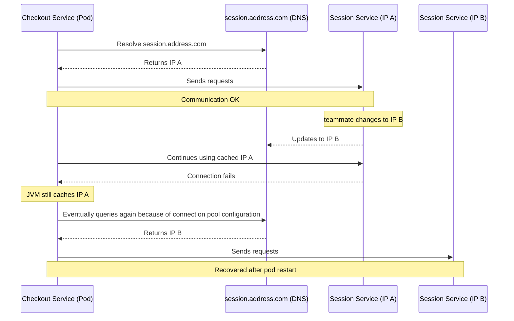

> 운영 중인 서비스에서 IP 변경이 어떻게 장애로 이어질 수 있었는지, 이를 해결하며 얻은 인사이트를 정리해 둡니다.
> + 영문 버전은 [Medium](https://medium.com/p/0b1cadd08ba2/edit)에서 확인하실 수 있습니다.
> + 샘플코드는 [feign-dns-lookup-test](https://github.com/rojae/feign-dns-lookup-test)에서 확인하실 수 있습니다.
{: .prompt-info }

---

## **“문제는 예고 없이 찾아온다”**

얼마 전 실 서비스 중에 문제를 겪었다. 

운영 중인 세션 서비스의 라우팅 IP를 변경했지만, DNS 이름은 그대로 유지했었다. 

나를 포함한 팀원들은 별다른 문제없이 새 IP로 잘 붙을 거라고 예상했는데, 그게 아니었다. 

동료가 세션 서비스의 IP를 바꾼 뒤에도 DNS 이름이 같았던 탓에, 체크아웃 서비스 쪽에서 504 게이트웨이 타임아웃이 발생했고, 다른 팀에서도 장애를 호소했다. 

결국 원인을 살펴보니, 체크아웃 서비스가 새 IP를 받아오지 못하고 예전 IP로 계속 요청을 보내고 있었던 거다. 

바로 체크아웃 서비스의 파드를 롤아웃해서 다시 띄우자 정상적으로 새 IP로 연결되었고, 곧바로 서비스도 복구됐다. 

---

## **"팀원들과 논의"**
<figure style="text-align: center;">
  
  <figcaption style="margin-top: 0.5rem; font-size: 0.95rem; color: #666;">
    we are team
  </figcaption>
</figure>

*나: "혹시, 세션 서비스의 라우트 IP를 왜 변경했는지 설명해줄 수 있을까요?"*

*팀원 1: "라우트 IP를 바꿔도 문제없이 잘 동작할 거라고 생각했어요. DNS는 동일하니까요"*

*팀원 2: "HTTP 옵션, 예를 들어 keep-alive 같은 부분도 신경 써야 하지 않을까요?"*


---

## **"지금 다시 생각해보면서, 정리해보니.."**



음… 😕

정리하자면, “팀원이 세션 서비스의 라우트 IP를 변경했지만 DNS 이름은 그대로 뒀다”는 거다.

사실 나도.. 체크아웃 서비스가 DNS를 통해 새 IP를 자동으로 찾아갈 거라고 예상했는데, 왜 계속 타임아웃이 났을까?

DNS가 새 주소를 받아야 정상일 텐데. 
아마 캐시 문제나 TTL(수명)이 너무 길어서 이전 IP를 계속 쓰고 있었던 것 같기도 하다. 
DNS 레코드는 멀쩡해 보여도, 그 때문에 체크아웃 서비스가 세션 서비스에 도달하지 못했을 가능성이 있을 것 같다.

---

## **"Java에서 DNS가 어떻게 해석되는가?"**
<figure style="text-align: center;">
  
  <figcaption style="margin-top: 0.5rem; font-size: 0.95rem; color: #666;">
    InetAddress.java
  </figcaption>
</figure>

이 부분은 `디버깅`을 통해서 확인이 가능했다. 
Java Core에 포함된 `InetAddress.java`가 DNS(호스트)를 IP 주소로 해석해주는 역할을 한다. 

**그러나 아래 2가지 현상 때문에 의아했다.**

1. *DNS 해석이 매번 정상적으로 동작하지 않았다.* 
2. *통신 오류가 발생한 이후에도, 리졸버가 새 IP를 안정적으로 받아오지 못하고 계속 예전 IP로만 연결을 시도했다.*

원인은 같아 보이지만, 사실상 **완전히 다른 문제**라고 볼 수 있다.

---

## **"networkaddress.cache.* in JVM"**
> **1.** *DNS 해석이 매번 정상적으로 동작하지 않았다.*
→ 답은 `/java/security` 파일(JVM Option)에 있었다.

대부분의 `Java API 통신 라이브러리`는 **Java Core의 DNS 해석 메커니즘**을 그대로 사용한다. 
이때, `DNS에서 반환된 IP 주소`를 **메모리에 캐싱**해서 애플리케이션의 성능을 높인다. 

주요 옵션으로는 다음과 같다.
- networkaddress.cache.ttl : 긍정적(정상) 캐시의 TTL 
- networkaddress.cache.negative.ttl : 부정적(실패) 캐시의 TTL

---

## **"HTTP Connection Pool을 고려해보자"**
> **2.** *InetAddress.java 안에 있는 리졸버가 새 IP를 안정적으로 가져오지 못했다. 통신 실패가 발생한 이후에도 계속 같은 IP로만 연결을 시도했다.*
→ 답은 Http Connection Pool의 설정이 잘못되어 있었기 때문이다.

요청서버(`checkout-server`)는 `spring-cloud-feign`을 사용하고 있었고 아래와 같은 방식이였다.

```java
@Configuration
public class FeignHttpClientConfig {

    @Bean
    public Client feignClient() {
        return new ApacheHttpClient(HttpClientBuilder.create().build());
    }

}
```

하지만 이 방식은 안전하지 않다. 
일부 서버가 200 OK를 반환하지 않더라도, 동일한 IP에만 계속 연결을 시도하고 DNS를 다시 조회하지 않는다. 

그래서 504 오류가 발생했을 때 연결을 선제적으로 끊는 등의 폴백(fallback) 메커니즘이 분명히 필요하다는 점이 명확해졌다. 

**아래는 원인 분석을 끝낸 뒤 작성한 최종 다이어그램이다.**



결국 이 문제는 JVM의 IP 캐싱과 HTTP 커넥션 풀 때문에 발생했다.

## **"라이브 환경에서 IP 주소를 변경할 때"**
아래 **두 가지 요소**를 반드시 기억해야 한다. 
- JVM TTL 옵션 (java/security 파일의 networkaddress.cache.*) 
- HTTP 커넥션 풀 팩토리 (애플리케이션 설정)

**결론적으로,** JVM의 DNS 캐싱은 흔히 간과되지만 서비스 가용성에 치명적인 영향을 줄 수 있다. 
커넥션 풀과 결합되면, 오래된 DNS 레코드가 훨씬 더 오래 유지될 수 있으며, 그 결과 IP가 변경될 경우 예기치 못한 장애로 이어질 수 있다.


---

## **"느낀 점"**

JVM의 DNS 캐싱은 의외로 사람들이 많이 간과한다. 

운영 환경에서는 DNS가 바뀌거나, 로드밸런서가 교체되거나, 라우팅이 바뀌는 일이 흔하다. 
근데 JVM이 너무 똑똑하게(?) 예전 IP를 계속 기억하고 있으면, 그게 그대로 장애로 터질 수 있다. 

커넥션 풀도 마찬가지다. 

“재사용”은 성능 면에서는 좋지만, 장애가 발생하면 그 재사용이 오히려 문제를 키울 수 있다. 

- `JVM`의 `networkaddress.cache.ttl`에 대해서 어느정도 인식하고 있자.
- `Connection pool`은 장애 상황을 고려해서 `fallback` 로직을 반드시 설계하자.

*IP가 변경되면 “즉시” 반영될 거라고 쉽게 믿지 말하야 한다.*

**JVM DNS 캐싱 + Connection Pool** 이 두 가지가 얽히면 

**장애가 터질 수 있다는 걸** 이번에 제대로 배웠다. 

---

## **"샘플 코드"**
이 코드는 테스트 편의를 위해 작성된 샘플입니다.
> [feign-dns-lookup-test](https://github.com/rojae/feign-dns-lookup-test)

---


## **"참고한 내용들"**

### Standard JVM `networkaddress.cache.*` Properties with Java version

| Property                            | Description                                                                       | Default | Java Version Introduced | Status     | Java Proposal Reference                                                                                                                                                                                                                                               |
| ----------------------------------- | --------------------------------------------------------------------------------- | ------- | ----------------------- | ---------- | --------------------------------------------------------------------------------------------------------------------------------------------------------------------------------------------------------------------------------------------------------------------- |
| `networkaddress.cache.ttl`          | Positive cache TTL (seconds) for successful name resolutions. `-1` means forever. | `-1`    | JDK 1.4+                | Standard   | introduced in JDK 1.4, no JEP (java.security standard)                                                                                                                                                                                                                |
| `networkaddress.cache.negative.ttl` | Negative cache TTL (seconds) for failed name resolutions. `-1` means forever.     | `10`    | JDK 1.4+                | Standard   | introduced in JDK 1.4, no JEP (java.security standard)                                                                                                                                                                                                                |
| `networkaddress.cache.stale.ttl`    | TTL (seconds) for allowing stale (expired) cache reuse if fresh lookup fails.     | `0`     | JDK 17+                 | Standard   | [JDK-8306653 (Reuse stale data to improve DNS resolver resiliency)](https://bugs.openjdk.org/browse/JDK-8306653) AND [Oracle-Docs Java-24](https://docs.oracle.com/en/java/javase/24/docs/api/java.base/java/net/doc-files/net-properties.html#address-cache-heading) |
| `sun.net.inetaddr.ttl`              | Legacy alias for positive TTL (same as `networkaddress.cache.ttl`).               | n/a     | pre-JDK 1.4             | Deprecated | no JEP                                                                                                                                                                                                                                                                |
| `sun.net.inetaddr.negative.ttl`     | Legacy alias for negative TTL (same as `networkaddress.cache.negative.ttl`).      | n/a     | pre-JDK 1.4             | Deprecated | no JEP                                                                                                                                                                                                                                                                |

### Shutdown OS Cache

| OS          | Command                                                             | Description                                |
| ----------- | ------------------------------------------------------------------- | ------------------------------------------ |
| **macOS**   | `sudo killall -HUP mDNSResponder`                                   | Flush macOS DNS cache immediately          |
| **Linux**   | `sudo systemd-resolve --flush-caches`<br>OR<br>`sudo nscd -i hosts` | Flush Linux systemd-resolved or nscd cache |
| **Windows** | `ipconfig /flushdns`                                                | Flush Windows DNS client cache             |

### Reference Links

#### Oracle Docs

- [Oracle-Docs Java-24](https://docs.oracle.com/en/java/javase/24/docs/api/java.base/java/net/doc-files/net-properties.html#address-cache-heading)
- [Oracle-Docs Java-17](https://docs.oracle.com/en/java/javase/17/docs/api/java.base/java/net/doc-files/net-properties.html)
- [Oracle-Docs Java-11](https://docs.oracle.com/en/java/javase/11/docs/api/java.base/java/net/doc-files/net-properties.html)
- [Oracle-Docs Java-8](https://docs.oracle.com/javase/8/docs/technotes/guides/net/properties.html)

#### Open JDK

- [JDK-8306653 (Reuse stale data to improve DNS resolver resiliency)](https://bugs.openjdk.org/browse/JDK-8306653)
- [JDK-8219993 (OpenJDK bug)](https://bugs.openjdk.org/browse/JDK-8219993)
- [JDK-8323089 (OpenJDK bug)](https://bugs.openjdk.org/browse/JDK-8323089)

#### RFC

- [RFC-8767 (Serving Stale Data to Improve DNS Resiliency)](https://www.rfc-editor.org/rfc/rfc8767)