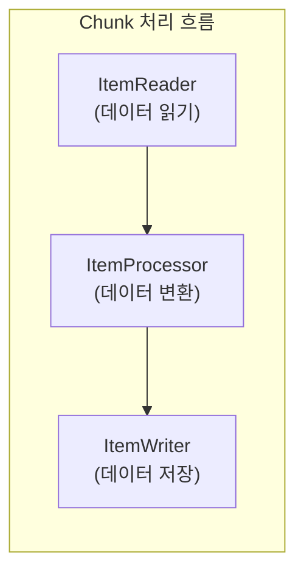
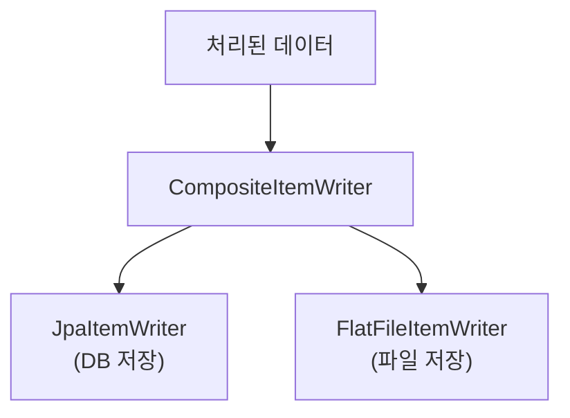

Spring Batch에서 가장 핵심적인 컴포넌트는 **Reader**, **Processor**, **Writer**입니다.
이 글에서는 본격적인 Spring Batch 시리즈를 시작하기 전에, 각 인터페이스에서 제공하는 다양한 구현체들을 정리해보겠습니다.

---

## Sample Code

> 이 시리즈에서 다루는 전체 예제 코드는 GitHub에서 확인할 수 있습니다.
>
> **[spring-batch-sample](https://github.com/rojae/spring-sample/tree/main/spring-batch-sample)**
{: .prompt-info }

---

## 시리즈 목차

- **Spring Batch Reader, Processor, Writer - (핵심 인터페이스 총정리)** ← 현재 글
- [Spring Batch 개념과 환경 설정 - (Job, Step, Chunk 이해하기)](/posts/spring-batch-intro)
- [Spring Batch 이메일 발송 배치 - (실전 구현 예제)](/posts/spring-batch-email)
- [Spring Batch 성능 최적화 - (멀티스레드와 파티셔닝)](/posts/spring-batch-performance)

---

## Reader, Processor, Writer란?

Spring Batch의 Chunk 지향 처리에서 각 컴포넌트의 역할은 다음과 같습니다.



| 컴포넌트 | 역할 | 실행 단위 |
|----------|------|-----------|
| **ItemReader** | 데이터 소스에서 데이터를 읽음 | 1건씩 읽기 |
| **ItemProcessor** | 읽은 데이터를 가공/변환 | 1건씩 처리 |
| **ItemWriter** | 처리된 데이터를 저장 | Chunk 단위로 저장 |

---

## 1. ItemReader 구현체

ItemReader는 다양한 데이터 소스에서 데이터를 읽어오는 역할을 합니다.
Spring Batch에서는 여러 가지 구현체를 제공하고 있습니다.

### 데이터베이스 기반 Reader

#### JdbcPagingItemReader

페이징 방식으로 데이터베이스에서 데이터를 조회합니다.
대용량 데이터 처리에 적합하며, 메모리 효율이 좋습니다.

```java
@Bean
@StepScope
public JdbcPagingItemReader<Customer> jdbcPagingReader(
        DataSource dataSource,
        @Value("#{jobParameters['status']}") String status
) {
    Map<String, Object> parameterValues = new HashMap<>();
    parameterValues.put("status", status);

    return new JdbcPagingItemReaderBuilder<Customer>()
            .name("jdbcPagingReader")
            .dataSource(dataSource)
            .selectClause("SELECT id, name, email, status")
            .fromClause("FROM customer")
            .whereClause("WHERE status = :status")
            .sortKeys(Map.of("id", Order.ASCENDING))
            .parameterValues(parameterValues)
            .pageSize(1000)
            .rowMapper(new BeanPropertyRowMapper<>(Customer.class))
            .build();
}
```

> 페이징 쿼리는 반드시 **정렬 조건**을 포함해야 합니다. 정렬이 없으면 중복 데이터가 조회될 수 있습니다.
{: .prompt-warning }

#### JdbcCursorItemReader

커서 방식으로 데이터베이스에서 데이터를 조회합니다.
페이징보다 성능이 좋지만, DB 커넥션을 오래 유지합니다.

```java
@Bean
public JdbcCursorItemReader<Customer> jdbcCursorReader(DataSource dataSource) {
    return new JdbcCursorItemReaderBuilder<Customer>()
            .name("jdbcCursorReader")
            .dataSource(dataSource)
            .sql("SELECT id, name, email, status FROM customer WHERE status = 'ACTIVE' ORDER BY id")
            .rowMapper(new BeanPropertyRowMapper<>(Customer.class))
            .fetchSize(1000)
            .build();
}
```

| 특성 | JdbcPagingItemReader | JdbcCursorItemReader |
|------|----------------------|----------------------|
| **쿼리 방식** | 페이지별 SELECT | 단일 SELECT + 커서 |
| **DB 커넥션** | 페이지마다 연결/해제 | 전체 처리 동안 유지 |
| **메모리 사용** | 낮음 | 낮음 |
| **성능** | 보통 | 높음 |
| **재시작** | 쉬움 | 어려움 |

#### JpaPagingItemReader

JPA를 사용하여 페이징 방식으로 데이터를 조회합니다.

```java
@Bean
@StepScope
public JpaPagingItemReader<Customer> jpaPagingReader(
        EntityManagerFactory entityManagerFactory,
        @Value("#{jobParameters['status']}") String status
) {
    return new JpaPagingItemReaderBuilder<Customer>()
            .name("jpaPagingReader")
            .entityManagerFactory(entityManagerFactory)
            .queryString("SELECT c FROM Customer c WHERE c.status = :status ORDER BY c.id")
            .parameterValues(Map.of("status", status))
            .pageSize(1000)
            .build();
}
```

#### JpaCursorItemReader

Spring Batch 4.3부터 추가된 JPA 커서 기반 Reader입니다.

```java
@Bean
@StepScope
public JpaCursorItemReader<Customer> jpaCursorReader(
        EntityManagerFactory entityManagerFactory
) {
    return new JpaCursorItemReaderBuilder<Customer>()
            .name("jpaCursorReader")
            .entityManagerFactory(entityManagerFactory)
            .queryString("SELECT c FROM Customer c WHERE c.status = 'ACTIVE' ORDER BY c.id")
            .build();
}
```

#### RepositoryItemReader

Spring Data Repository를 사용하여 데이터를 조회합니다.
기존 Repository 메서드를 재활용할 수 있어 편리합니다.

```java
@Bean
@StepScope
public RepositoryItemReader<Customer> repositoryReader(
        CustomerRepository customerRepository,
        @Value("#{jobParameters['status']}") String status
) {
    return new RepositoryItemReaderBuilder<Customer>()
            .name("repositoryReader")
            .repository(customerRepository)
            .methodName("findByStatus")
            .arguments(List.of(status))
            .pageSize(1000)
            .sorts(Map.of("id", Sort.Direction.ASC))
            .build();
}
```

### 파일 기반 Reader

#### FlatFileItemReader

CSV, TSV 등 텍스트 파일에서 데이터를 읽습니다.

```java
@Bean
@StepScope
public FlatFileItemReader<Customer> flatFileReader(
        @Value("#{jobParameters['inputFile']}") Resource resource
) {
    return new FlatFileItemReaderBuilder<Customer>()
            .name("flatFileReader")
            .resource(resource)
            .encoding("UTF-8")
            .linesToSkip(1)  // 헤더 스킵
            .delimited()
            .delimiter(",")
            .names("id", "name", "email", "status")
            .targetType(Customer.class)
            .build();
}
```

> CSV 파일에 한글이 포함된 경우 반드시 `encoding("UTF-8")`을 설정하세요.
{: .prompt-tip }

#### JsonItemReader

JSON 파일에서 데이터를 읽습니다.

```java
@Bean
@StepScope
public JsonItemReader<Customer> jsonReader(
        @Value("#{jobParameters['inputFile']}") Resource resource
) {
    return new JsonItemReaderBuilder<Customer>()
            .name("jsonReader")
            .resource(resource)
            .jsonObjectReader(new JacksonJsonObjectReader<>(Customer.class))
            .build();
}
```

#### StaxEventItemReader

XML 파일에서 데이터를 읽습니다.

```java
@Bean
@StepScope
public StaxEventItemReader<Customer> xmlReader(
        @Value("#{jobParameters['inputFile']}") Resource resource
) {
    return new StaxEventItemReaderBuilder<Customer>()
            .name("xmlReader")
            .resource(resource)
            .addFragmentRootElements("customer")
            .unmarshaller(customerMarshaller())
            .build();
}
```

### 기타 Reader

#### ItemReaderAdapter

기존 서비스 메서드를 ItemReader로 사용할 수 있습니다.

```java
@Bean
public ItemReaderAdapter<Customer> serviceReader(CustomerService customerService) {
    ItemReaderAdapter<Customer> reader = new ItemReaderAdapter<>();
    reader.setTargetObject(customerService);
    reader.setTargetMethod("nextCustomer");
    return reader;
}
```

#### ListItemReader

List 데이터를 읽습니다. 주로 테스트 용도로 사용됩니다.

```java
@Bean
public ListItemReader<Customer> listReader() {
    List<Customer> customers = Arrays.asList(
            new Customer(1L, "Alice", "alice@test.com"),
            new Customer(2L, "Bob", "bob@test.com")
    );
    return new ListItemReader<>(customers);
}
```

### Reader 선택 가이드

| 데이터 소스 | 권장 Reader | 비고 |
|-------------|-------------|------|
| RDBMS (대용량) | JdbcCursorItemReader | 성능 우선 |
| RDBMS (재시작 필요) | JdbcPagingItemReader | 안정성 우선 |
| JPA 엔티티 | JpaPagingItemReader | JPA 활용 시 |
| Spring Data | RepositoryItemReader | Repository 재활용 |
| CSV/TSV 파일 | FlatFileItemReader | 파일 처리 |
| JSON 파일 | JsonItemReader | JSON 처리 |
| XML 파일 | StaxEventItemReader | XML 처리 |

---

## 2. ItemProcessor 구현체

ItemProcessor는 읽은 데이터를 가공하거나 필터링하는 역할을 합니다.

### 기본 구조

```java
public interface ItemProcessor<I, O> {
    O process(@NonNull I item) throws Exception;
}
```

- **I**: 입력 타입 (Reader에서 읽은 데이터)
- **O**: 출력 타입 (Writer에 전달할 데이터)
- **return null**: 해당 아이템을 필터링 (Writer에 전달하지 않음)

### Custom ItemProcessor

대부분의 경우 직접 구현하여 사용합니다.

```java
@Component
public class CustomerItemProcessor implements ItemProcessor<Customer, CustomerDto> {

    @Override
    public CustomerDto process(Customer customer) throws Exception {
        // 1. 필터링: null 반환 시 해당 아이템 스킵
        if (customer.getStatus().equals("INACTIVE")) {
            return null;
        }

        // 2. 변환: Customer -> CustomerDto
        return CustomerDto.builder()
                .id(customer.getId())
                .name(customer.getName().toUpperCase())
                .email(customer.getEmail())
                .processedAt(LocalDateTime.now())
                .build();
    }
}
```

### ValidatingItemProcessor

데이터 유효성 검사를 수행합니다.

```java
@Bean
public ValidatingItemProcessor<Customer> validatingProcessor() {
    ValidatingItemProcessor<Customer> processor = new ValidatingItemProcessor<>();
    processor.setValidator(new BeanValidatingItemProcessor<>());
    return processor;
}
```

### CompositeItemProcessor

여러 Processor를 체인으로 연결합니다.

```java
@Bean
public CompositeItemProcessor<Customer, CustomerDto> compositeProcessor(
        ItemProcessor<Customer, Customer> validateProcessor,
        ItemProcessor<Customer, CustomerDto> transformProcessor
) {
    return new CompositeItemProcessorBuilder<Customer, CustomerDto>()
            .delegates(List.of(validateProcessor, transformProcessor))
            .build();
}
```


### ClassifierCompositeItemProcessor

조건에 따라 다른 Processor를 사용합니다.

```java
@Bean
public ClassifierCompositeItemProcessor<Customer, CustomerDto> classifierProcessor() {
    ClassifierCompositeItemProcessor<Customer, CustomerDto> processor =
            new ClassifierCompositeItemProcessor<>();

    processor.setClassifier(customer -> {
        if ("VIP".equals(customer.getGrade())) {
            return vipProcessor();
        } else {
            return normalProcessor();
        }
    });

    return processor;
}
```

### Processor 선택 가이드

| 요구사항 | 권장 Processor | 비고 |
|----------|----------------|------|
| 단순 변환 | Custom Processor | 직접 구현 |
| 유효성 검사 | ValidatingItemProcessor | Bean Validation 활용 |
| 다단계 처리 | CompositeItemProcessor | 체인 연결 |
| 조건별 분기 | ClassifierCompositeItemProcessor | 조건 분기 |

---

## 3. ItemWriter 구현체

ItemWriter는 처리된 데이터를 저장하는 역할을 합니다.
Chunk 단위로 한 번에 저장하므로 트랜잭션 처리에 효율적입니다.

### 데이터베이스 기반 Writer

#### JdbcBatchItemWriter

JDBC를 사용하여 배치 Insert/Update를 수행합니다.
대용량 데이터 저장에 가장 효율적입니다.

```java
@Bean
public JdbcBatchItemWriter<Customer> jdbcBatchWriter(DataSource dataSource) {
    return new JdbcBatchItemWriterBuilder<Customer>()
            .dataSource(dataSource)
            .sql("""
                INSERT INTO customer (id, name, email, status, created_at)
                VALUES (:id, :name, :email, :status, :createdAt)
            """)
            .beanMapped()
            .build();
}
```

> `beanMapped()`는 객체의 프로퍼티를 Named Parameter에 자동 매핑합니다.
{: .prompt-tip }

#### JpaItemWriter

JPA를 사용하여 데이터를 저장합니다.

```java
@Bean
public JpaItemWriter<Customer> jpaWriter(EntityManagerFactory entityManagerFactory) {
    return new JpaItemWriterBuilder<Customer>()
            .entityManagerFactory(entityManagerFactory)
            .usePersist(true)  // true: persist, false: merge
            .build();
}
```

#### RepositoryItemWriter

Spring Data Repository를 사용하여 데이터를 저장합니다.

```java
@Bean
public RepositoryItemWriter<Customer> repositoryWriter(CustomerRepository repository) {
    return new RepositoryItemWriterBuilder<Customer>()
            .repository(repository)
            .methodName("save")
            .build();
}
```

### 파일 기반 Writer

#### FlatFileItemWriter

CSV, TSV 등 텍스트 파일에 데이터를 저장합니다.

```java
@Bean
@StepScope
public FlatFileItemWriter<Customer> flatFileWriter(
        @Value("#{jobParameters['outputFile']}") Resource resource
) {
    return new FlatFileItemWriterBuilder<Customer>()
            .name("flatFileWriter")
            .resource(resource)
            .encoding("UTF-8")
            .delimited()
            .delimiter(",")
            .names("id", "name", "email", "status")
            .headerCallback(writer -> writer.write("ID,Name,Email,Status"))
            .footerCallback(writer -> writer.write("--- End of File ---"))
            .build();
}
```

#### JsonFileItemWriter

JSON 파일에 데이터를 저장합니다.

```java
@Bean
@StepScope
public JsonFileItemWriter<Customer> jsonWriter(
        @Value("#{jobParameters['outputFile']}") Resource resource
) {
    return new JsonFileItemWriterBuilder<Customer>()
            .name("jsonWriter")
            .resource(resource)
            .jsonObjectMarshaller(new JacksonJsonObjectMarshaller<>())
            .build();
}
```

#### StaxEventItemWriter

XML 파일에 데이터를 저장합니다.

```java
@Bean
@StepScope
public StaxEventItemWriter<Customer> xmlWriter(
        @Value("#{jobParameters['outputFile']}") Resource resource
) {
    return new StaxEventItemWriterBuilder<Customer>()
            .name("xmlWriter")
            .resource(resource)
            .rootTagName("customers")
            .marshaller(customerMarshaller())
            .build();
}
```

### 기타 Writer

#### CompositeItemWriter

여러 Writer를 동시에 사용합니다.

```java
@Bean
public CompositeItemWriter<Customer> compositeWriter(
        JpaItemWriter<Customer> jpaWriter,
        FlatFileItemWriter<Customer> fileWriter
) {
    return new CompositeItemWriterBuilder<Customer>()
            .delegates(List.of(jpaWriter, fileWriter))
            .build();
}
```



#### ClassifierCompositeItemWriter

조건에 따라 다른 Writer를 사용합니다.

```java
@Bean
public ClassifierCompositeItemWriter<Customer> classifierWriter() {
    ClassifierCompositeItemWriter<Customer> writer = new ClassifierCompositeItemWriter<>();

    writer.setClassifier(customer -> {
        if ("VIP".equals(customer.getGrade())) {
            return vipWriter();
        } else {
            return normalWriter();
        }
    });

    return writer;
}
```

#### ItemWriterAdapter

기존 서비스 메서드를 ItemWriter로 사용할 수 있습니다.

```java
@Bean
public ItemWriterAdapter<Customer> serviceWriter(CustomerService customerService) {
    ItemWriterAdapter<Customer> writer = new ItemWriterAdapter<>();
    writer.setTargetObject(customerService);
    writer.setTargetMethod("saveCustomer");
    return writer;
}
```

### Writer 선택 가이드

| 데이터 저장소 | 권장 Writer | 비고 |
|---------------|-------------|------|
| RDBMS (대용량) | JdbcBatchItemWriter | 성능 최고 |
| RDBMS (JPA) | JpaItemWriter | JPA 활용 시 |
| Spring Data | RepositoryItemWriter | Repository 재활용 |
| CSV/TSV 파일 | FlatFileItemWriter | 파일 출력 |
| JSON 파일 | JsonFileItemWriter | JSON 출력 |
| XML 파일 | StaxEventItemWriter | XML 출력 |
| 여러 대상 동시 | CompositeItemWriter | 복합 저장 |

---

## 4. 인터페이스 조합 예시

실제 배치에서는 이 컴포넌트들을 조합하여 사용합니다.

### DB to DB

```java
@Bean
public Step dbToDbStep(
        JdbcPagingItemReader<Customer> reader,
        CustomerItemProcessor processor,
        JdbcBatchItemWriter<CustomerDto> writer
) {
    return new StepBuilder("dbToDbStep", jobRepository)
            .<Customer, CustomerDto>chunk(1000, transactionManager)
            .reader(reader)
            .processor(processor)
            .writer(writer)
            .build();
}
```

### File to DB

```java
@Bean
public Step fileToDbStep(
        FlatFileItemReader<Customer> reader,
        ValidatingItemProcessor<Customer> processor,
        JpaItemWriter<Customer> writer
) {
    return new StepBuilder("fileToDbStep", jobRepository)
            .<Customer, Customer>chunk(1000, transactionManager)
            .reader(reader)
            .processor(processor)
            .writer(writer)
            .build();
}
```

### DB to File

```java
@Bean
public Step dbToFileStep(
        JpaPagingItemReader<Customer> reader,
        CustomerItemProcessor processor,
        FlatFileItemWriter<CustomerDto> writer
) {
    return new StepBuilder("dbToFileStep", jobRepository)
            .<Customer, CustomerDto>chunk(1000, transactionManager)
            .reader(reader)
            .processor(processor)
            .writer(writer)
            .build();
}
```

---

## 핵심 요약

### Reader 요약

| 구현체 | 데이터 소스 | 특징 |
|--------|-------------|------|
| JdbcPagingItemReader | RDBMS | 페이징, 재시작 용이 |
| JdbcCursorItemReader | RDBMS | 고성능, 커넥션 유지 |
| JpaPagingItemReader | RDBMS | JPA 페이징 |
| JpaCursorItemReader | RDBMS | JPA 커서 |
| RepositoryItemReader | RDBMS | Repository 재활용 |
| FlatFileItemReader | 파일 | CSV/TSV |
| JsonItemReader | 파일 | JSON |

### Processor 요약

| 구현체 | 용도 |
|--------|------|
| Custom Processor | 일반적인 변환/필터링 |
| ValidatingItemProcessor | 유효성 검사 |
| CompositeItemProcessor | 다단계 처리 |
| ClassifierCompositeItemProcessor | 조건별 분기 |

### Writer 요약

| 구현체 | 데이터 저장소 | 특징 |
|--------|---------------|------|
| JdbcBatchItemWriter | RDBMS | 고성능 배치 저장 |
| JpaItemWriter | RDBMS | JPA persist/merge |
| RepositoryItemWriter | RDBMS | Repository 재활용 |
| FlatFileItemWriter | 파일 | CSV/TSV |
| JsonFileItemWriter | 파일 | JSON |
| CompositeItemWriter | 복합 | 여러 Writer 동시 사용 |

---

## 다음 글 안내

다음 글에서는 이 인터페이스들을 실제로 활용하여 Spring Batch 프로젝트를 구성하는 방법을 알아보겠습니다.

- 👉 [Spring Batch 개념과 환경 설정 - (Job, Step, Chunk 이해하기)](/posts/spring-batch-intro)
