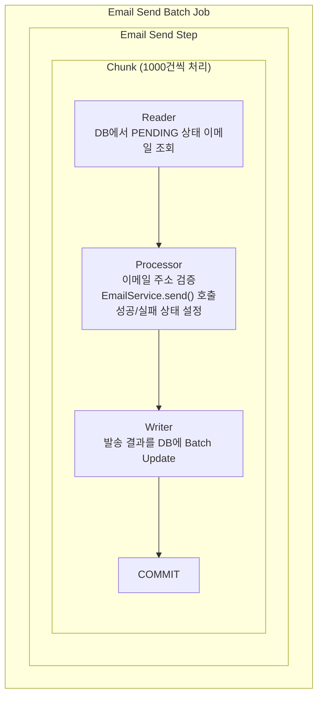
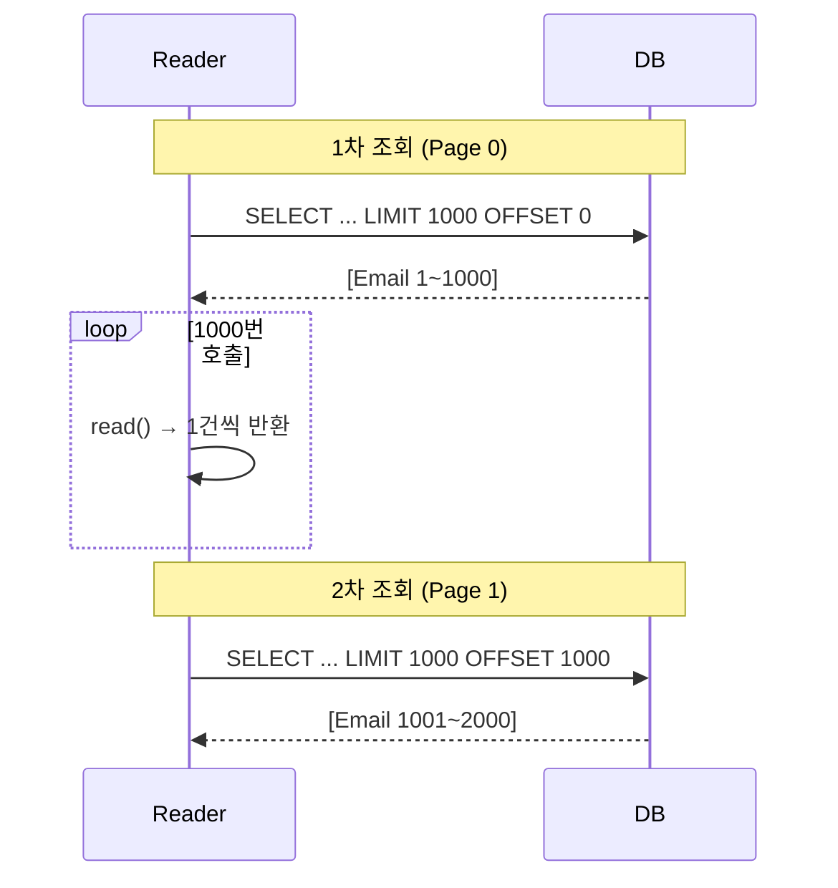
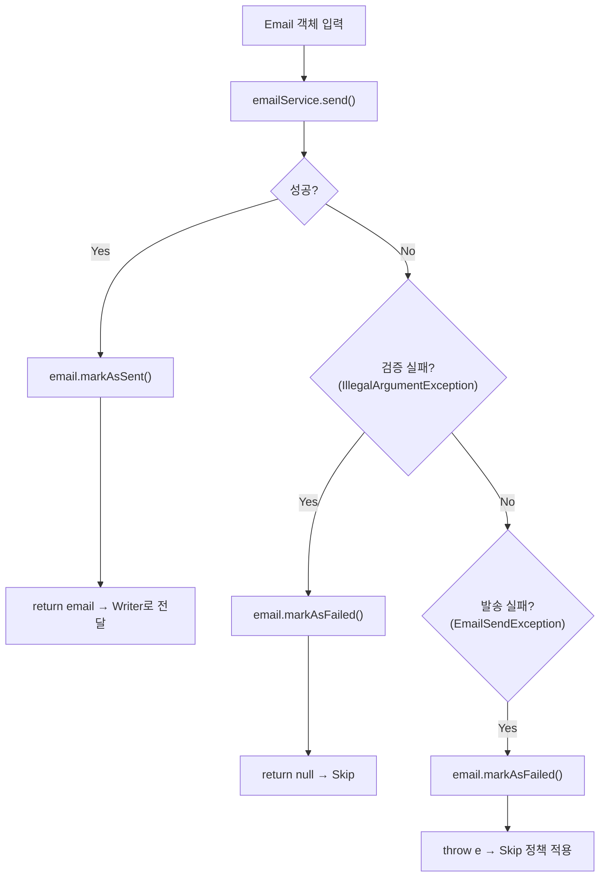
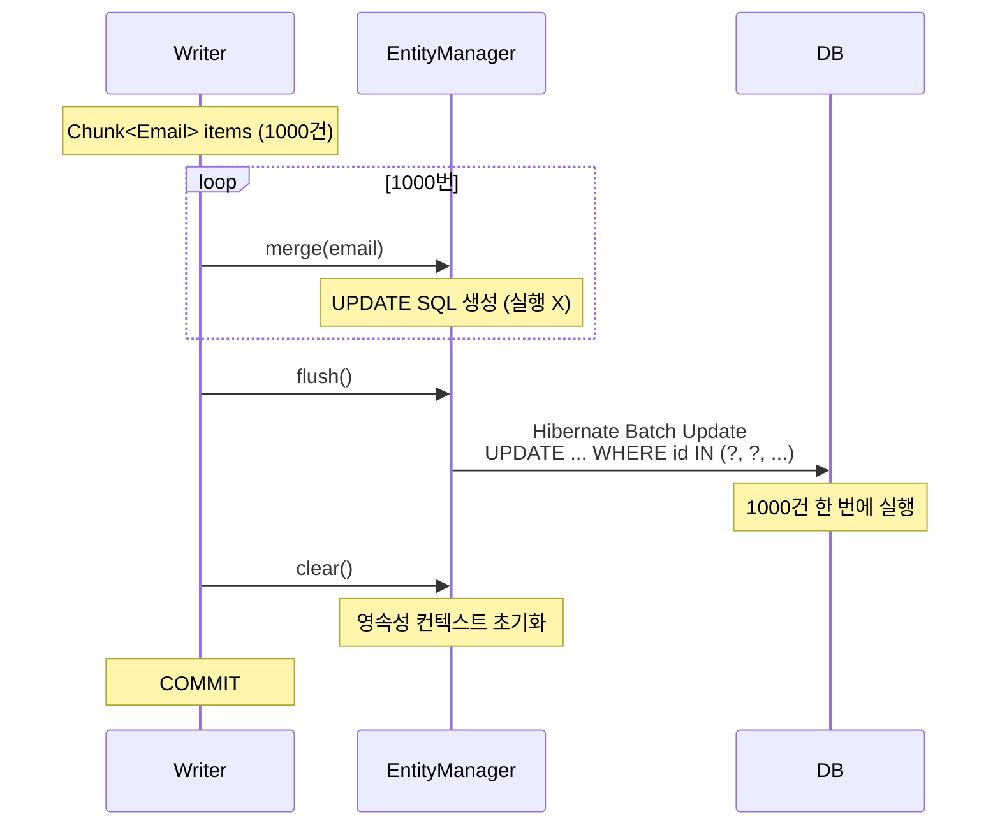
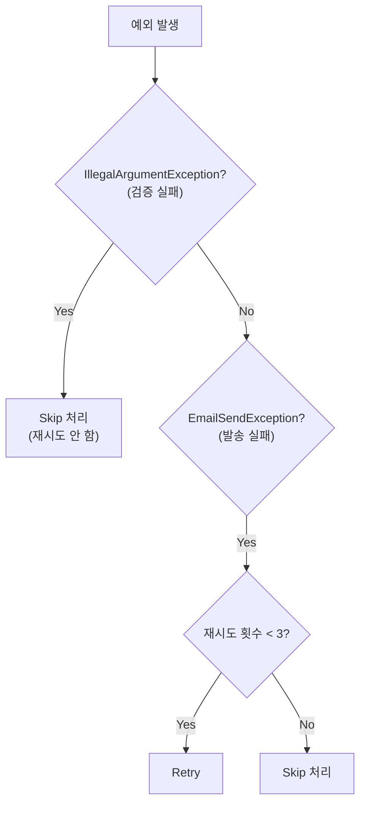
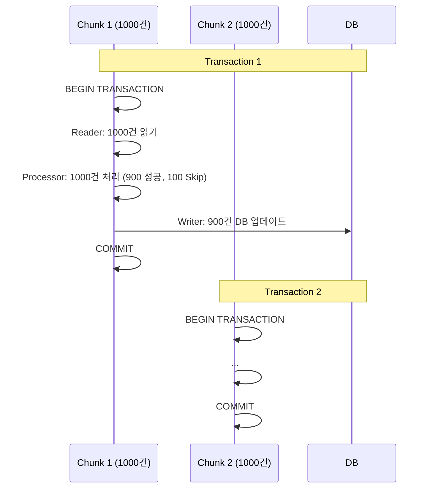

> Reader, Processor, Writer를 활용한 실무 배치 개발을 다뤄보겠습니다.

---

## 시리즈 목차

- [Spring Batch Reader, Processor, Writer - (핵심 인터페이스 총정리)](/posts/spring-batch-components)
- [Spring Batch 개념과 환경 설정 - (Job, Step, Chunk 이해하기)](/posts/spring-batch-intro)
- **Spring Batch 이메일 발송 배치 - (실전 구현 예제)** ← 현재 글
- [Spring Batch 성능 최적화 - (멀티스레드와 파티셔닝)](/posts/spring-batch-performance)

---

## 이 글에서 다룰 내용

- 실제 이메일 발송 배치 구현
- Reader/Processor/Writer 상세 분석
- 성공/실패 처리 및 상태 업데이트
- Skip과 Retry 전략
- 트랜잭션 관리
- 테스트 및 디버깅

---

## 구현할 배치 시스템 아키텍처

### 전체 흐름도



---

## 프로젝트 구조

```text
src/main/java/com/example/batch/
├── job/
│   ├── EmailSendJobConfiguration.java    # Job 설정
│   └── listener/
│       └── EmailJobExecutionListener.java # Job 리스너
├── entity/
│   └── Email.java                         # 이메일 엔티티
├── repository/
│   └── EmailRepository.java               # JPA Repository
├── service/
│   ├── EmailService.java                  # 이메일 발송 서비스
│   └── EmailValidator.java                # 이메일 검증
└── dto/
    └── EmailSendResult.java               # 발송 결과 DTO
```

---

## 단계별 구현

### 1단계: Entity 및 Repository

#### Email.java

```java
package com.example.batch.entity;

import jakarta.persistence.*;
import lombok.*;
import java.time.LocalDateTime;

@Entity
@Table(name = "email_send_queue")
@Getter
@Setter
@NoArgsConstructor
@AllArgsConstructor
@Builder
public class Email {

    @Id
    @GeneratedValue(strategy = GenerationType.IDENTITY)
    private Long id;

    @Column(name = "to_email", nullable = false)
    private String toEmail;

    @Column(nullable = false)
    private String subject;

    @Column(nullable = false, columnDefinition = "TEXT")
    private String content;

    @Column(nullable = false, length = 20)
    @Enumerated(EnumType.STRING)
    private EmailStatus status = EmailStatus.PENDING;

    @Column(name = "sent_at")
    private LocalDateTime sentAt;

    @Column(name = "error_message", columnDefinition = "TEXT")
    private String errorMessage;

    @Column(name = "retry_count")
    private Integer retryCount = 0;

    @Column(name = "created_at", nullable = false, updatable = false)
    private LocalDateTime createdAt;

    @Column(name = "updated_at")
    private LocalDateTime updatedAt;

    @PrePersist
    protected void onCreate() {
        createdAt = LocalDateTime.now();
        updatedAt = LocalDateTime.now();
    }

    @PreUpdate
    protected void onUpdate() {
        updatedAt = LocalDateTime.now();
    }

    /**
     * 발송 성공 처리
     */
    public void markAsSent() {
        this.status = EmailStatus.SUCCESS;
        this.sentAt = LocalDateTime.now();
        this.errorMessage = null;
    }

    /**
     * 발송 실패 처리
     */
    public void markAsFailed(String errorMessage) {
        this.status = EmailStatus.FAILED;
        this.errorMessage = errorMessage;
        this.retryCount++;
    }

    /**
     * 재시도 가능 여부
     */
    public boolean canRetry() {
        return this.retryCount < 3;
    }
}
```

#### EmailStatus.java

```java
package com.example.batch.entity;

public enum EmailStatus {
    PENDING,   // 대기 중
    SUCCESS,   // 발송 성공
    FAILED     // 발송 실패
}
```

#### EmailRepository.java

```java
package com.example.batch.repository;

import com.example.batch.entity.Email;
import com.example.batch.entity.EmailStatus;
import org.springframework.data.jpa.repository.JpaRepository;
import org.springframework.data.jpa.repository.Query;

import java.time.LocalDateTime;
import java.util.List;

public interface EmailRepository extends JpaRepository<Email, Long> {

    /**
     * PENDING 상태의 이메일 조회
     */
    List<Email> findByStatusOrderByIdAsc(EmailStatus status);

    /**
     * 특정 기간 동안의 발송 통계
     */
    @Query("""
        SELECT e.status, COUNT(e)
        FROM Email e
        WHERE e.sentAt BETWEEN :startDate AND :endDate
        GROUP BY e.status
    """)
    List<Object[]> getStatistics(LocalDateTime startDate, LocalDateTime endDate);
}
```

---

### 2단계: 이메일 발송 서비스

#### EmailService.java

```java
package com.example.batch.service;

import lombok.extern.slf4j.Slf4j;
import org.springframework.stereotype.Service;

import java.util.concurrent.TimeUnit;

/**
 * 이메일 발송 서비스 (시뮬레이션)
 */
@Slf4j
@Service
public class EmailService {

    private static final double SUCCESS_RATE = 0.9; // 90% 성공률

    /**
     * 이메일 발송
     *
     * @return true: 성공, false: 실패
     * @throws IllegalArgumentException 잘못된 이메일 주소
     * @throws EmailSendException 발송 실패
     */
    public boolean send(String toEmail, String subject, String content) {
        log.debug("Sending email to: {}, subject: {}", toEmail, subject);

        // 1. 이메일 주소 검증
        validateEmail(toEmail);

        // 2. 네트워크 지연 시뮬레이션 (10~50ms)
        simulateNetworkDelay();

        // 3. 랜덤 실패 시뮬레이션 (10% 확률)
        if (Math.random() > SUCCESS_RATE) {
            log.warn("Failed to send email to: {} (simulated failure)", toEmail);
            throw new EmailSendException("SMTP connection timeout");
        }

        log.debug("Email sent successfully to: {}", toEmail);
        return true;
    }

    /**
     * 이메일 주소 검증
     */
    private void validateEmail(String email) {
        if (email == null || email.isBlank()) {
            throw new IllegalArgumentException("Email address cannot be empty");
        }

        // "invalid"가 포함된 이메일은 무조건 실패
        if (email.contains("invalid")) {
            throw new IllegalArgumentException("Invalid email address: " + email);
        }

        // 기본 형식 검증
        if (!email.matches("^[A-Za-z0-9+_.-]+@[A-Za-z0-9.-]+\\.[A-Za-z]{2,}$")) {
            throw new IllegalArgumentException("Invalid email format: " + email);
        }
    }

    /**
     * 네트워크 지연 시뮬레이션
     */
    private void simulateNetworkDelay() {
        try {
            long delay = 10 + (long) (Math.random() * 40); // 10~50ms
            TimeUnit.MILLISECONDS.sleep(delay);
        } catch (InterruptedException e) {
            Thread.currentThread().interrupt();
            throw new EmailSendException("Email sending interrupted", e);
        }
    }
}
```

#### EmailSendException.java

```java
package com.example.batch.service;

/**
 * 이메일 발송 실패 예외
 */
public class EmailSendException extends RuntimeException {

    public EmailSendException(String message) {
        super(message);
    }

    public EmailSendException(String message, Throwable cause) {
        super(message, cause);
    }
}
```

---

### 3단계: Reader 구현

#### ItemReader 방식 비교

Spring Batch는 여러 종류의 Reader를 제공합니다.

| Reader | 특징 | 사용 시기 |
|--------|------|----------|
| **JpaPagingItemReader** | JPA 페이징 조회 | 복잡한 조건, 엔티티 그래프 |
| **JdbcPagingItemReader** | JDBC 페이징 조회 | 단순 조회, 성능 중요 |
| **JdbcCursorItemReader** | JDBC 커서 기반 | 대용량, 스트리밍 |
| **RepositoryItemReader** | Spring Data Repository | 기존 Repository 재사용 |

이 예제에서는 **JpaPagingItemReader**를 사용하겠습니다.

---

#### EmailItemReader 설정

```java
package com.example.batch.job;

import com.example.batch.entity.Email;
import com.example.batch.entity.EmailStatus;
import jakarta.persistence.EntityManagerFactory;
import lombok.RequiredArgsConstructor;
import lombok.extern.slf4j.Slf4j;
import org.springframework.batch.item.database.JpaPagingItemReader;
import org.springframework.batch.item.database.builder.JpaPagingItemReaderBuilder;
import org.springframework.context.annotation.Bean;
import org.springframework.context.annotation.Configuration;

import java.util.Map;

@Slf4j
@Configuration
@RequiredArgsConstructor
public class EmailItemReaderConfig {

    private final EntityManagerFactory entityManagerFactory;

    /**
     * 이메일 Reader
     *
     * pageSize: 한 번에 읽어올 데이터 개수
     */
    @Bean
    public JpaPagingItemReader<Email> emailItemReader() {
        return new JpaPagingItemReaderBuilder<Email>()
                .name("emailItemReader")
                .entityManagerFactory(entityManagerFactory)
                .queryString("SELECT e FROM Email e WHERE e.status = :status ORDER BY e.id ASC")
                .parameterValues(Map.of("status", EmailStatus.PENDING))
                .pageSize(1000)  // fetch-size
                .build();
    }
}
```

#### Reader 동작 원리



핵심 포인트를 정리하면 다음과 같습니다.

- `pageSize`만큼 한 번에 조회 (네트워크 왕복 최소화)
- `read()` 메서드는 1건씩 반환 (메모리 효율적)
- `ORDER BY` 필수 (일관된 순서 보장)

---

### 4단계: Processor 구현

#### EmailItemProcessor.java

```java
package com.example.batch.job;

import com.example.batch.entity.Email;
import com.example.batch.service.EmailSendException;
import com.example.batch.service.EmailService;
import lombok.RequiredArgsConstructor;
import lombok.extern.slf4j.Slf4j;
import org.springframework.batch.item.ItemProcessor;
import org.springframework.stereotype.Component;

/**
 * 이메일 발송 Processor
 */
@Slf4j
@Component
@RequiredArgsConstructor
public class EmailItemProcessor implements ItemProcessor<Email, Email> {

    private final EmailService emailService;

    @Override
    public Email process(Email email) throws Exception {
        log.debug("Processing email: id={}, to={}", email.getId(), email.getToEmail());

        try {
            // 1. 이메일 발송 시도
            emailService.send(
                email.getToEmail(),
                email.getSubject(),
                email.getContent()
            );

            // 2. 성공 처리
            email.markAsSent();
            log.info("Email sent successfully: id={}, to={}",
                email.getId(), email.getToEmail());

            return email;

        } catch (IllegalArgumentException e) {
            // 3. 검증 실패 (Skip 대상)
            log.warn("Invalid email address: id={}, to={}, error={}",
                email.getId(), email.getToEmail(), e.getMessage());

            email.markAsFailed("Invalid email: " + e.getMessage());

            // null 반환 = Writer에 전달하지 않음 = Skip
            return null;

        } catch (EmailSendException e) {
            // 4. 발송 실패 (Retry 또는 Skip)
            log.error("Failed to send email: id={}, to={}, error={}",
                email.getId(), email.getToEmail(), e.getMessage());

            email.markAsFailed(e.getMessage());

            // 예외 던지기 = Skip 정책에 따라 처리
            throw e;
        }
    }
}
```

#### Processor 처리 흐름도



핵심 개념을 정리해보겠습니다.

- `return email`: 정상 처리 → Writer로 전달
- `return null`: Skip → Writer로 전달 안 함
- `throw Exception`: Skip 또는 Retry 정책 적용

---

### 5단계: Writer 구현

#### EmailItemWriter.java

```java
package com.example.batch.job;

import com.example.batch.entity.Email;
import lombok.RequiredArgsConstructor;
import lombok.extern.slf4j.Slf4j;
import org.springframework.batch.item.Chunk;
import org.springframework.batch.item.ItemWriter;
import org.springframework.stereotype.Component;
import org.springframework.transaction.annotation.Transactional;

import jakarta.persistence.EntityManager;

/**
 * 이메일 발송 결과 저장 Writer
 */
@Slf4j
@Component
@RequiredArgsConstructor
public class EmailItemWriter implements ItemWriter<Email> {

    private final EntityManager entityManager;

    @Override
    @Transactional
    public void write(Chunk<? extends Email> chunk) throws Exception {
        long startTime = System.currentTimeMillis();

        for (Email email : chunk.getItems()) {
            // JPA merge로 업데이트
            entityManager.merge(email);
        }

        // Batch flush
        entityManager.flush();
        entityManager.clear();

        long elapsed = System.currentTimeMillis() - startTime;
        log.info("Updated {} emails in {}ms", chunk.size(), elapsed);
    }
}
```

#### Writer 동작 원리



성능 최적화 포인트입니다.

- `entityManager.flush()`: Batch Update 강제 실행
- `entityManager.clear()`: 메모리 해제
- Hibernate의 `batch_size` 설정 활용

---

### 6단계: Job Configuration

#### EmailSendJobConfiguration.java

```java
package com.example.batch.job;

import com.example.batch.entity.Email;
import lombok.RequiredArgsConstructor;
import lombok.extern.slf4j.Slf4j;
import org.springframework.batch.core.Job;
import org.springframework.batch.core.Step;
import org.springframework.batch.core.job.builder.JobBuilder;
import org.springframework.batch.core.repository.JobRepository;
import org.springframework.batch.core.step.builder.StepBuilder;
import org.springframework.batch.item.ItemProcessor;
import org.springframework.batch.item.ItemReader;
import org.springframework.batch.item.ItemWriter;
import org.springframework.context.annotation.Bean;
import org.springframework.context.annotation.Configuration;
import org.springframework.transaction.PlatformTransactionManager;

@Slf4j
@Configuration
@RequiredArgsConstructor
public class EmailSendJobConfiguration {

    private final JobRepository jobRepository;
    private final PlatformTransactionManager transactionManager;

    private static final int CHUNK_SIZE = 1000;
    private static final int SKIP_LIMIT = 100;

    /**
     * Job 정의
     */
    @Bean
    public Job emailSendJob(Step emailSendStep) {
        return new JobBuilder("emailSendJob", jobRepository)
                .start(emailSendStep)
                .build();
    }

    /**
     * Step 정의
     */
    @Bean
    public Step emailSendStep(
            ItemReader<Email> emailItemReader,
            ItemProcessor<Email, Email> emailItemProcessor,
            ItemWriter<Email> emailItemWriter
    ) {
        return new StepBuilder("emailSendStep", jobRepository)
                .<Email, Email>chunk(CHUNK_SIZE, transactionManager)
                .reader(emailItemReader)
                .processor(emailItemProcessor)
                .writer(emailItemWriter)
                .faultTolerant()  // 에러 허용 활성화
                .skip(Exception.class)  // 모든 예외 Skip 대상
                .skipLimit(SKIP_LIMIT)  // 최대 100건까지 Skip 허용
                .build();
    }
}
```

---

## 에러 처리 전략

### Skip vs Retry

#### Skip: 건너뛰기

```java
.faultTolerant()
.skip(Exception.class)
.skipLimit(100)
```

동작 방식을 살펴보겠습니다.

```text
Chunk 1000건 처리 중...
├─ Item 1: 성공
├─ Item 2: 성공
├─ Item 3: 예외 발생 → Skip (1/100)
├─ Item 4: 성공
├─ Item 5: 예외 발생 → Skip (2/100)
...
└─ Commit (998건 성공, 2건 Skip)
```

사용 시기는 일부 실패해도 전체 처리는 계속되어야 할 때입니다.

- 잘못된 이메일 주소
- 일시적인 네트워크 오류
- 데이터 검증 실패

---

#### Retry: 재시도

```java
.faultTolerant()
.retry(EmailSendException.class)
.retryLimit(3)
```

동작 방식입니다.

```text
Item 처리 시도...
├─ 1차 시도: 실패 (네트워크 오류)
├─ 2차 시도: 실패
├─ 3차 시도: 성공
└─ 결과: 성공

또는

├─ 1차 시도: 실패
├─ 2차 시도: 실패
├─ 3차 시도: 실패
└─ Skip 처리
```

사용 시기는 재시도하면 성공할 가능성이 있을 때입니다.

- 일시적인 네트워크 장애
- DB 락 타임아웃
- 외부 API 응답 지연

---

### Skip과 Retry 조합

```java
@Bean
public Step emailSendStep(...) {
    return new StepBuilder("emailSendStep", jobRepository)
            .<Email, Email>chunk(CHUNK_SIZE, transactionManager)
            .reader(emailItemReader)
            .processor(emailItemProcessor)
            .writer(emailItemWriter)
            .faultTolerant()
            // Retry 설정
            .retry(EmailSendException.class)  // 발송 실패는 재시도
            .retryLimit(3)  // 최대 3번
            // Skip 설정
            .skip(EmailSendException.class)  // 3번 실패하면 Skip
            .skip(IllegalArgumentException.class)  // 검증 실패는 바로 Skip
            .skipLimit(100)  // 전체 100건까지 허용
            .build();
}
```

#### 처리 흐름



---

## 트랜잭션 관리

### Chunk 기반 트랜잭션



핵심 포인트입니다.

- Chunk = Transaction 단위
- Chunk 성공 시 전체 COMMIT
- Chunk 실패 시 전체 ROLLBACK (Skip 제외)
- 다음 Chunk는 새 Transaction

---

### application.yml 트랜잭션 설정

```yaml
spring:
  jpa:
    properties:
      hibernate:
        # Batch Update 최적화
        jdbc:
          batch_size: 100  # 한 번에 실행할 SQL 개수
        order_inserts: true
        order_updates: true

        # 로깅
        show_sql: true
        format_sql: true

# 배치 설정
batch:
  chunk-size: 1000  # Chunk 크기
  page-size: 1000   # Reader 페이지 크기
  skip-limit: 100   # Skip 제한
```

---

## 모니터링 및 로깅

### Job Execution Listener

```java
package com.example.batch.job.listener;

import lombok.extern.slf4j.Slf4j;
import org.springframework.batch.core.JobExecution;
import org.springframework.batch.core.JobExecutionListener;
import org.springframework.stereotype.Component;

import java.time.Duration;
import java.time.LocalDateTime;

/**
 * Job 실행 리스너
 */
@Slf4j
@Component
public class EmailJobExecutionListener implements JobExecutionListener {

    @Override
    public void beforeJob(JobExecution jobExecution) {
        log.info("========================================");
        log.info("Email Send Job Started");
        log.info("Job Name: {}", jobExecution.getJobInstance().getJobName());
        log.info("Start Time: {}", jobExecution.getStartTime());
        log.info("========================================");
    }

    @Override
    public void afterJob(JobExecution jobExecution) {
        LocalDateTime startTime = jobExecution.getStartTime();
        LocalDateTime endTime = jobExecution.getEndTime();
        Duration duration = Duration.between(startTime, endTime);

        log.info("========================================");
        log.info("Email Send Job Finished");
        log.info("Status: {}", jobExecution.getStatus());
        log.info("Exit Status: {}", jobExecution.getExitStatus());
        log.info("Duration: {} seconds", duration.getSeconds());

        jobExecution.getStepExecutions().forEach(stepExecution -> {
            log.info("Step: {}", stepExecution.getStepName());
            log.info("  - Read Count: {}", stepExecution.getReadCount());
            log.info("  - Write Count: {}", stepExecution.getWriteCount());
            log.info("  - Skip Count: {}", stepExecution.getSkipCount());
            log.info("  - Commit Count: {}", stepExecution.getCommitCount());
            log.info("  - Rollback Count: {}", stepExecution.getRollbackCount());
        });
        log.info("========================================");
    }
}
```

#### Job에 Listener 등록

```java
@Bean
public Job emailSendJob(
        Step emailSendStep,
        EmailJobExecutionListener listener
) {
    return new JobBuilder("emailSendJob", jobRepository)
            .listener(listener)  // Listener 등록
            .start(emailSendStep)
            .build();
}
```

---

### 실행 로그 예시

```text
2026-01-22 16:30:00.123  INFO --- ========================================
2026-01-22 16:30:00.124  INFO --- Email Send Job Started
2026-01-22 16:30:00.125  INFO --- Job Name: emailSendJob
2026-01-22 16:30:00.126  INFO --- Start Time: 2026-01-22T16:30:00
2026-01-22 16:30:00.127  INFO --- ========================================

2026-01-22 16:30:01.234  INFO --- Processing email: id=1, to=user1@example.com
2026-01-22 16:30:01.235  INFO --- Email sent successfully: id=1, to=user1@example.com
2026-01-22 16:30:01.345  INFO --- Processing email: id=2, to=user2@example.com
2026-01-22 16:30:01.346  INFO --- Email sent successfully: id=2, to=user2@example.com
2026-01-22 16:30:01.456  WARN --- Invalid email address: id=4, to=invalid@test.com
...
2026-01-22 16:30:05.567  INFO --- Updated 900 emails in 234ms

2026-01-22 16:30:10.678  INFO --- ========================================
2026-01-22 16:30:10.679  INFO --- Email Send Job Finished
2026-01-22 16:30:10.680  INFO --- Status: COMPLETED
2026-01-22 16:30:10.681  INFO --- Exit Status: COMPLETED
2026-01-22 16:30:10.682  INFO --- Duration: 10 seconds
2026-01-22 16:30:10.683  INFO --- Step: emailSendStep
2026-01-22 16:30:10.684  INFO ---   - Read Count: 1000
2026-01-22 16:30:10.685  INFO ---   - Write Count: 900
2026-01-22 16:30:10.686  INFO ---   - Skip Count: 100
2026-01-22 16:30:10.687  INFO ---   - Commit Count: 1
2026-01-22 16:30:10.688  INFO ---   - Rollback Count: 0
2026-01-22 16:30:10.689  INFO --- ========================================
```

---

## 테스트

### 통합 테스트

```java
package com.example.batch.job;

import com.example.batch.entity.Email;
import com.example.batch.entity.EmailStatus;
import com.example.batch.repository.EmailRepository;
import org.junit.jupiter.api.BeforeEach;
import org.junit.jupiter.api.Test;
import org.springframework.batch.core.Job;
import org.springframework.batch.core.JobExecution;
import org.springframework.batch.core.JobParameters;
import org.springframework.batch.core.JobParametersBuilder;
import org.springframework.batch.test.JobLauncherTestUtils;
import org.springframework.batch.test.context.SpringBatchTest;
import org.springframework.beans.factory.annotation.Autowired;
import org.springframework.boot.test.context.SpringBootTest;
import org.springframework.test.context.ActiveProfiles;

import static org.assertj.core.api.Assertions.assertThat;

@SpringBootTest
@SpringBatchTest
@ActiveProfiles("test")
class EmailSendJobTest {

    @Autowired
    private JobLauncherTestUtils jobLauncherTestUtils;

    @Autowired
    private EmailRepository emailRepository;

    @Autowired
    private Job emailSendJob;

    @BeforeEach
    void setUp() {
        emailRepository.deleteAll();
        jobLauncherTestUtils.setJob(emailSendJob);
    }

    @Test
    void 이메일_발송_배치_성공_테스트() throws Exception {
        // Given: 테스트 데이터 생성
        for (int i = 1; i <= 100; i++) {
            Email email = Email.builder()
                    .toEmail("user" + i + "@example.com")
                    .subject("Test Subject " + i)
                    .content("Test Content " + i)
                    .status(EmailStatus.PENDING)
                    .build();
            emailRepository.save(email);
        }

        // When: 배치 실행
        JobParameters jobParameters = new JobParametersBuilder()
                .addLong("timestamp", System.currentTimeMillis())
                .toJobParameters();

        JobExecution jobExecution = jobLauncherTestUtils.launchJob(jobParameters);

        // Then: 결과 검증
        assertThat(jobExecution.getStatus().isUnsuccessful()).isFalse();

        // 대부분 성공 (90% 성공률)
        long successCount = emailRepository.findByStatusOrderByIdAsc(EmailStatus.SUCCESS).size();
        assertThat(successCount).isGreaterThan(80);
    }

    @Test
    void 잘못된_이메일_주소_Skip_테스트() throws Exception {
        // Given: 잘못된 이메일 포함
        Email validEmail = Email.builder()
                .toEmail("valid@example.com")
                .subject("Valid")
                .content("Valid")
                .status(EmailStatus.PENDING)
                .build();

        Email invalidEmail = Email.builder()
                .toEmail("invalid@test.com")
                .subject("Invalid")
                .content("Invalid")
                .status(EmailStatus.PENDING)
                .build();

        emailRepository.save(validEmail);
        emailRepository.save(invalidEmail);

        // When: 배치 실행
        JobParameters jobParameters = new JobParametersBuilder()
                .addLong("timestamp", System.currentTimeMillis())
                .toJobParameters();

        JobExecution jobExecution = jobLauncherTestUtils.launchJob(jobParameters);

        // Then: Job은 성공, invalid 이메일은 Skip
        assertThat(jobExecution.getStatus().isUnsuccessful()).isFalse();

        Email failed = emailRepository.findById(invalidEmail.getId()).orElseThrow();
        assertThat(failed.getStatus()).isEqualTo(EmailStatus.FAILED);
        assertThat(failed.getErrorMessage()).contains("Invalid email");
    }
}
```

---

## 핵심 요약

### 구현 포인트

| 컴포넌트 | 역할 | 핵심 포인트 |
|----------|------|-------------|
| **Reader** | DB에서 데이터 조회 | pageSize로 한 번에 조회, 1건씩 반환 |
| **Processor** | 비즈니스 로직 수행 | null 반환 = Skip, 예외 = Skip/Retry |
| **Writer** | DB에 결과 저장 | Chunk 단위로 Batch Update |

### 에러 처리

| 전략 | 사용 시기 | 설정 |
|------|----------|------|
| **Skip** | 일부 실패해도 계속 진행 | `.skip(Exception.class).skipLimit(100)` |
| **Retry** | 재시도하면 성공 가능 | `.retry(Exception.class).retryLimit(3)` |

### 트랜잭션

- Chunk = Transaction 단위
- Chunk 성공 → COMMIT
- Chunk 실패 → ROLLBACK (Skip 제외)

---

## 다음 편 예고

3편에서는 성능 최적화와 운영 노하우를 다루겠습니다.

다룰 내용은 다음과 같습니다.

- 멀티스레드 처리 (Parallel Step)
- Partitioning 전략
- Chunk 크기 최적화
- 스케줄링 (Quartz, Spring Scheduler)
- 운영 환경 배포
- 모니터링 및 알림

> 2편에서 다룬 Skip/Retry 전략은 실무에서 가장 많이 사용하는 에러 처리 방식입니다.
> 꼭 직접 구현해보시길 권장합니다.
{: .prompt-tip }
