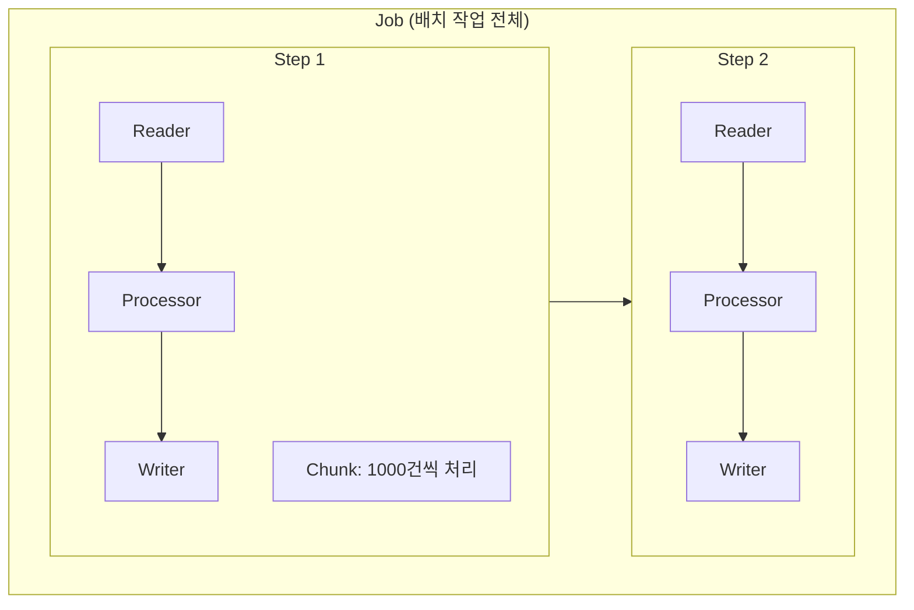
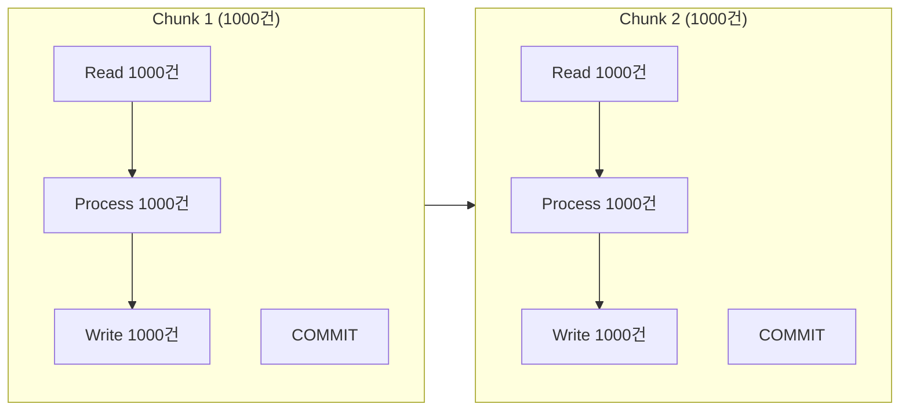
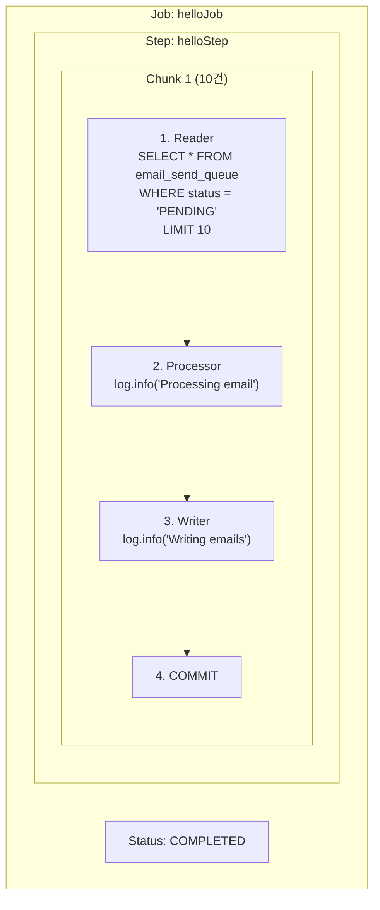

> 대용량 데이터를 효율적으로 처리하는 Spring Batch를 시작해보겠습니다.

---

## 시리즈 목차

- [Spring Batch Reader, Processor, Writer - (핵심 인터페이스 총정리)](/posts/spring-batch-components)
- **Spring Batch 개념과 환경 설정 - (Job, Step, Chunk 이해하기)** ← 현재 글
- [Spring Batch 이메일 발송 배치 - (실전 구현 예제)](/posts/spring-batch-email)
- [Spring Batch 성능 최적화 - (멀티스레드와 파티셔닝)](/posts/spring-batch-performance)

---

## 이 글에서 다룰 내용

- Spring Batch가 무엇이고 왜 필요한가?
- 핵심 개념 이해하기 (Job, Step, Chunk)
- Gradle 프로젝트 설정
- Hello World 배치 만들기

---

## Spring Batch가 필요한 순간

### 이런 상황을 겪어보셨나요?

```java
// 100만 건의 데이터를 처리하려고 했더니...
List<User> users = userRepository.findAll(); // OutOfMemoryError!

for (User user : users) {
    processUser(user);
}
```

위 코드의 문제점은 명확합니다.

- 메모리 부족 (모든 데이터를 한 번에 로딩)
- 느린 처리 속도 (단건 처리)
- 재시작 불가 (중간에 실패하면 처음부터)
- 모니터링 어려움 (진행률 확인 불가)

### Spring Batch가 해결해줍니다

| 문제 | Spring Batch 해결책 |
|------|---------------------|
| 메모리 부족 | Chunk 단위 처리로 메모리 효율적 |
| 느린 처리 속도 | Batch Update로 빠른 처리 |
| 재시작 불가 | 실패 지점부터 재개 지원 |
| 모니터링 어려움 | 메타데이터 자동 관리로 진행률 추적 |

---

## Spring Batch 핵심 개념

### 전체 구조 한눈에 보기



---

### 1. Job: 배치 작업의 최상위 개념

**Job**은 배치 작업 전체를 의미합니다.

```java
@Bean
public Job emailSendJob(Step emailSendStep) {
    return jobBuilderFactory.get("emailSendJob")
            .start(emailSendStep)
            .build();
}
```

> 쉽게 말해 회사의 "프로젝트" 같은 개념이라고 보시면 됩니다. 여러 Step(단계)으로 구성됩니다.
{: .prompt-tip }

---

### 2. Step: 실제 작업이 수행되는 단계

**Step**은 Job을 구성하는 독립적인 작업 단위입니다.

```java
@Bean
public Step emailSendStep() {
    return stepBuilderFactory.get("emailSendStep")
            .<Email, Email>chunk(1000)  // 1000건씩 처리
            .reader(emailReader())
            .processor(emailProcessor())
            .writer(emailWriter())
            .build();
}
```

> 프로젝트의 "태스크" 같은 개념입니다. Reader → Processor → Writer로 구성됩니다.
{: .prompt-tip }

---

### 3. Chunk: 데이터를 묶어서 처리하는 단위

**Chunk**는 한 번에 처리할 데이터의 개수입니다.



핵심 포인트를 정리하면 다음과 같습니다.

- Chunk 단위로 읽고, 처리하고, 쓰기
- Chunk 단위로 트랜잭션 커밋
- 실패 시 해당 Chunk만 롤백

---

### 4. Reader, Processor, Writer

#### Reader: 데이터 읽기

```java
@Bean
public ItemReader<Email> emailReader() {
    return new JpaPagingItemReaderBuilder<Email>()
            .name("emailReader")
            .entityManagerFactory(entityManagerFactory)
            .queryString("SELECT e FROM Email e WHERE e.status = 'PENDING'")
            .pageSize(1000)
            .build();
}
```

데이터베이스, 파일, API 등에서 데이터를 읽어오는 역할을 합니다.

---

#### Processor: 데이터 가공

```java
@Bean
public ItemProcessor<Email, Email> emailProcessor() {
    return email -> {
        // 이메일 발송 로직
        boolean success = emailService.send(
            email.getToEmail(),
            email.getSubject(),
            email.getContent()
        );

        // 상태 업데이트
        email.setStatus(success ? "SUCCESS" : "FAILED");
        email.setSentAt(LocalDateTime.now());

        return email;
    };
}
```

데이터 검증, 비즈니스 로직 수행, 데이터 변환 등을 담당합니다.

> `null`을 반환하면 해당 아이템은 skip됩니다!
{: .prompt-warning }

---

#### Writer: 데이터 저장

```java
@Bean
public ItemWriter<Email> emailWriter() {
    return new JpaItemWriterBuilder<Email>()
            .entityManagerFactory(entityManagerFactory)
            .build();
}
```

처리된 데이터를 데이터베이스, 파일 등에 저장합니다.

---

## 프로젝트 설정

### 1. Gradle 설정 (build.gradle)

```gradle
plugins {
    id 'java'
    id 'org.springframework.boot' version '3.2.2'
    id 'io.spring.dependency-management' version '1.1.4'
}

group = 'com.example'
version = '0.0.1-SNAPSHOT'

java {
    sourceCompatibility = '21'
}

configurations {
    compileOnly {
        extendsFrom annotationProcessor
    }
}

repositories {
    mavenCentral()
}

dependencies {
    // Spring Boot Starters
    implementation 'org.springframework.boot:spring-boot-starter-batch'
    implementation 'org.springframework.boot:spring-boot-starter-data-jpa'

    // Database
    runtimeOnly 'org.postgresql:postgresql'

    // Lombok
    compileOnly 'org.projectlombok:lombok'
    annotationProcessor 'org.projectlombok:lombok'

    // Test
    testImplementation 'org.springframework.boot:spring-boot-starter-test'
    testImplementation 'org.springframework.batch:spring-batch-test'
}

tasks.named('test') {
    useJUnitPlatform()
}
```

#### 핵심 의존성 설명

| 의존성 | 역할 |
|--------|------|
| `spring-boot-starter-batch` | Spring Batch 핵심 기능 |
| `spring-boot-starter-data-jpa` | JPA를 통한 DB 접근 |
| `postgresql` | PostgreSQL 드라이버 |
| `spring-batch-test` | 배치 테스트 지원 |

---

### 2. application.yml 설정

```yaml
spring:
  application:
    name: email-batch-service

  # DataSource 설정
  datasource:
    url: jdbc:postgresql://localhost:5432/batch_db
    username: postgres
    password: postgres
    driver-class-name: org.postgresql.Driver

    # HikariCP 커넥션 풀 설정
    hikari:
      maximum-pool-size: 10
      minimum-idle: 5
      connection-timeout: 30000
      idle-timeout: 600000
      max-lifetime: 1800000

  # JPA 설정
  jpa:
    database-platform: org.hibernate.dialect.PostgreSQLDialect
    hibernate:
      ddl-auto: update
    show-sql: true
    properties:
      hibernate:
        format_sql: true
        highlight_sql: true

  # Spring Batch 설정
  batch:
    jdbc:
      initialize-schema: always  # 배치 메타데이터 테이블 자동 생성
    job:
      enabled: false  # 자동 실행 방지 (수동으로 실행)

# 로깅 설정
logging:
  level:
    org.springframework.batch: INFO
    org.hibernate.SQL: DEBUG
    com.example: DEBUG
```

#### 설정 포인트

##### initialize-schema: always

```yaml
spring:
  batch:
    jdbc:
      initialize-schema: always
```

Spring Batch 메타데이터 테이블을 자동 생성합니다.

- `BATCH_JOB_INSTANCE`
- `BATCH_JOB_EXECUTION`
- `BATCH_STEP_EXECUTION`
- `BATCH_JOB_EXECUTION_CONTEXT`
- `BATCH_STEP_EXECUTION_CONTEXT`

| 옵션 | 설명 |
|------|------|
| `always` | 항상 생성 (개발 환경) |
| `never` | 생성 안 함 (운영 환경 - 수동 생성) |

---

##### job.enabled: false

```yaml
spring:
  batch:
    job:
      enabled: false
```

애플리케이션 시작 시 배치 자동 실행을 방지합니다. 배치는 스케줄러나 수동으로 실행하는 것이 일반적입니다.

---

### 3. 데이터베이스 테이블 생성

```sql
-- 이메일 발송 큐 테이블
CREATE TABLE email_send_queue (
    id BIGSERIAL PRIMARY KEY,
    to_email VARCHAR(255) NOT NULL,
    subject VARCHAR(500) NOT NULL,
    content TEXT NOT NULL,
    status VARCHAR(20) NOT NULL DEFAULT 'PENDING',
    sent_at TIMESTAMP,
    error_message TEXT,
    retry_count INT DEFAULT 0,
    created_at TIMESTAMP DEFAULT CURRENT_TIMESTAMP,
    updated_at TIMESTAMP DEFAULT CURRENT_TIMESTAMP
);

-- 인덱스 생성 (성능 최적화)
CREATE INDEX idx_email_status ON email_send_queue(status);
CREATE INDEX idx_email_created_at ON email_send_queue(created_at);

-- 샘플 데이터 입력
INSERT INTO email_send_queue (to_email, subject, content) VALUES
('user1@example.com', 'Welcome!', 'Welcome to our service'),
('user2@example.com', 'Newsletter', 'Check out our latest news'),
('user3@example.com', 'Promotion', 'Special discount for you'),
('invalid@test.com', 'Test', 'This will fail'),
('user5@example.com', 'Update', 'System update notification');
```

---

## Hello World 배치 만들기

간단한 로그 출력 배치를 만들어보겠습니다.

### 1단계: Entity 생성

```java
package com.example.batch.entity;

import jakarta.persistence.*;
import lombok.Getter;
import lombok.NoArgsConstructor;
import lombok.Setter;
import java.time.LocalDateTime;

@Entity
@Table(name = "email_send_queue")
@Getter
@Setter
@NoArgsConstructor
public class Email {

    @Id
    @GeneratedValue(strategy = GenerationType.IDENTITY)
    private Long id;

    @Column(name = "to_email", nullable = false)
    private String toEmail;

    @Column(nullable = false)
    private String subject;

    @Column(nullable = false, columnDefinition = "TEXT")
    private String content;

    @Column(nullable = false, length = 20)
    private String status = "PENDING";

    @Column(name = "sent_at")
    private LocalDateTime sentAt;

    @Column(name = "error_message", columnDefinition = "TEXT")
    private String errorMessage;

    @Column(name = "retry_count")
    private Integer retryCount = 0;

    @Column(name = "created_at")
    private LocalDateTime createdAt = LocalDateTime.now();

    @Column(name = "updated_at")
    private LocalDateTime updatedAt = LocalDateTime.now();
}
```

---

### 2단계: 간단한 배치 Configuration

```java
package com.example.batch.job;

import com.example.batch.entity.Email;
import lombok.RequiredArgsConstructor;
import lombok.extern.slf4j.Slf4j;
import org.springframework.batch.core.Job;
import org.springframework.batch.core.Step;
import org.springframework.batch.core.job.builder.JobBuilder;
import org.springframework.batch.core.repository.JobRepository;
import org.springframework.batch.core.step.builder.StepBuilder;
import org.springframework.batch.item.ItemProcessor;
import org.springframework.batch.item.ItemReader;
import org.springframework.batch.item.ItemWriter;
import org.springframework.batch.item.database.builder.JpaPagingItemReaderBuilder;
import org.springframework.context.annotation.Bean;
import org.springframework.context.annotation.Configuration;
import org.springframework.transaction.PlatformTransactionManager;

import jakarta.persistence.EntityManagerFactory;

@Slf4j
@Configuration
@RequiredArgsConstructor
public class HelloBatchConfiguration {

    private final JobRepository jobRepository;
    private final PlatformTransactionManager transactionManager;
    private final EntityManagerFactory entityManagerFactory;

    /**
     * Job 정의
     */
    @Bean
    public Job helloJob() {
        return new JobBuilder("helloJob", jobRepository)
                .start(helloStep())
                .build();
    }

    /**
     * Step 정의
     */
    @Bean
    public Step helloStep() {
        return new StepBuilder("helloStep", jobRepository)
                .<Email, Email>chunk(10, transactionManager)  // 10건씩 처리
                .reader(helloReader())
                .processor(helloProcessor())
                .writer(helloWriter())
                .build();
    }

    /**
     * Reader: PENDING 상태의 이메일 조회
     */
    @Bean
    public ItemReader<Email> helloReader() {
        return new JpaPagingItemReaderBuilder<Email>()
                .name("helloReader")
                .entityManagerFactory(entityManagerFactory)
                .queryString("SELECT e FROM Email e WHERE e.status = 'PENDING' ORDER BY e.id")
                .pageSize(10)
                .build();
    }

    /**
     * Processor: 로그만 출력
     */
    @Bean
    public ItemProcessor<Email, Email> helloProcessor() {
        return email -> {
            log.info("Processing email: {} -> {}", email.getId(), email.getToEmail());
            return email;
        };
    }

    /**
     * Writer: 로그만 출력
     */
    @Bean
    public ItemWriter<Email> helloWriter() {
        return items -> {
            log.info("Writing {} emails", items.size());
            for (Email email : items) {
                log.info("  - {}: {}", email.getId(), email.getSubject());
            }
        };
    }
}
```

---

### 3단계: 배치 실행 Controller

개발 환경에서 테스트하기 위한 간단한 Controller입니다.

```java
package com.example.batch.controller;

import lombok.RequiredArgsConstructor;
import lombok.extern.slf4j.Slf4j;
import org.springframework.batch.core.Job;
import org.springframework.batch.core.JobParameters;
import org.springframework.batch.core.JobParametersBuilder;
import org.springframework.batch.core.launch.JobLauncher;
import org.springframework.web.bind.annotation.PostMapping;
import org.springframework.web.bind.annotation.RequestMapping;
import org.springframework.web.bind.annotation.RestController;

@Slf4j
@RestController
@RequestMapping("/api/batch")
@RequiredArgsConstructor
public class BatchController {

    private final JobLauncher jobLauncher;
    private final Job helloJob;

    @PostMapping("/hello")
    public String runHelloBatch() {
        try {
            // Job Parameter에 timestamp를 넣어서 매번 새로운 Job으로 인식
            JobParameters jobParameters = new JobParametersBuilder()
                    .addLong("timestamp", System.currentTimeMillis())
                    .toJobParameters();

            jobLauncher.run(helloJob, jobParameters);

            return "Hello Batch 실행 완료!";

        } catch (Exception e) {
            log.error("Batch execution failed", e);
            return "배치 실행 실패: " + e.getMessage();
        }
    }
}
```

---

### 4단계: 실행 및 확인

#### 1. 애플리케이션 시작

```bash
./gradlew bootRun
```

#### 2. 배치 실행

```bash
curl -X POST http://localhost:8080/api/batch/hello
```

#### 3. 로그 확인

```text
2026-01-22 15:30:00.123  INFO --- Job: [SimpleJob: [name=helloJob]] launched
2026-01-22 15:30:00.234  INFO --- Executing step: [helloStep]
2026-01-22 15:30:00.345  INFO --- Processing email: 1 -> user1@example.com
2026-01-22 15:30:00.346  INFO --- Processing email: 2 -> user2@example.com
2026-01-22 15:30:00.347  INFO --- Processing email: 3 -> user3@example.com
2026-01-22 15:30:00.456  INFO --- Writing 3 emails
2026-01-22 15:30:00.457  INFO ---   - 1: Welcome!
2026-01-22 15:30:00.458  INFO ---   - 2: Newsletter
2026-01-22 15:30:00.459  INFO ---   - 3: Promotion
2026-01-22 15:30:00.567  INFO --- Job: [SimpleJob: [name=helloJob]] completed with status: [COMPLETED]
```

#### 4. 메타데이터 확인

```sql
-- Job 실행 이력
SELECT * FROM batch_job_execution ORDER BY job_execution_id DESC LIMIT 1;

-- Step 실행 상세
SELECT * FROM batch_step_execution ORDER BY step_execution_id DESC LIMIT 1;
```

---

## 처리 흐름 시각화

### Hello Batch 전체 흐름



---

## 핵심 개념 정리

### Job vs Step vs Chunk

```text
Job (배치 작업)
 │
 ├─ Step 1
 │   ├─ Chunk 1 (1~10건)    → Reader → Processor → Writer → COMMIT
 │   ├─ Chunk 2 (11~20건)   → Reader → Processor → Writer → COMMIT
 │   └─ Chunk 3 (21~30건)   → Reader → Processor → Writer → COMMIT
 │
 ├─ Step 2
 │   └─ Chunk 1 (1~10건)    → Reader → Processor → Writer → COMMIT
 │
 └─ Step 3
     └─ ...
```

### Reader → Processor → Writer 흐름

| 컴포넌트 | 처리 단위 | 역할 |
|----------|-----------|------|
| Reader | 1건씩 읽기 | DB에서 데이터 조회 |
| Processor | 1건씩 처리 | 비즈니스 로직 수행 |
| Writer | Chunk씩 쓰기 | DB에 결과 저장 |

> Reader/Processor는 **1건씩**, Writer는 **Chunk 단위**로 처리한다는 점이 핵심입니다.
{: .prompt-info }

---

## 다음 편 예고

2편에서는 실제 이메일 발송 배치를 구현합니다.

다룰 내용은 다음과 같습니다.

- 실제 이메일 발송 로직 구현
- 발송 성공/실패 처리
- 발송 결과 DB 업데이트
- Chunk 크기 최적화
- 에러 처리 (Skip, Retry)
- 트랜잭션 관리

### 미리보기 코드

```java
// 2편에서 만들 실제 Processor
@Bean
public ItemProcessor<Email, Email> emailProcessor() {
    return email -> {
        try {
            // 실제 이메일 발송
            boolean success = emailService.send(
                email.getToEmail(),
                email.getSubject(),
                email.getContent()
            );

            email.setStatus(success ? "SUCCESS" : "FAILED");
            email.setSentAt(LocalDateTime.now());

            return email;

        } catch (Exception e) {
            email.setStatus("FAILED");
            email.setErrorMessage(e.getMessage());
            throw e;  // Skip 또는 Retry
        }
    };
}
```

---

## 핵심 요약

### Spring Batch를 사용하는 이유

| 이점 | 설명 |
|------|------|
| 대용량 처리 | 메모리 효율적인 Chunk 단위 처리 |
| 트랜잭션 관리 | Chunk 단위 커밋으로 안정성 확보 |
| 재시작 지원 | 실패 지점부터 재개 가능 |
| 모니터링 | 메타데이터 자동 기록 |

### Gradle 의존성

```gradle
implementation 'org.springframework.boot:spring-boot-starter-batch'
implementation 'org.springframework.boot:spring-boot-starter-data-jpa'
runtimeOnly 'org.postgresql:postgresql'
```

### 기본 Configuration

```java
@Bean
public Job myJob() {
    return new JobBuilder("myJob", jobRepository)
            .start(myStep())
            .build();
}

@Bean
public Step myStep() {
    return new StepBuilder("myStep", jobRepository)
            .<Input, Output>chunk(1000, transactionManager)
            .reader(reader())
            .processor(processor())
            .writer(writer())
            .build();
}
```

---

## 참고 자료

- [Spring Batch 공식 문서](https://docs.spring.io/spring-batch/docs/current/reference/html/)
- [Spring Boot Batch 가이드](https://spring.io/guides/gs/batch-processing/)
- [Baeldung Spring Batch 튜토리얼](https://www.baeldung.com/spring-batch-intro)

---

## 마치며

1편에서는 Spring Batch의 기본 개념과 Hello World 배치를 만들어봤습니다.

다음 편에서는 실제 이메일 발송 로직 구현, 성공/실패 처리, 에러 핸들링, 트랜잭션 관리를 다루겠습니다.

> 초기 설계가 탄탄해야 서비스도 견고해지고 높게 지을 수 있다고 생각하기 때문에
> 배치 처리의 기본기를 꼭 다지고 가시길 바랍니다.
{: .prompt-tip }
