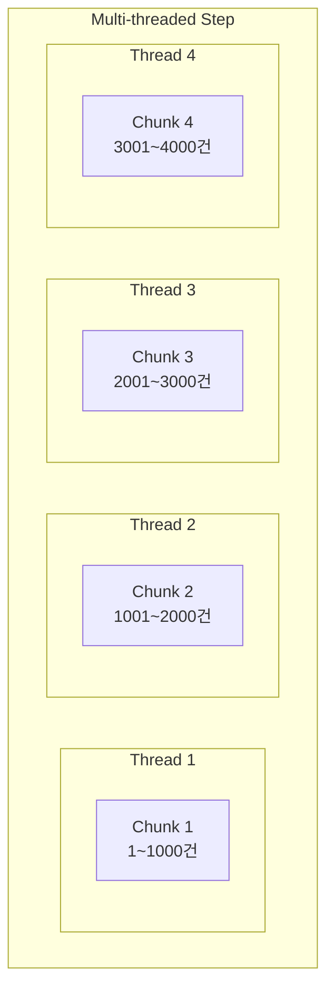
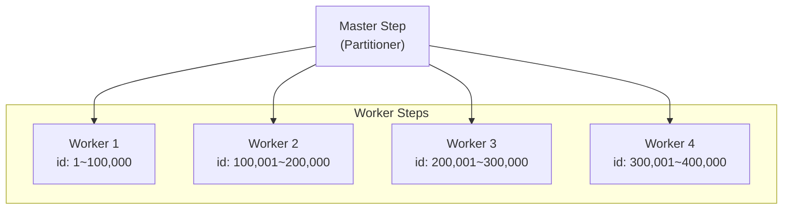
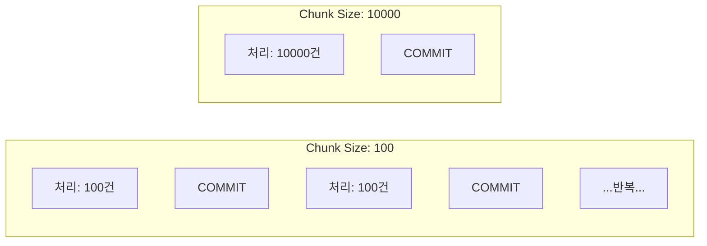

지금까지 Spring Batch의 개념과 실전 구현을 살펴보았습니다.
이번 글에서는 **대용량 데이터를 효율적으로 처리하기 위한 성능 최적화 전략**과 **실제 운영 환경에서 필요한 노하우**를 정리해보겠습니다.

---

## 시리즈 목차

- [Spring Batch Reader, Processor, Writer - (핵심 인터페이스 총정리)](/posts/spring-batch-components)
- [Spring Batch 개념과 환경 설정 - (Job, Step, Chunk 이해하기)](/posts/spring-batch-intro)
- [Spring Batch 이메일 발송 배치 - (실전 구현 예제)](/posts/spring-batch-email)
- **Spring Batch 성능 최적화 - (멀티스레드와 파티셔닝)** ← 현재 글

---

## 이 글에서 다룰 내용

이번 글에서는 다음 내용을 다루겠습니다.

- 멀티스레드 처리 (Multi-threaded Step)
- Partitioning 전략
- Chunk 크기 최적화
- DB 쿼리 최적화
- 스케줄링 전략
- 운영 환경 배포
- 모니터링 및 알림

---

## 성능 최적화가 필요한 순간

### 현재 상황 진단

먼저 현재 상황을 진단해보겠습니다.

```
처리 대상: 1,000,000건
Chunk Size: 1,000건
1 Chunk 처리 시간: 10초
예상 총 소요 시간: 10,000초 = 약 2.7시간
```

단일 스레드로는 대용량 처리에 한계가 있습니다.
이런 경우 최적화 전략을 적용하면 처리 시간을 크게 단축할 수 있습니다.

### 최적화 목표

| 최적화 전략 | 예상 효과 |
|-------------|-----------|
| Multi-threaded Step | 2~4배 향상 |
| Partitioning | 5~10배 향상 |
| DB 쿼리 최적화 | 1.5~2배 향상 |
| Chunk 크기 튜닝 | 1.2~1.5배 향상 |

---

## 1. Multi-threaded Step

### 개념

Multi-threaded Step은 여러 스레드가 동시에 Chunk를 처리하는 방식입니다.
구현이 간단하면서도 효과적인 성능 향상을 기대할 수 있습니다.



### 구현

`taskExecutor()`와 `throttleLimit()`을 설정하면 멀티스레드로 동작합니다.

```java
@Configuration
@RequiredArgsConstructor
public class MultiThreadedJobConfiguration {

    private final JobRepository jobRepository;
    private final PlatformTransactionManager transactionManager;

    @Bean
    public Step multiThreadedEmailSendStep(
            ItemReader<Email> emailItemReader,
            ItemProcessor<Email, Email> emailItemProcessor,
            ItemWriter<Email> emailItemWriter
    ) {
        return new StepBuilder("multiThreadedEmailSendStep", jobRepository)
                .<Email, Email>chunk(1000, transactionManager)
                .reader(emailItemReader)
                .processor(emailItemProcessor)
                .writer(emailItemWriter)
                .taskExecutor(taskExecutor())  // 멀티스레드 설정
                .throttleLimit(4)  // 동시 실행 스레드 수
                .build();
    }

    @Bean
    public TaskExecutor taskExecutor() {
        ThreadPoolTaskExecutor executor = new ThreadPoolTaskExecutor();
        executor.setCorePoolSize(4);
        executor.setMaxPoolSize(8);
        executor.setQueueCapacity(100);
        executor.setThreadNamePrefix("batch-thread-");
        executor.initialize();
        return executor;
    }
}
```

### 주의사항

> Multi-threaded Step 사용 시 Reader는 **Thread-safe**해야 합니다!
{: .prompt-warning }

여러 스레드가 동시에 Reader에 접근하기 때문에, 동시성 문제가 발생할 수 있습니다.
`saveState(false)` 설정으로 상태 저장을 비활성화하는 것이 필수입니다.

#### Thread-safe Reader 만들기

```java
@Bean
@StepScope
public JpaPagingItemReader<Email> threadSafeEmailReader() {
    JpaPagingItemReader<Email> reader = new JpaPagingItemReaderBuilder<Email>()
            .name("threadSafeEmailReader")
            .entityManagerFactory(entityManagerFactory)
            .queryString("SELECT e FROM Email e WHERE e.status = :status ORDER BY e.id ASC")
            .parameterValues(Map.of("status", EmailStatus.PENDING))
            .pageSize(1000)
            .saveState(false)  // 상태 저장 비활성화 (멀티스레드에서 필수)
            .build();

    return reader;
}
```

---

## 2. Partitioning

### 개념

Partitioning은 데이터를 여러 파티션으로 나눠서 병렬 처리하는 방식입니다.
Multi-threaded Step보다 복잡하지만, 대용량 데이터 처리에서 더 높은 성능을 기대할 수 있습니다.



### Partitioner 구현

Partitioner는 전체 데이터를 어떻게 나눌지 결정합니다.
아래 예제에서는 ID 범위를 기준으로 파티션을 나누고 있습니다.

```java
package com.example.batch.job.partitioner;

import lombok.RequiredArgsConstructor;
import org.springframework.batch.core.partition.support.Partitioner;
import org.springframework.batch.item.ExecutionContext;
import org.springframework.jdbc.core.JdbcTemplate;
import org.springframework.stereotype.Component;

import java.util.HashMap;
import java.util.Map;

/**
 * 이메일 ID 범위 기반 Partitioner
 */
@Component
@RequiredArgsConstructor
public class EmailIdRangePartitioner implements Partitioner {

    private final JdbcTemplate jdbcTemplate;

    @Override
    public Map<String, ExecutionContext> partition(int gridSize) {
        // 1. 전체 데이터 범위 조회
        Long minId = jdbcTemplate.queryForObject(
            "SELECT MIN(id) FROM email_send_queue WHERE status = 'PENDING'",
            Long.class
        );
        Long maxId = jdbcTemplate.queryForObject(
            "SELECT MAX(id) FROM email_send_queue WHERE status = 'PENDING'",
            Long.class
        );

        if (minId == null || maxId == null) {
            return new HashMap<>();
        }

        // 2. 파티션 크기 계산
        long targetSize = (maxId - minId) / gridSize + 1;

        // 3. 파티션별 ExecutionContext 생성
        Map<String, ExecutionContext> result = new HashMap<>();

        long start = minId;
        long end = start + targetSize - 1;

        for (int i = 0; i < gridSize; i++) {
            ExecutionContext context = new ExecutionContext();
            context.putLong("minId", start);
            context.putLong("maxId", Math.min(end, maxId));
            context.putString("partitionName", "partition" + i);

            result.put("partition" + i, context);

            start = end + 1;
            end = start + targetSize - 1;
        }

        return result;
    }
}
```

### Partitioned Job 설정

Master Step이 파티션을 분배하고, Worker Step이 실제 처리를 담당합니다.

```java
@Configuration
@RequiredArgsConstructor
public class PartitionedJobConfiguration {

    private final JobRepository jobRepository;
    private final PlatformTransactionManager transactionManager;
    private final EntityManagerFactory entityManagerFactory;
    private final EmailIdRangePartitioner partitioner;

    @Bean
    public Job partitionedEmailSendJob() {
        return new JobBuilder("partitionedEmailSendJob", jobRepository)
                .start(masterStep())
                .build();
    }

    /**
     * Master Step - 파티션 분배
     */
    @Bean
    public Step masterStep() {
        return new StepBuilder("masterStep", jobRepository)
                .partitioner("workerStep", partitioner)
                .step(workerStep())
                .gridSize(4)  // 4개 파티션
                .taskExecutor(taskExecutor())
                .build();
    }

    /**
     * Worker Step - 실제 처리
     */
    @Bean
    public Step workerStep() {
        return new StepBuilder("workerStep", jobRepository)
                .<Email, Email>chunk(1000, transactionManager)
                .reader(partitionedEmailReader(null, null))
                .processor(emailProcessor())
                .writer(emailWriter())
                .build();
    }

    /**
     * 파티션별 Reader - StepScope로 파티션 파라미터 주입
     */
    @Bean
    @StepScope
    public JpaPagingItemReader<Email> partitionedEmailReader(
            @Value("#{stepExecutionContext['minId']}") Long minId,
            @Value("#{stepExecutionContext['maxId']}") Long maxId
    ) {
        return new JpaPagingItemReaderBuilder<Email>()
                .name("partitionedEmailReader")
                .entityManagerFactory(entityManagerFactory)
                .queryString("""
                    SELECT e FROM Email e
                    WHERE e.status = 'PENDING'
                    AND e.id BETWEEN :minId AND :maxId
                    ORDER BY e.id ASC
                """)
                .parameterValues(Map.of("minId", minId, "maxId", maxId))
                .pageSize(1000)
                .build();
    }

    @Bean
    public TaskExecutor taskExecutor() {
        ThreadPoolTaskExecutor executor = new ThreadPoolTaskExecutor();
        executor.setCorePoolSize(4);
        executor.setMaxPoolSize(8);
        executor.setQueueCapacity(100);
        executor.setThreadNamePrefix("partition-");
        executor.initialize();
        return executor;
    }
}
```

### Multi-threaded vs Partitioning

두 방식의 차이점을 정리하면 다음과 같습니다.

| 특성 | Multi-threaded Step | Partitioning |
|------|---------------------|--------------|
| **복잡도** | 낮음 | 높음 |
| **확장성** | 중간 | 높음 |
| **Reader 요구사항** | Thread-safe 필요 | 일반 Reader 사용 가능 |
| **데이터 분배** | 자동 (순서대로) | 수동 (Partitioner) |
| **재시작** | 어려움 | 파티션별 재시작 가능 |
| **추천 사용 시기** | 간단한 병렬 처리 | 대용량 데이터 처리 |

> 처음에는 Multi-threaded Step으로 시작하고, 필요에 따라 Partitioning으로 전환하는 것을 권장합니다.
{: .prompt-tip }

---

## 3. Chunk 크기 최적화

### Chunk 크기가 성능에 미치는 영향

Chunk 크기는 한 번의 트랜잭션에서 처리할 데이터 건수를 결정합니다.



| Chunk Size | 장점 | 단점 |
|------------|------|------|
| **작은 크기 (100)** | 메모리 효율적, 빠른 롤백 | 커밋 오버헤드 많음 |
| **큰 크기 (10000)** | 커밋 오버헤드 적음 | 메모리 사용 증가, 롤백 시 손실 큼 |

### 최적 Chunk 크기 찾기

일반적으로 **1000**을 시작점으로 두고 조정하는 것을 권장합니다.

```java
@Configuration
public class ChunkSizeConfig {

    // 일반적인 권장 범위: 100 ~ 5000
    // 시작점: 1000으로 시작해서 조정

    @Value("${batch.chunk-size:1000}")
    private int chunkSize;

    @Bean
    public Step optimizedStep(...) {
        return new StepBuilder("optimizedStep", jobRepository)
                .<Email, Email>chunk(chunkSize, transactionManager)
                .reader(reader)
                .processor(processor)
                .writer(writer)
                .build();
    }
}
```

### Chunk 크기 벤치마크 테스트

최적의 Chunk 크기는 데이터 특성에 따라 다르므로, 벤치마크 테스트를 통해 찾는 것이 좋습니다.

```java
@SpringBootTest
@ActiveProfiles("test")
class ChunkSizeBenchmarkTest {

    @Autowired
    private JobLauncher jobLauncher;

    @ParameterizedTest
    @ValueSource(ints = {100, 500, 1000, 2000, 5000})
    void chunkSizeBenchmark(int chunkSize) throws Exception {
        // Given
        prepareTestData(100000);  // 10만건 테스트 데이터

        // When
        long startTime = System.currentTimeMillis();

        JobParameters params = new JobParametersBuilder()
                .addLong("timestamp", System.currentTimeMillis())
                .addLong("chunkSize", (long) chunkSize)
                .toJobParameters();

        jobLauncher.run(emailSendJob, params);

        long elapsed = System.currentTimeMillis() - startTime;

        // Then
        System.out.printf("Chunk Size: %d, Time: %dms%n", chunkSize, elapsed);
    }
}
```

테스트 결과 예시입니다.

```
Chunk Size: 100,  Time: 45000ms
Chunk Size: 500,  Time: 32000ms
Chunk Size: 1000, Time: 28000ms  ← 최적
Chunk Size: 2000, Time: 30000ms
Chunk Size: 5000, Time: 35000ms
```

---

## 4. DB 쿼리 최적화

### 인덱스 설계

배치 처리에서는 인덱스 설계가 성능에 큰 영향을 미칩니다.

```sql
-- 필수 인덱스
CREATE INDEX idx_email_status ON email_send_queue(status);
CREATE INDEX idx_email_status_id ON email_send_queue(status, id);

-- 복합 인덱스 (자주 사용하는 조건)
CREATE INDEX idx_email_status_created ON email_send_queue(status, created_at);
```

### Batch Update 최적화

#### Hibernate 설정

Hibernate에서 Batch Insert/Update를 활성화하면 DB 호출 횟수를 줄일 수 있습니다.

```yaml
spring:
  jpa:
    properties:
      hibernate:
        jdbc:
          batch_size: 100  # Batch Insert/Update 크기
        order_inserts: true
        order_updates: true
        batch_versioned_data: true
```

#### Native Query 사용

대량 상태 변경이 필요한 경우, Native Query를 사용하면 더 효율적입니다.

```java
@Repository
public interface EmailRepository extends JpaRepository<Email, Long> {

    /**
     * Batch Update - 대량 상태 변경
     */
    @Modifying
    @Query("""
        UPDATE Email e
        SET e.status = :newStatus, e.updatedAt = :now
        WHERE e.id IN :ids
    """)
    int updateStatusByIds(
        @Param("ids") List<Long> ids,
        @Param("newStatus") EmailStatus newStatus,
        @Param("now") LocalDateTime now
    );
}
```

### Reader 쿼리 최적화

#### 커서 기반 Reader (대용량 처리에 적합)

Paging 방식보다 Cursor 방식이 대용량 데이터 처리에 더 효율적입니다.

```java
@Bean
public JdbcCursorItemReader<Email> cursorEmailReader() {
    return new JdbcCursorItemReaderBuilder<Email>()
            .name("cursorEmailReader")
            .dataSource(dataSource)
            .sql("""
                SELECT id, to_email, subject, content, status,
                       sent_at, error_message, retry_count,
                       created_at, updated_at
                FROM email_send_queue
                WHERE status = 'PENDING'
                ORDER BY id
            """)
            .rowMapper(new BeanPropertyRowMapper<>(Email.class))
            .fetchSize(1000)  // 커서 fetch 크기
            .build();
}
```

---

## 5. 스케줄링

### Spring Scheduler 사용

가장 간단한 스케줄링 방법은 Spring의 `@Scheduled` 어노테이션을 사용하는 것입니다.

```java
@Configuration
@EnableScheduling
public class BatchScheduleConfig {

    private final JobLauncher jobLauncher;
    private final Job emailSendJob;

    public BatchScheduleConfig(JobLauncher jobLauncher, Job emailSendJob) {
        this.jobLauncher = jobLauncher;
        this.emailSendJob = emailSendJob;
    }

    /**
     * 매일 오전 6시에 실행
     */
    @Scheduled(cron = "0 0 6 * * *")
    public void runEmailSendJob() {
        try {
            JobParameters params = new JobParametersBuilder()
                    .addLong("timestamp", System.currentTimeMillis())
                    .toJobParameters();

            jobLauncher.run(emailSendJob, params);

        } catch (Exception e) {
            log.error("Scheduled batch job failed", e);
            // 알림 전송
        }
    }

    /**
     * 5분마다 실행 (재시도 배치)
     */
    @Scheduled(fixedRate = 300000)  // 5분 = 300,000ms
    public void runRetryJob() {
        // 재시도 배치 로직
    }
}
```

### Quartz Scheduler (복잡한 스케줄링)

더 복잡한 스케줄링이 필요한 경우 Quartz를 사용할 수 있습니다.

```java
@Configuration
public class QuartzConfig {

    @Bean
    public JobDetail emailSendJobDetail() {
        return JobBuilder.newJob(QuartzEmailSendJob.class)
                .withIdentity("emailSendJob")
                .storeDurably()
                .build();
    }

    @Bean
    public Trigger emailSendTrigger() {
        return TriggerBuilder.newTrigger()
                .forJob(emailSendJobDetail())
                .withIdentity("emailSendTrigger")
                .withSchedule(CronScheduleBuilder.cronSchedule("0 0 6 * * ?"))
                .build();
    }
}

public class QuartzEmailSendJob extends QuartzJobBean {

    @Autowired
    private JobLauncher jobLauncher;

    @Autowired
    private Job emailSendJob;

    @Override
    protected void executeInternal(JobExecutionContext context) {
        try {
            JobParameters params = new JobParametersBuilder()
                    .addLong("timestamp", System.currentTimeMillis())
                    .toJobParameters();

            jobLauncher.run(emailSendJob, params);

        } catch (Exception e) {
            throw new JobExecutionException(e);
        }
    }
}
```

---

## 6. 운영 환경 배포

### Profile 분리

로컬 환경과 운영 환경의 설정을 분리하는 것이 중요합니다.

```yaml
# application.yml (공통)
spring:
  profiles:
    active: ${SPRING_PROFILES_ACTIVE:local}

---
# application-local.yml
spring:
  config:
    activate:
      on-profile: local
  batch:
    jdbc:
      initialize-schema: always
    job:
      enabled: false

batch:
  chunk-size: 100
  thread-count: 2

---
# application-prod.yml
spring:
  config:
    activate:
      on-profile: prod
  batch:
    jdbc:
      initialize-schema: never  # 운영에서는 수동 관리
    job:
      enabled: false

batch:
  chunk-size: 1000
  thread-count: 8
```

### Docker 배포

#### Dockerfile

```dockerfile
FROM eclipse-temurin:21-jre-alpine

WORKDIR /app

# JAR 복사
COPY build/libs/email-batch-*.jar app.jar

# 환경 변수
ENV JAVA_OPTS="-Xms512m -Xmx2g -XX:+UseG1GC"
ENV SPRING_PROFILES_ACTIVE=prod

# 실행
ENTRYPOINT ["sh", "-c", "java $JAVA_OPTS -jar app.jar"]
```

#### docker-compose.yml

```yaml
version: '3.8'

services:
  email-batch:
    build: .
    environment:
      - SPRING_PROFILES_ACTIVE=prod
      - SPRING_DATASOURCE_URL=jdbc:postgresql://db:5432/batch_db
      - SPRING_DATASOURCE_USERNAME=postgres
      - SPRING_DATASOURCE_PASSWORD=postgres
      - JAVA_OPTS=-Xms512m -Xmx2g
    depends_on:
      - db
    networks:
      - batch-network

  db:
    image: postgres:15-alpine
    environment:
      - POSTGRES_DB=batch_db
      - POSTGRES_USER=postgres
      - POSTGRES_PASSWORD=postgres
    volumes:
      - postgres-data:/var/lib/postgresql/data
    networks:
      - batch-network

volumes:
  postgres-data:

networks:
  batch-network:
```

### Kubernetes 배포

Kubernetes에서는 CronJob을 사용하여 배치를 스케줄링할 수 있습니다.

#### CronJob 설정

```yaml
apiVersion: batch/v1
kind: CronJob
metadata:
  name: email-send-batch
spec:
  schedule: "0 6 * * *"  # 매일 오전 6시
  concurrencyPolicy: Forbid  # 중복 실행 방지
  successfulJobsHistoryLimit: 3
  failedJobsHistoryLimit: 3
  jobTemplate:
    spec:
      backoffLimit: 3
      template:
        spec:
          containers:
          - name: email-batch
            image: email-batch:latest
            resources:
              requests:
                memory: "512Mi"
                cpu: "500m"
              limits:
                memory: "2Gi"
                cpu: "2000m"
            env:
            - name: SPRING_PROFILES_ACTIVE
              value: "prod"
            - name: SPRING_DATASOURCE_URL
              valueFrom:
                secretKeyRef:
                  name: db-secret
                  key: url
          restartPolicy: OnFailure
```

---

## 7. 모니터링 및 알림

### Spring Boot Actuator

Actuator를 활성화하면 배치 상태를 모니터링할 수 있습니다.

```yaml
management:
  endpoints:
    web:
      exposure:
        include: health,info,metrics,batch
  endpoint:
    health:
      show-details: always
```

### 커스텀 메트릭

Micrometer를 사용하여 배치 처리 현황을 메트릭으로 수집할 수 있습니다.

```java
@Component
@RequiredArgsConstructor
public class BatchMetrics {

    private final MeterRegistry meterRegistry;

    private Counter successCounter;
    private Counter failCounter;
    private Timer processTimer;

    @PostConstruct
    public void init() {
        successCounter = Counter.builder("batch.email.success")
                .description("Success email count")
                .register(meterRegistry);

        failCounter = Counter.builder("batch.email.fail")
                .description("Failed email count")
                .register(meterRegistry);

        processTimer = Timer.builder("batch.email.process.time")
                .description("Email processing time")
                .register(meterRegistry);
    }

    public void recordSuccess() {
        successCounter.increment();
    }

    public void recordFail() {
        failCounter.increment();
    }

    public Timer.Sample startTimer() {
        return Timer.start(meterRegistry);
    }

    public void stopTimer(Timer.Sample sample) {
        sample.stop(processTimer);
    }
}
```

### Slack 알림

배치 실행 결과를 Slack으로 알림 받으면 장애 대응이 빨라집니다.

```java
@Component
@RequiredArgsConstructor
@Slf4j
public class SlackNotificationListener implements JobExecutionListener {

    private final SlackClient slackClient;

    @Override
    public void afterJob(JobExecution jobExecution) {
        String status = jobExecution.getStatus().toString();
        String jobName = jobExecution.getJobInstance().getJobName();

        if (jobExecution.getStatus().isUnsuccessful()) {
            // 실패 알림
            slackClient.send(SlackMessage.builder()
                    .channel("#batch-alerts")
                    .color("danger")
                    .title("Batch Job Failed")
                    .text(String.format(
                        "Job: %s\nStatus: %s\nTime: %s",
                        jobName, status, LocalDateTime.now()
                    ))
                    .build());
        } else {
            // 성공 알림 (요약)
            var stepExecution = jobExecution.getStepExecutions().iterator().next();
            slackClient.send(SlackMessage.builder()
                    .channel("#batch-logs")
                    .color("good")
                    .title("Batch Job Completed")
                    .text(String.format(
                        "Job: %s\nRead: %d\nWrite: %d\nSkip: %d",
                        jobName,
                        stepExecution.getReadCount(),
                        stepExecution.getWriteCount(),
                        stepExecution.getSkipCount()
                    ))
                    .build());
        }
    }
}
```

---

## 성능 최적화 체크리스트

운영 환경에서 배치를 실행할 때 확인해야 할 항목들을 정리했습니다.

### 배치 실행 전

- [ ] 인덱스 확인 (status, id 복합 인덱스)
- [ ] Chunk 크기 설정 검토
- [ ] 커넥션 풀 설정 확인
- [ ] 메모리 설정 확인 (Xms, Xmx)

### 배치 실행 중

- [ ] CPU/메모리 사용량 모니터링
- [ ] DB 커넥션 모니터링
- [ ] 로그 레벨 적절히 설정

### 배치 실행 후

- [ ] 처리 건수 확인
- [ ] Skip/Fail 건수 확인
- [ ] 소요 시간 분석
- [ ] 병목 구간 파악

---

## 핵심 요약

### 성능 최적화 전략

| 전략 | 효과 | 복잡도 |
|------|------|--------|
| Multi-threaded Step | 2~4배 | 낮음 |
| Partitioning | 5~10배 | 높음 |
| Chunk 크기 튜닝 | 1.2~1.5배 | 낮음 |
| DB 쿼리 최적화 | 1.5~2배 | 중간 |

### 운영 포인트

| 항목 | 권장 사항 |
|------|-----------|
| **스케줄링** | Kubernetes CronJob 또는 Spring Scheduler |
| **모니터링** | Actuator + Prometheus + Grafana |
| **알림** | Slack 연동 (실패 시 즉시 알림) |
| **로깅** | 구조화된 로그 (JSON 포맷) |

### Chunk 크기 가이드

| 데이터 크기 | 권장 Chunk Size |
|-------------|-----------------|
| ~ 10,000건 | 100 ~ 500 |
| 10,000 ~ 100,000건 | 500 ~ 1,000 |
| 100,000건 ~ | 1,000 ~ 5,000 |

---

## 참고 자료

- [Spring Batch 공식 문서 - Scaling and Parallel Processing](https://docs.spring.io/spring-batch/docs/current/reference/html/scalability.html)
- [Spring Batch Performance Tuning](https://docs.spring.io/spring-batch/docs/current/reference/html/spring-batch-integration.html)
- [Baeldung - Spring Batch Partitioner](https://www.baeldung.com/spring-batch-partitioner)

---

## 시리즈 마무리

3편에 걸쳐 Spring Batch의 기초부터 성능 최적화까지 살펴보았습니다.

### 시리즈 요약

| 편 | 주제 | 핵심 내용 |
|----|------|-----------|
| 1편 | 개념과 환경 설정 | Job, Step, Chunk 개념 |
| 2편 | 실전 배치 구현 | Reader, Processor, Writer |
| 3편 | 성능 최적화 | Multi-thread, Partitioning |

### 다음 학습 추천

- Spring Batch Admin (모니터링 UI)
- Spring Cloud Data Flow (마이크로서비스 배치)
- Apache Kafka + Spring Batch (이벤트 기반 배치)

궁금한 점이나 피드백은 댓글로 남겨주세요!
