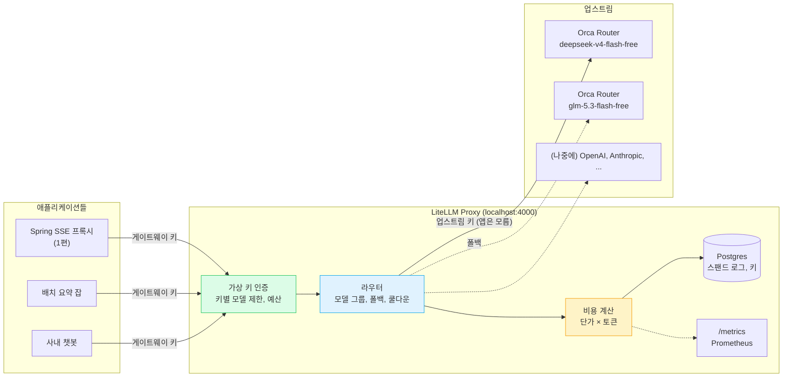
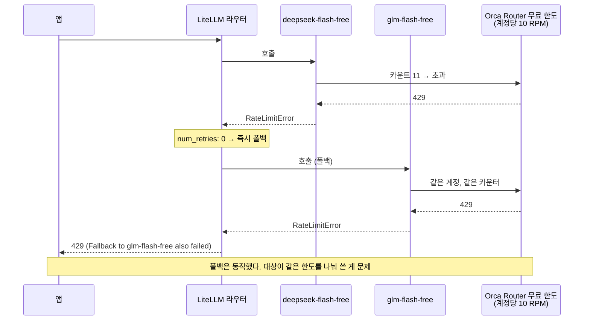

> 애플리케이션 코드는 base URL 한 줄만 바꾸고, 키 관리와 비용 집계와 폴백을 게이트웨이로 옮깁니다.
> LiteLLM을 실제로 띄워 무료 모델의 429와 예산 초과까지 직접 부딪히며 정리해 둡니다.

---

## Sample Code

> 이 시리즈에서 다루는 전체 예제 코드는 GitHub에서 확인할 수 있습니다.
>
> **[litellm-gateway-sample](https://github.com/rojae/spring-sample/tree/main/litellm-gateway-sample)** (게이트웨이 설정과 스크립트)
> **[spring-sse-sample](https://github.com/rojae/spring-sample/tree/main/spring-sse-sample)** (1편의 Spring 앱, 코드 변경 없이 그대로 사용)
{: .prompt-info }

---

## 시리즈 목차

- [SSE, LLM 시대에 다시 보기 - (토큰이 한꺼번에 도착하는 이유)](/posts/sse-revisited-for-llm-streaming)
- **Orca Router 앞에 LiteLLM 한 겹 끼우기 - (게이트웨이, 비용, 폴백)** ← 현재 글
- "MCP는 결국 JSON이고 웹 통신이잖아"에 답하기 - (stdio와 Streamable HTTP) *(작성 예정)*
- 게이트웨이 뒤에 MCP 서버 세우기 *(작성 예정)*
- MCP 인증과 보안, 백엔드가 가장 잘 아는 자리 *(작성 예정)*

---

## 이 글에서 다룰 내용

- LLM 게이트웨이가 무엇을 대신해 주는지, 왜 애플리케이션에서 빼내야 하는지
- LiteLLM Proxy를 docker compose로 띄우고 Orca Router를 뒤에 두는 설정 (프리픽스, `/v1`, 환경변수 규칙)
- 무료 모델에 "가상 단가"를 붙여 비용을 집계하는 방법과 그 계산이 맞는지 검산
- 가상 키에 예산을 걸고 초과시키기, 스팬드 로그 읽기
- 실패 1: `api_base`에 `/v1`을 빠뜨리면 두 번째 에러가 첫 번째와 다른 이유
- 실패 2: 무료 모델이 429를 맞으면 다른 무료 모델로 폴백하면 되겠지, 라는 착각
- Prometheus `/metrics`에 무엇이 찍히는지

---

## "키가 앱마다 흩어져 있어요"

LLM 기능이 서비스 하나에서 두 개, 세 개로 늘어나면 이런 상태가 됩니다.

- 업스트림 API 키가 앱마다 환경변수로 박혀 있고, 누가 어떤 키를 쓰는지 아무도 모릅니다.
- 이번 달 비용이 얼마인지는 공급자 콘솔에 들어가야 알 수 있고, 팀별로 나눠 볼 수 없습니다.
- 업스트림이 429를 내면 각 앱이 제각각 재시도합니다. 아니면 그냥 죽습니다.
- 모델을 바꾸려면 앱을 전부 다시 배포합니다.

이 네 가지는 모두 "애플리케이션이 알 필요 없는 일"입니다. 그래서 중간에 한 겹을 끼웁니다. 앱은 게이트웨이 주소와 게이트웨이가 발급한 키만 알고, 업스트림 키와 비용과 라우팅은 게이트웨이가 가집니다.

> **쉽게 말하면** 게이트웨이는 회사의 **총무팀**입니다. 직원(앱)은 외부 업체(OpenAI, Orca Router)와 직접 계약하지 않고 총무팀에 요청서를 냅니다. 총무팀이 업체 계약(API 키)을 들고 있고, 누가 얼마나 썼는지 장부(스팬드 로그)를 적고, 한 업체가 안 되면 다른 업체로 돌립니다(폴백). 직원은 총무팀 내선번호(base URL)와 사원증(가상 키)만 있으면 됩니다.
{: .prompt-tip }



이 글에서는 이 그림의 초록, 파랑, 노랑 상자를 하나씩 실제로 눌러 봅니다. 게이트웨이로는 [LiteLLM](https://docs.litellm.ai)을 골랐습니다. OpenAI 호환 API를 그대로 노출하기 때문에 1편의 Spring 앱을 코드 변경 없이 붙일 수 있고, 가상 키와 비용 집계가 오픈소스 버전에 들어 있습니다.

---

## 실습 환경

### docker compose

LiteLLM 컨테이너와, 가상 키와 스팬드 로그를 저장할 Postgres입니다. (핵심만 남긴 것이고, `container_name`과 헬스체크 재시도 횟수 같은 나머지 필드는 저장소의 파일에 있습니다.)

```yaml
services:
  litellm:
    image: ghcr.io/berriai/litellm:main-latest
    ports: ["${LITELLM_PORT:-4000}:4000"]
    environment:
      LITELLM_MASTER_KEY: ${LITELLM_MASTER_KEY:-sk-local-master-1234}
      DATABASE_URL: postgresql://llmproxy:dbpassword9090@db:5432/litellm
      ORCA_ROUTER_API_KEY: ${ORCA_ROUTER_API_KEY:?ORCA_ROUTER_API_KEY 가 필요합니다}
    volumes:
      - ./config.yaml:/app/config.yaml:ro
    command: ["--config", "/app/config.yaml", "--port", "4000"]
    depends_on:
      db:
        condition: service_healthy
  db:
    image: postgres:16-alpine
    environment:
      POSTGRES_DB: litellm
      POSTGRES_USER: llmproxy
      POSTGRES_PASSWORD: dbpassword9090
    healthcheck:
      test: ["CMD-SHELL", "pg_isready -d litellm -U llmproxy"]
      interval: 3s
```

호스트 포트는 `LITELLM_PORT`로 바꿀 수 있게 해 두었습니다. 4000은 다른 개발 도구와 자주 겹치는 포트입니다.

### config.yaml: 규칙 세 가지

```yaml
model_list:
  - model_name: deepseek-flash-free                   # 앱이 부르는 이름
    litellm_params:
      model: openai/deepseek/deepseek-v4-flash-free   # 규칙 1: OpenAI 호환이면 openai/ 프리픽스
      api_base: https://api.orcarouter.ai/v1          # 규칙 2: /v1 까지 적는다
      api_key: os.environ/ORCA_ROUTER_API_KEY         # 규칙 3: 키는 환경변수 참조
    model_info:
      input_cost_per_token: 0.00000022                # $0.22 / 1M (유료 쌍둥이 단가)
      output_cost_per_token: 0.00000066               # $0.66 / 1M

  - model_name: glm-flash-free                        # 폴백 대상 (역시 무료)
    litellm_params:
      model: openai/z-ai/glm-5.3-flash-free
      api_base: https://api.orcarouter.ai/v1
      api_key: os.environ/ORCA_ROUTER_API_KEY
    model_info:
      input_cost_per_token: 0.000000075
      output_cost_per_token: 0.00000025

  - model_name: broken-no-v1                          # 실패 재현용: /v1 빠뜨림
    litellm_params:
      model: openai/deepseek/deepseek-v4-flash-free
      api_base: https://api.orcarouter.ai
      api_key: os.environ/ORCA_ROUTER_API_KEY

litellm_settings:
  fallbacks: [{"deepseek-flash-free": ["glm-flash-free"]}]
  num_retries: 0          # 재시도 없이 바로 폴백
  allowed_fails: 1        # 1번 실패하면 그 배포를 쿨다운
  cooldown_time: 30
  callbacks: ["prometheus"]
  require_auth_for_metrics_endpoint: false
  # drop_params, request_timeout 과 router_settings(num_retries: 0) 는 저장소 파일 참고

general_settings:
  master_key: os.environ/LITELLM_MASTER_KEY
  database_url: os.environ/DATABASE_URL
```

| 규칙 | 이유 |
|------|------|
| `model: openai/<업스트림 모델 ID>` | LiteLLM은 프리픽스로 어떤 프로바이더 코드로 호출할지 정합니다. Orca Router는 OpenAI 호환이므로 `openai/` |
| `api_base`에 `/v1`까지 | LiteLLM은 뒤에 `/chat/completions`만 붙입니다. 빠뜨리면 404 (3번 절) |
| `api_key: os.environ/...` | 설정 파일에 키를 적지 않습니다. 컨테이너 환경변수에서 읽습니다 |

> **쉽게 말하면** `model_name`은 **메뉴판 이름**이고 `litellm_params.model`은 **주방의 레시피**입니다. 손님(앱)은 "deepseek-flash-free 주세요"라고만 하면 되고, 그게 실제로 어느 업체의 어떤 모델인지는 주방(게이트웨이)만 압니다. 레시피를 바꿔도 메뉴판은 그대로라서 손님은 모릅니다.
{: .prompt-tip }

### 무료 모델에 왜 단가를 붙이나

Orca Router의 `deepseek/deepseek-v4-flash-free`는 요청당 $0입니다. 그대로 두면 LiteLLM은 비용을 0으로 기록하고, 스팬드 로그는 아무 의미가 없어집니다.

그래서 `model_info`에 **유료 쌍둥이 모델의 단가**(`deepseek/deepseek-v4-flash`, 입력 $0.22 / 출력 $0.66 per 1M)를 넣었습니다. 실제 청구는 0이지만 "유료였다면 얼마였을지"가 쌓입니다. 나중에 유료로 넘어갈 때 예산을 잡는 근거가 되고, 팀별 사용량 비교도 됩니다.

> **쉽게 말하면** **무료 시식이지만 영수증에는 정가를 찍어 두는 것**입니다. 돈은 안 냈지만 "이만큼 먹었다"는 기록이 남아야 나중에 정식으로 사 먹을 때 예산을 잡을 수 있습니다.
{: .prompt-tip }

> 이 트릭은 사내에서 구독제나 정액제 API를 쓸 때도 그대로 씁니다. 청구서에는 안 찍히지만 "누가 얼마나 썼는가"는 알아야 하기 때문입니다.
{: .prompt-tip }

```bash
export ORCA_ROUTER_API_KEY=...
docker compose -f litellm-gateway-sample/docker-compose.yml up -d
curl http://localhost:4000/health/liveliness   # "I'm alive!"
```

---

## 1. 띄우고 첫 호출

<figure style="text-align: center;">
  
  <figcaption style="margin-top: 0.5rem; font-size: 0.95rem; color: #666;">
    /v1/models 에는 config 의 model_name 세 개가 보이고, 응답 헤더에 모델 ID와 비용이 붙어 온다
  </figcaption>
</figure>

응답에서 세 가지를 확인할 수 있습니다.

- **`x-litellm-model-id`**: 실제로 어느 배포(deployment)가 처리했는지. 같은 `model_name` 아래 배포가 여러 개일 때 이 값으로 구분합니다. 폴백이 일어났는지도 이 헤더로 압니다.
- **`x-litellm-response-cost: 6.446e-05`**: 게이트웨이가 계산한 비용입니다.
- **`model: deepseek-flash-free`**: 업스트림이 돌려준 `deepseek-v4-flash-ga-260731`이 아니라 **config의 `model_name`으로 바꿔서** 줍니다. 앱은 업스트림 모델 ID를 몰라도 됩니다.

> **쉽게 말하면** 응답 헤더의 `x-litellm-model-id`는 **영수증에 찍힌 담당 직원 번호**입니다. 같은 메뉴를 여러 주방이 만들 수 있을 때, 이번 주문을 실제로 누가 처리했는지 알려 줍니다. 폴백이 일어나면 이 번호가 바뀝니다.
{: .prompt-tip }

비용이 맞는지 검산해 봤습니다.

```
prompt     98 × $0.22/1M = $0.00002156
completion 65 × $0.66/1M = $0.00004290
                    합계 = $0.00006446   ← x-litellm-response-cost 와 일치
```

`completion_tokens` 65개 안에 `reasoning_tokens` 16개가 포함되어 있습니다. 사고 과정 토큰도 출력 단가로 과금된다는 뜻이고, 이건 실제 DeepSeek 과금 방식과 같습니다.

---

## 2. 스트리밍은 그대로 통과하나

1편의 핵심이 스트리밍이었으니, 게이트웨이를 거쳐도 SSE가 그대로 흘러나오는지가 중요합니다.

<figure style="text-align: center;">
  
  <figcaption style="margin-top: 0.5rem; font-size: 0.95rem; color: #666;">
    reasoning_content 는 그대로 통과하고, usage 는 한 번만, 그리고 cost 필드가 추가됐다
  </figcaption>
</figure>

1편에서 업스트림에 직접 받은 원문과 비교하면 이렇습니다.

| 항목 | Orca Router 직접 (1편) | LiteLLM 경유 |
|------|------------------------|--------------|
| `reasoning_content` | delta에 따로 옴 | **그대로 통과** (`openai/` 프로바이더가 알 수 없는 필드를 버리지 않음) |
| `model` | `deepseek-v4-flash-ga-260731` | `deepseek-flash-free` (model_name으로 치환) |
| `usage` | **두 번** (finish 청크, 마지막 청크) | **한 번**, 마지막 청크에만 |
| `usage.cost` | 없음 | **`0.00006446` 추가** |
| `[DONE]` | 있음 | 있음 |

1편에서 "usage가 두 번 온다"고 프록시에서 막았던 문제가 여기서는 게이트웨이가 정리해 줍니다. 그리고 스트리밍 응답에도 `cost`가 붙습니다. 클라이언트가 이 값을 읽으면 요청 단위로 비용을 표시할 수 있습니다.

---

## 3. 실패 1: `/v1`을 빠뜨리면 두 번째 에러가 다르다

`broken-no-v1`은 `api_base`에서 `/v1`만 뺀 설정입니다. 일부러 두 번 연속 호출했습니다.

<figure style="text-align: center;">
  
  <figcaption style="margin-top: 0.5rem; font-size: 0.95rem; color: #666;">
    첫 호출은 404. 두 번째는 같은 설정인데 429 all_deployments_in_cooldown
  </figcaption>
</figure>

첫 번째 에러는 예상대로입니다. LiteLLM이 `https://api.orcarouter.ai/chat/completions`를 호출했고, 그 주소에는 API가 없으니 Orca Router **웹사이트의 404 HTML 페이지**가 그대로 에러 메시지에 담겨 왔습니다. `OpenAIException - <!doctype html>`로 시작하는 에러를 보면 `api_base`부터 의심하면 됩니다.

두 번째 에러가 재밌습니다. 같은 요청인데 404가 아니라 **429 `all_deployments_in_cooldown`**입니다. `allowed_fails: 1`로 설정했기 때문에 한 번 실패한 배포를 30초 동안 쿨다운에 넣었고, 그 그룹에 다른 배포가 없으니 "쓸 수 있는 배포가 없다"가 된 겁니다.

> **쉽게 말하면** 쿨다운은 **방금 실수한 직원을 30초 동안 쉬게 하는 것**입니다. 업스트림이 아플 때 계속 두드리지 않으려는 보호 장치입니다. 문제는 직원이 아픈 게 아니라 **주소를 잘못 적어 준 것**(설정 실수)이어도 똑같이 쉬게 한다는 점입니다. 그래서 두 번째부터는 "직원이 없다"는 다른 에러가 보입니다.
{: .prompt-tip }

> 운영 중에 "처음엔 404였는데 지금은 429가 나요"라는 보고를 받으면, 원인은 404 쪽입니다. 429는 게이트웨이가 스스로 만든 결과입니다.
> 쿨다운은 진짜 장애에서 업스트림을 보호하는 장치지만, 설정 실수를 다른 에러로 덮어 버리기도 합니다.
{: .prompt-warning }

---

## 4. 가상 키에 예산 걸기

마스터 키는 관리자용입니다. 앱에는 **가상 키**를 따로 발급하고, 거기에 모델 제한과 예산을 겁니다.

```bash
curl http://localhost:4000/key/generate \
  -H "Authorization: Bearer $LITELLM_MASTER_KEY" \
  -H "Content-Type: application/json" \
  -d '{"max_budget": 0.00005, "key_alias": "budget-demo"}'
```

예산을 일부러 5센트의 1/1000인 $0.00005로 잡았습니다. 요청 한 번(약 $0.00009)이면 넘습니다.

> **쉽게 말하면** 가상 키는 **한도가 걸린 법인카드**입니다. 마스터 키는 카드를 발급하는 재무팀 권한이고, 앱에는 카드만 줍니다. 카드마다 쓸 수 있는 가게(모델)와 한도(예산)를 다르게 걸 수 있고, 한도가 차면 결제가 거절됩니다.
{: .prompt-tip }

<figure style="text-align: center;">
  
  <figcaption style="margin-top: 0.5rem; font-size: 0.95rem; color: #666;">
    1회차 성공 (cost 8.844e-05). 2회차는 Budget has been exceeded. 그런데 key/info 의 spend 는 아직 0.0
  </figcaption>
</figure>

1회차 비용도 검산이 됩니다. 프롬프트 84 토큰과 출력 106 토큰(그중 사고 과정 91)이라서 `84 × $0.22/1M + 106 × $0.66/1M = $0.00008844`, 헤더의 `8.844e-05`와 같습니다. "ping" 한 마디에 사고 과정 토큰이 91개나 붙은 것도 눈여겨볼 만합니다. 짧은 질문일수록 비용의 대부분이 사고 과정입니다.

여기서 세 가지를 배웠습니다.

- **예산 검사는 요청 전에 합니다.** 첫 요청은 예산 안에서 시작했으니 통과했고 결과적으로 예산을 넘겼습니다. 두 번째 요청은 시작 전에 막혔습니다. 즉 `max_budget`은 "이 금액에서 정확히 멈춘다"가 아니라 "이 금액을 넘긴 뒤의 다음 요청부터 막는다"입니다.
- **상태 코드가 422입니다.** 문서에는 400이나 429로 적힌 예가 섞여 있는데, 제가 쓴 `main-latest` 이미지는 422를 돌려줬습니다. 클라이언트에서 `type: "budget_exceeded"`로 분기하는 편이 안전합니다.
- **`/key/info`의 `spend`는 바로 반영되지 않습니다.** 두 번째 요청이 예산 초과로 막힌 직후에 조회했는데 `spend: 0.0`이었습니다. 예산 판정은 메모리 캐시에서 하고, DB 반영은 배치로 뒤따라옵니다. 몇 초 뒤 다시 조회하면 채워집니다. 모니터링 대시보드가 "예산 초과인데 사용량은 0"으로 보일 수 있다는 뜻입니다.

---

## 5. 스팬드 로그 읽기

요청 한 건마다 Postgres에 한 줄이 남습니다.

<figure style="text-align: center;">
  
  <figcaption style="margin-top: 0.5rem; font-size: 0.95rem; color: #666;">
    요청별 토큰 수와 가상 단가로 계산한 spend. 실패한 요청(broken-no-v1, 429)은 0 으로 남는다
  </figcaption>
</figure>

| 컬럼 | 의미 |
|------|------|
| `model` | 실제 호출한 업스트림 모델 (`openai/deepseek/...`). 응답의 `model`과 달리 여기는 원본 |
| `prompt_tokens`, `completion_tokens` | 업스트림 usage 그대로 |
| `spend` | `model_info` 단가로 계산한 금액 |
| `metadata.user_api_key_alias` | 어느 가상 키가 썼는지. 팀별 집계의 기준 |

실패한 요청도 `spend: 0.0`으로 남습니다. 429나 404가 얼마나 났는지 이 로그로 셀 수 있습니다.

> **쉽게 말하면** 스팬드 로그는 **가계부**입니다. 언제, 누가(가상 키), 무엇을(모델), 얼마나(토큰), 얼마에(spend) 썼는지 한 줄씩 적힙니다. 결제가 거절된 건도 0원으로 적어 두기 때문에 "왜 거절이 많았지"를 나중에 셀 수 있습니다.
{: .prompt-tip }

---

## 6. 실패 2: 무료 모델끼리 폴백하면 되겠지

무료 모델의 한도는 1편에서 확인한 대로 결제 이력이 없으면 **분당 10회**입니다. 넘기면 429가 옵니다. 그래서 config에 이렇게 적어 뒀습니다.

```yaml
fallbacks: [{"deepseek-flash-free": ["glm-flash-free"]}]
```

"DeepSeek 무료가 429면 GLM 무료로 넘기자." 그럴듯합니다. 12번 연속으로 쏴 봤습니다.

> **쉽게 말하면** 폴백은 **대타**입니다. 주전이 못 뛰면 대타가 나갑니다. 그런데 대타가 주전과 **같은 출전 횟수 제한을 나눠 쓰고 있다면** 주전이 한도를 다 쓴 순간 대타도 못 뜁니다. 이 실험이 정확히 그 경우입니다.
{: .prompt-tip }

<figure style="text-align: center;">
  
  <figcaption style="margin-top: 0.5rem; font-size: 0.95rem; color: #666;">
    #12 에서 429. LiteLLM 로그: Fallback to glm-flash-free also failed: RateLimitError
  </figcaption>
</figure>

11번째까지 성공하고 12번째에서 429가 났습니다. 그리고 **폴백 대상인 GLM 무료 모델도 같은 429**를 받았습니다. 업스트림 에러 메시지가 이유를 알려 줍니다.

```
Free model capacity is limited right now. Retry shortly, or add credits for higher,
more stable limits: https://www.orcarouter.ai/console/billing
```

무료 티어의 분당 한도는 **모델별이 아니라 계정 단위**로 보였습니다. 추측으로 끝내기 싫어서 일일 한도가 초기화된 뒤 게이트웨이 없이 Orca Router에 직접 확인해 봤습니다. GLM 무료 모델만 10번 호출하고, DeepSeek 무료 모델을 처음으로 1번 호출했습니다.

<figure style="text-align: center;">
  
  <figcaption style="margin-top: 0.5rem; font-size: 0.95rem; color: #666;">
    DeepSeek 은 한 번도 안 불렀는데 첫 호출부터 429. 카운터가 모델이 아니라 계정에 붙어 있다
  </figcaption>
</figure>

DeepSeek 무료 모델은 그 분에 한 번도 부르지 않았는데 첫 호출부터 429였습니다. 카운터는 계정에 하나입니다. DeepSeek 무료로 10번을 쓰면 GLM 무료도 같이 막히고, 그 반대도 같습니다. 그러니 무료 → 무료 폴백은 설정은 맞아도 효과가 없습니다.

폴백이 의미가 있으려면 **한도를 따로 세는 대상**이어야 합니다. 무료 → 유료(같은 계정이라도 유료는 한도가 다름), 또는 다른 공급자입니다. 1편에서 Orca Router 문서가 "무료 모델은 폴백 체인의 대상으로 넣을 수 없다"고 한 것도 같은 맥락입니다.



LiteLLM 입장에서는 정확히 설정대로 움직였습니다. 문제는 제가 폴백 대상을 고른 기준이었습니다. 게이트웨이의 폴백 설정을 볼 때는 "이 두 배포가 같은 한도를 공유하는가"를 먼저 물어야 합니다.

---

## 7. 1편의 Spring 앱 붙이기

이제 진짜 목적입니다. 1편의 스트리밍 프록시를 게이트웨이 뒤로 보냅니다. 코드는 한 줄도 바꾸지 않고 환경변수만 바꿉니다.

```bash
# 앱 전용 가상 키 (모델 제한 + 예산 $0.01)
curl http://localhost:4000/key/generate \
  -H "Authorization: Bearer $LITELLM_MASTER_KEY" \
  -H "Content-Type: application/json" \
  -d '{"max_budget": 0.01, "key_alias": "spring-sse-sample", "models": ["deepseek-flash-free"]}'

ORCA_BASE_URL=http://localhost:4000/v1 \
ORCA_MODEL=deepseek-flash-free \
ORCA_ROUTER_API_KEY=sk-...(위에서 받은 가상 키) \
SERVER_PORT=8090 ./gradlew :spring-sse-sample:bootRun
```

| 환경변수 | 1편 | 2편 |
|----------|-----|-----|
| `ORCA_BASE_URL` | `https://api.orcarouter.ai/v1` | `http://localhost:4000/v1` |
| `ORCA_MODEL` | `deepseek/deepseek-v4-flash-free` | `deepseek-flash-free` (config의 model_name) |
| `ORCA_ROUTER_API_KEY` | Orca Router 키 | **LiteLLM 가상 키** |

앱은 이제 Orca Router 키를 모릅니다. 데모 페이지에서 전송을 눌렀습니다.


<figure style="text-align: center;">
  
  <figcaption style="margin-top: 0.5rem; font-size: 0.95rem; color: #666;">
    1편과 같은 화면. 뒤에 LiteLLM 이 끼어 있다는 걸 앱도 브라우저도 모른다
  </figcaption>
</figure>

서버 로그와 게이트웨이 쪽 기록을 나란히 놓으면 이렇습니다.

```
# Spring 로그
[stream] ttft=1653ms elapsed=2847ms chunks=192 content=130 reasoning=59 error=-

# LiteLLM 스팬드 로그 (최신 1건)
model=openai/deepseek/deepseek-v4-flash-free  prompt=98  completion=199  spend=0.0001529  key_alias=spring-sse-sample

# 앱 키 누적
{"key_alias":"spring-sse-sample","spend":0.00019382,"max_budget":0.01,"models":["deepseek-flash-free"]}
```

앱은 base URL만 바꿨는데, 게이트웨이에는 "spring-sse-sample 키가 이 요청에 $0.0001529를 썼고 누적 $0.00019382"가 남았습니다. 이 키의 예산 $0.01이 다 차면 앱은 4번 절의 `budget_exceeded`를 받게 됩니다. 1편에서 만든 `event: error` 처리가 그때 일합니다.

---

## 8. `/metrics`에는 무엇이 찍히나

`callbacks: ["prometheus"]`를 켜 두었습니다. `/metrics`는 `/metrics/`로 307 리다이렉트되니 `curl -L`이 필요합니다.

```
$ curl -sL http://localhost:4000/metrics | grep -E "^litellm_" | sed 's/{.*//' | sort | uniq -c | sort -rn
  36 litellm_request_total_latency_metric_bucket
  36 litellm_llm_api_latency_metric_bucket
  18 litellm_llm_api_time_to_first_token_metric_bucket
  15 litellm_deployment_latency_per_output_token_bucket
   3 litellm_proxy_total_requests_metric_total
   3 litellm_deployment_total_requests_total
   3 litellm_deployment_state
   ...
```

요청 수, 배포별 상태, 지연 히스토그램, 그리고 **TTFT 히스토그램**(`litellm_llm_api_time_to_first_token_metric`)이 있습니다. 1편에서 파이썬 스크립트로 직접 재던 값이 게이트웨이에서는 기본으로 나옵니다.

> **쉽게 말하면** `/metrics`는 **자동차 계기판**입니다. 속도(요청 수), 엔진 온도(에러율), 연료(비용)를 숫자로 계속 보여 주고, Prometheus가 그걸 주기적으로 읽어 그래프로 그립니다. 1편에서는 이 계기판이 없어서 직접 스톱워치를 들었던 셈입니다.
{: .prompt-tip }

> 문서 일부에는 Prometheus 콜백이 엔터프라이즈 기능으로 적혀 있습니다. 제가 쓴 `main-latest` 오픈소스 이미지에서는 위처럼 동작했습니다. 버전에 따라 다를 수 있으니 띄운 뒤 직접 확인하는 편이 안전합니다.
{: .prompt-info }

---

## 9. 정리: 게이트웨이 도입 체크리스트

| 구간 | 확인할 것 |
|------|-----------|
| 설정 | `openai/` 프리픽스, `api_base`에 `/v1`, 키는 `os.environ/` |
| 비용 | 무료·정액 모델에는 유료 단가를 가상으로 붙여 집계 |
| 예산 | 예산 검사는 요청 전. 한 번은 넘긴다. 상태 코드보다 `type: budget_exceeded`로 분기 |
| 예산 | `/key/info`의 `spend`는 몇 초 늦게 반영 |
| 폴백 | 폴백 대상이 원본과 **같은 한도를 공유하는지** 먼저 확인 |
| 쿨다운 | `allowed_fails`가 설정 실수를 429로 바꿔 보여 줄 수 있음. 첫 에러를 찾을 것 |
| 앱 | 앱은 게이트웨이 주소와 가상 키만 안다. 업스트림 키는 게이트웨이 환경변수에만 |

---

## 참고 자료

- [LiteLLM: OpenAI-compatible endpoints](https://docs.litellm.ai/docs/providers/openai_compatible)
- [LiteLLM: Custom pricing](https://docs.litellm.ai/docs/proxy/custom_pricing)
- [LiteLLM: Proxy config (fallbacks, cooldown)](https://docs.litellm.ai/docs/proxy/configs)
- [LiteLLM: Virtual keys and budgets](https://docs.litellm.ai/docs/proxy/users)
- [LiteLLM: Prometheus metrics](https://docs.litellm.ai/docs/proxy/prometheus)
- [Orca Router: Free models](https://docs.orcarouter.ai/routing/free-models)

---

## 마치며

2편에서는 1편의 앱을 한 줄도 고치지 않고 LiteLLM 뒤로 보냈습니다. 그 과정에서 두 번 넘어졌습니다.

- `/v1`을 빠뜨리면 404가 나고, 그다음부터는 쿨다운 때문에 429로 보입니다.
- 무료 모델끼리의 폴백은 같은 한도를 나눠 쓰기 때문에 소용이 없었습니다.

두 가지 모두 게이트웨이 자체의 버그가 아니라, 게이트웨이가 **한 겹 더 생겼기 때문에** 새로 생긴 실패입니다. 층이 하나 늘면 확인할 곳도 하나 늡니다.

다음 편에서는 방향을 바꿔 MCP로 갑니다. "MCP는 결국 JSON이고 웹 통신이잖아"라는 질문에, Spring AI로 만든 MCP 서버를 stdio와 Streamable HTTP 두 전송으로 띄우고 파이프에 JSON 한 줄을 직접 넣어 가며 답하겠습니다.

> 게이트웨이는 문제를 없애 주는 게 아니라 문제가 생기는 자리를 한 곳으로 모아 줍니다.
> 그 한 곳에 로그와 비용과 한도가 같이 있다는 것이 도입의 진짜 이유입니다.
{: .prompt-tip }
