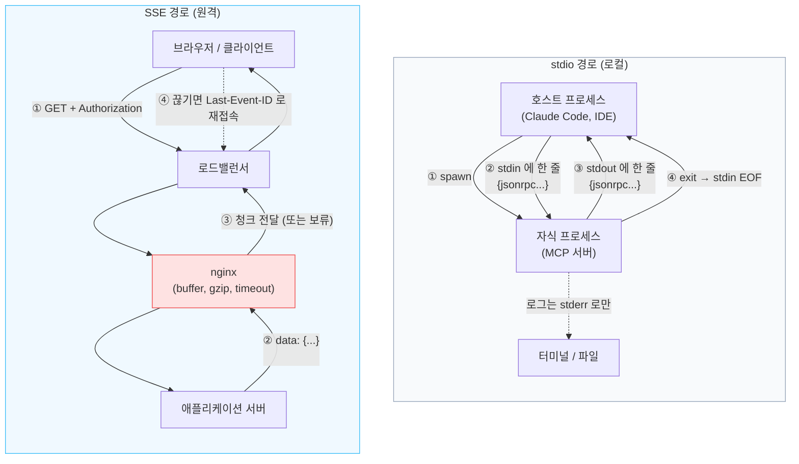
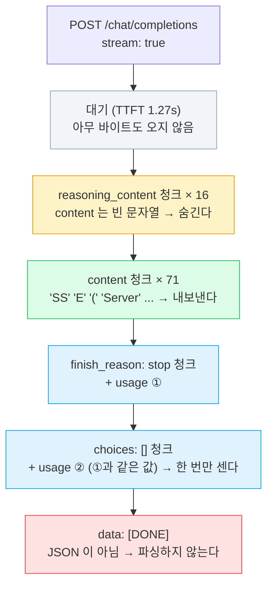
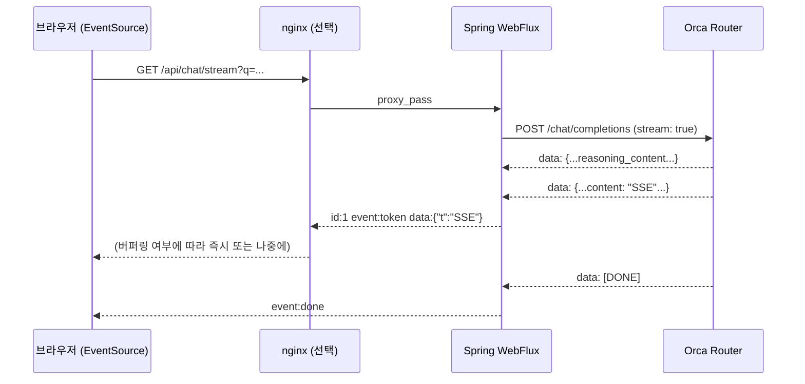
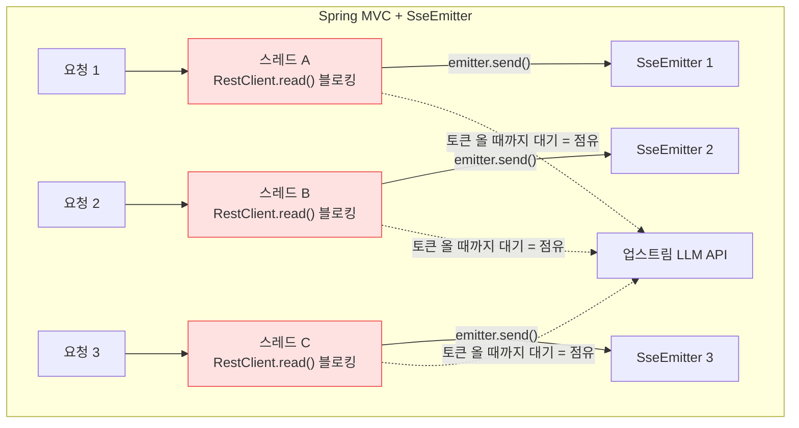
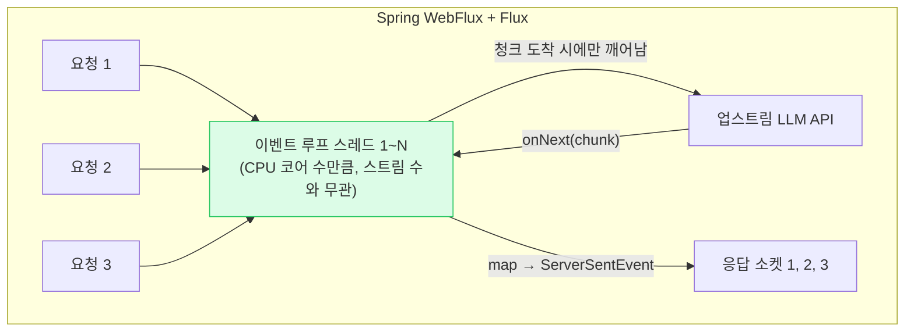
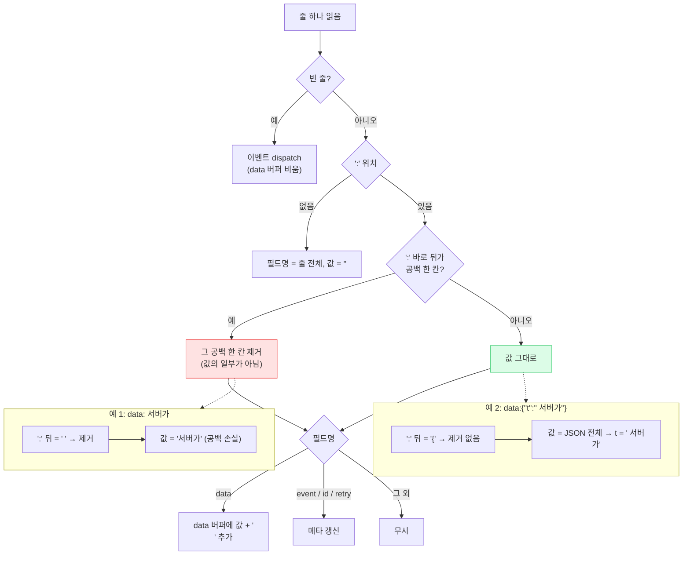
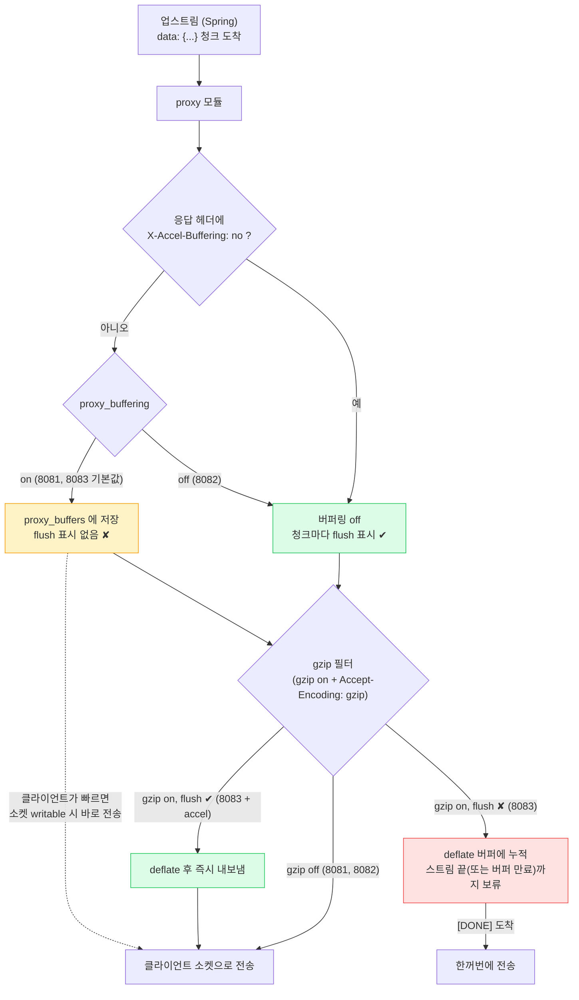

> LLM 응답 스트리밍을 nginx 뒤에 세웠을 때 무엇이 깨지는지, 직접 재현하며 얻은 것들을 정리해 둔다.
> + 샘플코드는 [spring-sse-sample](https://github.com/rojae/spring-sample/tree/main/spring-sse-sample)에서 확인할 수 있다.
> + 이 글은 "LLM 통신 스택" 시리즈의 1편이다. 2편은 [Orca Router 앞에 LiteLLM 한 겹 끼우기](/posts/litellm-gateway-in-front-of-orca-router), 3편부터는 MCP(stdio와 Streamable HTTP, 게이트웨이 뒤의 MCP, 인증과 보안)를 다룰 예정이다.
{: .prompt-info }

---

## **"토큰이 한꺼번에 도착해요"**

LLM 기능을 붙인 서비스를 만지다 보면 꼭 한 번은 이런 말을 듣는다.

*"로컬에서는 글자가 한 자씩 나오는데, 스테이징에 올리니까 3초 동안 아무것도 없다가 답이 통째로 떠요."*

서버 로그를 보면 첫 토큰은 1초 남짓에 나갔다고 찍혀 있다. 그런데 브라우저는 마지막 토큰이 나올 때까지 아무것도 받지 못한다.

나도 처음엔 "nginx가 버퍼링하는 거겠지"라고 넘겼다. 그 말이 반은 맞고 반은 틀렸다는 걸 직접 재현해 보고서야 알았다.

---

## **"논의"**

이 글을 쓰게 된 질문들은 대충 이랬다.

*A: "nginx가 SSE를 버퍼링하는 거 아니에요? `proxy_buffering off` 하면 되지 않나요?"*

*B: "WebFlux랑 SSE랑 비교를 해야 하는 거 아닌가요? 뭐가 다른 건지 잘 모르겠어요."*

*C: "회사에서 MCP 붙일 때 stdio랑 SSE 얘기가 나왔는데, 결국 둘 다 JSON 한 줄씩 보내는 거잖아요. 뭐가 다른데요?"*

세 질문이 같은 자리를 가리키고 있었다. **토큰이 서버에서 브라우저까지 오는 길에 무엇이 서 있고, 각각이 무슨 짓을 하는가.** 하나씩 정리하고, 실제로 깨뜨려 보기로 했다.

---

## **"지금 다시 생각해보면서, 정리해보니.."**

### WebSocket과 무엇이 다른가

| 항목 | SSE | WebSocket |
|------|-----|-----------|
| 방향 | 서버 → 클라이언트 단방향 | 양방향 |
| 프로토콜 | 그냥 HTTP (Content-Type만 다름) | HTTP에서 업그레이드한 별도 프로토콜 |
| 프록시/로드밸런서 | 일반 HTTP 응답으로 통과 | 업그레이드 지원 필요 |
| 재연결 | 브라우저가 자동으로 재접속, `Last-Event-ID` 전달 | 직접 구현 |
| 브라우저 API | `EventSource` 한 줄 | `WebSocket` + 프로토콜 설계 |

LLM 응답은 "서버가 토큰을 밀어주는" 단방향 흐름이다. 사용자의 입력은 요청 한 번으로 끝나고, 그 뒤로는 서버가 계속 말한다. 양방향 채널이 필요 없으니 WebSocket은 과했고, HTTP 그대로인 SSE가 딱 맞았다. OpenAI 호환 API의 `stream: true` 응답이 `text/event-stream`으로 오기 때문에 사실상 업계 표준도 SSE로 굳어졌다.

> **쉽게 말하면** WebSocket은 **전화**다. 양쪽이 아무 때나 말할 수 있지만 전화를 거는 절차가 따로 필요하다. SSE는 **라디오**다. 한 번 주파수를 맞추면 방송국이 계속 보내 주고, 듣는 쪽은 듣기만 한다. LLM 답변은 "질문 한 번, 답은 길게"라서 라디오면 충분하다.
{: .prompt-tip }

### 와이어 포맷은 단순하다

SSE는 텍스트 프로토콜이다. 줄 단위로 필드가 오고, 빈 줄이 이벤트 하나의 끝이다.

```
id: 1
event: token
data: {"t":"SSE"}

id: 2
event: token
data: {"t":"는"}

```

| 필드 | 의미 |
|------|------|
| `data:` | 페이로드. 여러 줄이면 `\n`으로 이어 붙임 |
| `event:` | 이벤트 이름. 없으면 `message` |
| `id:` | 마지막으로 받은 id. 재연결 시 `Last-Event-ID` 헤더로 서버에 전달 |
| `retry:` | 재연결 대기 시간(ms) |
| 빈 줄 | 이벤트 하나 끝 (dispatch) |

> **쉽게 말하면** SSE 이벤트 하나는 **편지 한 통**이다. `data:`가 본문, `event:`가 제목, `id:`가 편지 번호이고, **빈 줄이 봉투를 닫는 동작**이다. 브라우저는 빈 줄을 만나야 "편지 한 통 도착"이라고 앱에 알려 준다.
{: .prompt-tip }

여기서 나중에 나를 괴롭힐 규칙이 하나 있다. **`data:` 바로 뒤에 공백이 한 칸 있으면, 그 공백은 값이 아니라 구분자로 취급되어 버려진다.** 이건 뒤에서 다시 본다.

### 잠깐, stdio는?

질문 C에 대한 답이다. 메시지 형식은 정말로 같다. 다른 건 **그 줄이 어디를 타고 가느냐**다.

> **쉽게 말하면** stdio는 **옆자리 동료에게 쪽지를 직접 건네는 것**이다. 내가 그 사람을 불러 앉혔고(프로세스 실행), 쪽지는 손에서 손으로 간다. SSE는 **우편**이다. 봉투에 주소와 신분증(인증)을 붙여야 하고, 중간에 우체국(프록시)이 끼어 있어서 거기서 지연되거나 모아서 배달될 수 있다.
{: .prompt-tip }

| 항목 | stdio | SSE (HTTP) |
|------|-------|------------|
| 통로 | 부모가 자식 프로세스를 띄우고 stdin/stdout 파이프로 연결 | TCP 위의 HTTP 응답 본문 |
| 프레이밍 | 줄바꿈 하나가 메시지 하나 | `data:` 필드 + 빈 줄이 이벤트 하나 |
| 연결의 수명 | 프로세스의 수명. 죽으면 EOF | HTTP 연결의 수명. 끊기면 `EventSource`가 재접속 |
| 인증 | 없음. 그 프로세스를 띄울 수 있는 OS 권한이 곧 인증 | 헤더(`Authorization`), 쿠키, OAuth |
| 중간 장비 | 없음. 그래서 버퍼링 문제도 없음 | 프록시, 로드밸런서, gzip. 이 글의 원인 2 |
| 로그 | stdout에 찍는 순간 프로토콜이 깨짐. stderr로만 | 응답 본문과 로그가 분리되어 있음 |
| 쓰이는 곳 | 로컬 MCP 서버, 에디터 플러그인, LSP | 원격 MCP 서버, LLM API 스트리밍 |

같은 JSON 한 줄이 두 경로를 어떻게 지나가는지 그려 보면 차이가 분명해진다.



왼쪽은 중간에 아무것도 없다. 대신 stdout이 곧 프로토콜이라 `System.out.println` 한 줄이 통신을 깨뜨린다. 오른쪽은 인증과 재접속을 HTTP가 공짜로 주는 대신, 빨간 상자(nginx)가 응답을 잡고 있을 수 있다. 이 글의 원인 2가 정확히 그 상자 이야기다.

stdio는 프로세스 하나가 곧 세션이라 단순하고 빠르지만, 원격으로 보낼 수 없고 로그 한 줄이 통신을 깨뜨린다. SSE는 네트워크를 타는 대신 그 앞뒤에 낀 장비를 모두 신경 써야 한다. MCP가 로컬은 stdio, 원격은 Streamable HTTP(내부적으로 SSE)로 나눈 이유가 이것이다. stdio 쪽은 3편에서 프로세스를 직접 띄우고 파이프로 JSON을 넣어 가며 다룰 생각이다.

음… 정리하고 보니 결국 "중간에 무엇이 끼어 있느냐"가 전부다. 그러니 재현도 중간에 무언가를 끼워 가며 해야 한다.

---

## **"일단 재현부터 해보자"**

### 실습 준비: Orca Router의 무료 DeepSeek V4 Flash

실습에 돈이 들면 따라 하기 어렵다. [Orca Router](https://www.orcarouter.ai)에서 제공하는 무료 모델 `deepseek/deepseek-v4-flash-free`를 썼다.

<figure style="text-align: center;">
  
  <figcaption style="margin-top: 0.5rem; font-size: 0.95rem; color: #666;">
    DeepSeek V4 Flash (Free): 1M 컨텍스트, 384K 최대 출력, 요청당 $0
  </figcaption>
</figure>

| 항목 | 값 |
|------|-----|
| 모델 ID | `deepseek/deepseek-v4-flash-free` |
| 가격 | 요청당 $0 (`pricing.request: "0.000000"`) |
| 컨텍스트 | 1M 토큰 |
| 최대 출력 | 384K 토큰 |
| 지원 | Tools, JSON, Reasoning (`reasoning_content`가 따로 옴) |
| 유료 쌍둥이 | `deepseek/deepseek-v4-flash` (입력 $0.22 / 출력 $0.66 per 1M 토큰) |

같은 가중치를 무료 별칭과 유료 ID 두 개로 내놓고, 무료 쪽에만 호출 제한을 거는 구조다.

[orcarouter.ai](https://www.orcarouter.ai) 가입 후 콘솔에서 API 키를 만들고(무료 플랜 "Hacker"는 키 10개까지) 환경변수로 등록한다.

```bash
# ~/.zshrc
export ORCA_ROUTER_API_KEY=sk-or-...
```

> `export` 없이 `ORCA_ROUTER_API_KEY=...`로만 적으면 셸 변수라서 Java, Python 같은 자식 프로세스에서는 보이지 않는다.
> 나도 처음에 이걸로 10분을 날렸다. `curl`은 되는데 Spring이 401을 받으면 이 문제다.
{: .prompt-warning }

무료 모델 제한은 문서에 숫자로 박혀 있지 않고 공개 API로 내려온다. 직접 찍어 봤다.

<figure style="text-align: center;">
  
  <figcaption style="margin-top: 0.5rem; font-size: 0.95rem; color: #666;">
    /api/free-package/public 과 /v1/models 로 확인한 무료 티어 (2026-09 기준)
  </figcaption>
</figure>

| 누적 결제 | 분당 요청(RPM) | 일일 요청(RPD) |
|-----------|----------------|----------------|
| $0 (한 번도 충전 안 함) | 10 | 50 |
| $20 이상 | 20 | 800 |

무료 모델을 쓸 때 알아 둘 점은 이렇다.

- 무료 모델은 ID 뒤에 `-free`가 붙는다. 목록은 수시로 바뀌므로 `/v1/models`에서 확인하는 편이 안전하다.
- 제한을 넘기면 `429`, 프롬프트 길이 상한을 넘기면 `400`이 온다. **무료 트래픽에는 `X-RateLimit-*` 헤더가 오지 않는다.**
- 일일 카운터는 UTC 00:00에 초기화된다. 한국 시간으로 오전 9시다.
- 무료 모델은 유료 모델로 자동 폴백되지 않는다. 폴백 체인의 대상으로도 넣을 수 없다.
- 이 글의 실험 전체(약 20회 호출)는 하루 50회 안에서 끝났다. 하루 한도가 작으니 실험은 계획적으로 하는 게 좋다.

### 패킷부터 보자: curl -N으로 원문 받기

설명보다 원문이 빠르다. `stream: true`로 직접 호출해 봤다.

```bash
curl -sN https://api.orcarouter.ai/v1/chat/completions \
  -H "Authorization: Bearer $ORCA_ROUTER_API_KEY" \
  -H "Content-Type: application/json" \
  -d '{"model":"deepseek/deepseek-v4-flash-free",
       "messages":[{"role":"user","content":"SSE가 무엇인지 한 문장으로 설명해줘."}],
       "stream":true,"stream_options":{"include_usage":true}}'
```

<figure style="text-align: center;">
  
  <figcaption style="margin-top: 0.5rem; font-size: 0.95rem; color: #666;">
    업스트림이 보내는 SSE 원문. 앞부분은 reasoning_content, 뒤에 usage 와 [DONE]
  </figcaption>
</figure>

스트림 하나가 시작부터 끝까지 어떤 청크로 이루어지는지 시간순으로 그리면 이렇다.



프록시가 할 일이 이 그림에 다 있다. 노란 구간은 숨기고, 초록 구간만 내보내고, 파란 구간은 한 번만 세고, 빨간 구간은 JSON으로 파싱하지 않는 것이다.

원문에서 눈에 띄는 것들을 짚어 보면 이렇다.

- **`curl -N`이 필수다.** curl은 기본적으로 출력을 버퍼링하기 때문에 `-N`(`--no-buffer`)이 없으면 curl 자체가 "한꺼번에 도착"을 만들어 낸다.
- 모든 이벤트가 `data:` 한 줄과 빈 줄로만 되어 있다. `event:`도 `id:`도 없다. OpenAI 호환 API는 SSE의 가장 단순한 형태만 쓴다.
- 앞쪽 청크들은 `content`가 비어 있고 `reasoning_content`만 채워져 있다. 모델이 생각하는 동안에도 프레임은 계속 온다. 이걸 화면에 그대로 붙이면 "We need answer in Korean." 같은 영어 사고 과정이 사용자에게 노출된다.
- `stream_options.include_usage: true`를 주면 마지막에 `usage`가 온다. 그런데 **두 번 온다.** `finish_reason: "stop"` 청크와 `choices: []`인 마지막 청크 양쪽에 같은 값이 들어 있다. 비용 집계를 이벤트 개수로 하면 두 배로 잡힌다.
- 종료는 JSON이 아니라 문자열 `[DONE]`이다. 파서가 이걸 JSON으로 읽으려 하면 마지막에 예외가 난다.

> **쉽게 말하면** `reasoning_content`는 모델이 답하기 전에 하는 **혼잣말**이다. "한국어로 답해야겠군, SSE는..." 같은 메모가 먼저 오고, 그다음에 진짜 답(`content`)이 온다. 혼잣말은 요금은 나가지만 사용자에게 보여 줄 내용은 아니다.
{: .prompt-tip }

curl의 `-w` 옵션으로 찍은 시간도 의미가 있다.

```
[time_total=1.84s  starttransfer=1.27s]
```

`starttransfer`가 첫 바이트 도착 시각, 즉 TTFT(Time To First Token)다. 전체 1.84초 중 1.27초가 첫 토큰을 기다리는 시간이었다. 스트리밍이 체감상 빠른 이유는 총 시간이 줄어서가 아니라 이 1.27초 뒤부터는 계속 무언가가 보이기 때문이다.

> **쉽게 말하면** TTFT는 **식당에서 주문하고 첫 접시가 나오기까지의 시간**이다. 코스 전체가 끝나는 시간은 같아도, 첫 접시가 빨리 나오면 덜 지루하다. 스트리밍은 요리를 빨리 하는 게 아니라 **나오는 대로 바로 내오는 것**이다.
{: .prompt-tip }

### Spring WebFlux로 스트리밍 프록시 만들기

브라우저에 API 키를 노출할 수는 없으니 중간에 서버가 하나 필요하다. 업스트림 SSE를 받아 브라우저에 SSE로 다시 내보내는 프록시다.



```gradle
dependencies {
    implementation 'org.springframework.boot:spring-boot-starter-webflux'

    compileOnly 'org.projectlombok:lombok'
    annotationProcessor 'org.projectlombok:lombok'
    annotationProcessor 'org.springframework.boot:spring-boot-configuration-processor'

    testImplementation 'org.springframework.boot:spring-boot-starter-test'
}
```

#### WebFlux와 SSE는 비교 대상이 아니다

질문 B에 대한 답이다. 먼저 층을 나눠야 한다. **SSE는 와이어 포맷**이고, **WebFlux는 그 포맷을 만들어 내는 서버 쪽 프로그래밍 모델**이다. 같은 층에 있지 않으니 "WebFlux vs SSE"는 성립하지 않는다. 성립하는 비교는 두 가지다.

- 전송 층: SSE vs WebSocket vs 롱 폴링 (앞에서 다뤘다)
- 서버 모델 층: Spring MVC의 `SseEmitter` vs WebFlux의 `Flux<ServerSentEvent>`

두 번째 비교가 여기서의 선택이다. 브라우저가 받는 바이트는 둘 다 똑같다.

> **쉽게 말하면** SSE는 **접시에 담긴 음식의 모양**이고, MVC와 WebFlux는 **주방이 돌아가는 방식**이다. 손님은 접시만 본다. 주방이 요리사 한 명당 주문 하나를 끝까지 붙잡는 방식(블로킹)인지, 요리사 몇 명이 여러 주문을 오가며 처리하는 방식(논블로킹)인지는 손님 눈에 안 보이지만, 손님이 많아지면 차이가 난다.
{: .prompt-tip }

| 항목 | Spring MVC + `SseEmitter` | Spring WebFlux + `Flux<ServerSentEvent>` |
|------|---------------------------|------------------------------------------|
| 클라이언트 쪽 연결 | 비동기 서블릿으로 유지. 스레드는 반납됨 | Netty 이벤트 루프가 유지 |
| **업스트림(LLM API) 읽기** | `RestTemplate`/`RestClient`는 블로킹. 스트림 하나당 스레드 하나가 읽는 동안 점유 | `WebClient`가 논블로킹. 스레드 점유 없음 |
| 동시 스트림 1,000개 | 읽기 스레드 1,000개 (Java 21 가상 스레드로 완화 가능) | 이벤트 루프 스레드 몇 개 |
| 코드 모양 | 별도 스레드에서 `emitter.send()` 반복 호출 | 업스트림 `Flux`를 `map`해서 반환 |
| 백프레셔 | 없음. 클라이언트가 느리면 서버 버퍼가 쌓임 | Reactor가 처리 |
| 학습 비용 | 낮음 | 높음. 디버깅이 어려움 |

동시 스트림이 늘어날 때 스레드가 어떻게 쓰이는지 그려 보면 차이가 보인다.





MVC 쪽 빨간 상자는 스트림 수만큼 늘어난다. 토큰이 오지 않는 1초 동안에도 그 스레드는 `read()`에 묶여 있다. WebFlux 쪽 초록 상자는 스트림이 3개든 3,000개든 개수가 같고, 업스트림에서 바이트가 도착했을 때만 잠깐 일한다.

> **쉽게 말하면** 블로킹 읽기는 **웨이터가 주방 창구 앞에 서서 음식이 나올 때까지 기다리는 것**이다. 손님 100명이면 웨이터 100명이 창구 앞에 줄을 선다. 논블로킹은 **웨이터가 주문만 넣어 두고 다른 테이블을 돌다가, 벨이 울리면 가져오는 것**이다. 웨이터 몇 명이면 된다.
{: .prompt-tip }

LLM 프록시는 "요청 하나가 몇 초 동안 열려 있고, 그동안 업스트림을 계속 읽는" 워크로드다. 이 읽기가 블로킹이면 동시 사용자 수만큼 스레드가 잠긴다. 그래서 WebFlux를 골랐다. 이미 MVC 기반 서비스라면 `SseEmitter` + 가상 스레드 조합도 충분히 현실적인 답이다. 중요한 건 프레임워크가 아니라 **업스트림 읽기가 블로킹인지 아닌지**다.

#### 설정과 WebClient

```yaml
orca:
  base-url: ${ORCA_BASE_URL:https://api.orcarouter.ai/v1}
  model: ${ORCA_MODEL:deepseek/deepseek-v4-flash-free}
  api-key: ${ORCA_ROUTER_API_KEY}
  response-timeout: ${ORCA_RESPONSE_TIMEOUT:60s}
```

```java
@Bean
public WebClient orcaWebClient(WebClient.Builder builder, OrcaProperties props) {
    HttpClient httpClient = HttpClient.create()
            .compress(false)          // gzip 응답을 받지 않는다
            .responseTimeout(props.responseTimeout())
            .keepAlive(true);

    return builder
            .baseUrl(props.baseUrl())
            .clientConnector(new ReactorClientHttpConnector(httpClient))
            .defaultHeader(HttpHeaders.AUTHORIZATION, "Bearer " + props.apiKey())
            .defaultHeader(HttpHeaders.ACCEPT, MediaType.TEXT_EVENT_STREAM_VALUE)
            .defaultHeader(HttpHeaders.CONTENT_TYPE, MediaType.APPLICATION_JSON_VALUE)
            .build();
}
```

`compress(false)`가 왜 중요한지는 원인 2에서 nginx로 재현하며 설명한다. 압축은 곧 버퍼다.

#### 핵심: 업스트림 청크를 이벤트로 바꾸기

```java
public Flux<ServerSentEvent<String>> stream(String prompt) {
    Stats stats = new Stats();

    return upstreamPayloads(prompt)
            .doOnNext(payload -> stats.markChunk())
            .filter(payload -> !ChunkParser.isDone(payload))      // "[DONE]" 은 JSON 이 아니다
            .concatMap(payload -> Flux.fromIterable(toEvents(payload, stats)))
            .concatWith(Flux.defer(() -> Flux.just(
                    ServerSentEvent.<String>builder().event("done").data("[DONE]").build())))
            .onErrorResume(error -> {
                // 스트림 도중 500 을 던질 수 없다. 이미 200 헤더가 나갔다.
                return Flux.just(ServerSentEvent.<String>builder()
                        .event("error").data(String.valueOf(error.getMessage())).build());
            })
            .doFinally(signal -> stats.log("stream", prompt));
}

private Flux<String> upstreamPayloads(String prompt) {
    return orcaWebClient.post()
            .uri("/chat/completions")
            .accept(MediaType.TEXT_EVENT_STREAM)
            .body(BodyInserters.fromValue(requestBody(prompt)))
            .retrieve()
            // text/event-stream 이면 WebClient 가 "data:" 접두어를 떼고 payload 만 준다.
            .bodyToFlux(String.class);
}
```

```java
private List<ServerSentEvent<String>> toEvents(String payload, Stats stats) {
    List<ServerSentEvent<String>> events = new ArrayList<>(2);

    ChunkParser.extractContent(payload).ifPresent(content ->
        events.add(ServerSentEvent.<String>builder()
                .id(String.valueOf(stats.seq.incrementAndGet()))
                .event("token")
                .data(SseEvents.encodeToken(content))   // 원인 1에서 설명
                .build()));

    ChunkParser.extractUsage(payload).ifPresent(usage -> {
        // 업스트림은 usage 를 두 번 보낸다. 한 번만 내보낸다.
        if (stats.usageSent.compareAndSet(false, true)) {
            events.add(ServerSentEvent.<String>builder().event("usage").data(usage).build());
        }
    });
    return events;
}
```

세 가지 결정이 들어 있다.

| 결정 | 이유 |
|------|------|
| `reasoning_content`는 내보내지 않고 개수만 센다 | 사고 과정이 사용자에게 노출되면 안 됨 |
| `usage`는 스트림당 한 번만 | 업스트림이 두 번 보내므로 |
| 에러는 `event: error`로 보내고 정상 종료 | 이미 200 OK 헤더와 본문 일부가 나간 뒤라 상태 코드를 바꿀 수 없음 |

> 스트리밍 응답에서는 "헤더가 나간 뒤의 실패"를 반드시 본문 안에서 표현해야 한다.
> 클라이언트가 `[DONE]` 없이 연결이 끊긴 것과 서버가 명시적으로 실패를 알린 것을 구분할 수 있어야 재시도 정책을 세울 수 있다.
{: .prompt-warning }

```java
@GetMapping(value = "/stream", produces = MediaType.TEXT_EVENT_STREAM_VALUE)
public Flux<ServerSentEvent<String>> stream(
        @RequestParam("q") String q,
        @RequestParam(value = "accel", defaultValue = "false") boolean accel,
        ServerHttpResponse response) {

    response.getHeaders().setCacheControl("no-cache");
    if (accel) {
        response.getHeaders().add("X-Accel-Buffering", "no");   // 원인 2에서 설명
    }
    return chatStreamService.stream(q);
}
```

`GET`에 쿼리 파라미터를 쓴 이유는 브라우저의 `EventSource`가 GET만 지원하기 때문이다. `POST`로 SSE를 받으려면 `fetch` + `ReadableStream`으로 직접 파싱해야 한다.

#### 실행해 보기

```bash
export ORCA_ROUTER_API_KEY=...
SERVER_PORT=8090 ./gradlew :spring-sse-sample:bootRun
```

> 내 로컬은 8080에 다른 서비스가 떠 있어서 8090으로 띄웠다. 이 글의 캡처에 8090이 보이는 이유다.
{: .prompt-info }

```bash
curl -N -G --data-urlencode "q=SSE가 무엇인지 한 문장으로 설명해줘." \
  http://localhost:8090/api/chat/stream
```

<figure style="text-align: center;">
  
  <figcaption style="margin-top: 0.5rem; font-size: 0.95rem; color: #666;">
    id / event / data 세 필드로 정리된 이벤트. usage 는 한 번, 마지막은 event:done
  </figcaption>
</figure>

서버 로그에는 요청 한 건당 한 줄이 남는다.

```
[stream] ttft=1243ms elapsed=2462ms chunks=142 content=121 reasoning=18 error=-
```

업스트림 청크 142개 중 실제 글자가 담긴 건 121개, 18개는 사고 과정이었다. 이 로그가 나중에 "서버는 빠른데 브라우저가 느리다"를 증명하는 근거가 된다.

---

## **"의아했던 두 가지"**

브라우저 데모 페이지를 만들어 붙이고, 앞에 nginx도 세워 봤다. 그랬더니 **아래 2가지 현상이 나왔다.**

1. *브라우저에서 띄어쓰기가 전부 사라졌다. curl로 볼 때는 멀쩡했다.*
2. *nginx를 앞에 세웠더니 토큰이 응답 끝에 한꺼번에 도착했다. 단, 특정 설정에서만.*

둘 다 "중간에서 뭔가 잘려 나간다"처럼 보이지만, 사실상 **완전히 다른 층의 문제**였다. 하나는 브라우저의 파서, 하나는 nginx의 필터다.

---

## **"1. SSE 명세의 공백 한 칸"**
> **1.** *브라우저에서 띄어쓰기가 전부 사라졌다.*
→ 답은 SSE 명세의 `data:` 파싱 규칙에 있었다.

`EventSource`로 연결하고 `token` 이벤트를 화면에 이어 붙이는 단순한 페이지였다. 그런데 결과가 이랬다.

<figure style="text-align: center;">
  
  <figcaption style="margin-top: 0.5rem; font-size: 0.95rem; color: #666;">
    "SSE(Server-SentEvents)는서버가클라이언트에게..." 공백이 하나도 없다
  </figcaption>
</figure>

```
서버가 보낸 것:      data: 서버가
                         ^ 토큰 " 서버가" 의 앞 공백
브라우저가 받은 것:  "서버가"
```

SSE 명세는 `data:` 뒤에 공백이 정확히 한 칸 있으면 그것을 구분자로 보고 버린다. `data: hello`와 `data:hello`가 같은 값이 되도록 만든 규칙인데, LLM 토큰은 대부분 **앞에 공백이 붙은 채로** 온다(`" 서버가"`, `" Events"`). 토크나이저가 단어 앞 공백을 토큰에 포함시키기 때문이다. 그래서 모든 단어의 앞 공백이 전부 잘려 나갔다.

> **쉽게 말하면** 우체국 규칙에 "본문 첫 글자 앞의 공백 한 칸은 무시한다"가 있다고 생각해 보자. 보통은 문제가 없다. 그런데 LLM은 단어를 보낼 때 **공백을 단어 앞에 붙여서** 보낸다(`" 서버가"`). 그 공백이 우체국에서 전부 지워지니 단어들이 다 붙어 버린다. JSON으로 감싸면 본문 첫 글자가 `{`가 되어 규칙에 안 걸린다.
{: .prompt-tip }

Spring의 `ServerSentEvent`는 `data:` 뒤에 공백 없이 값을 붙인다. 그러니 `" 서버가"`를 그대로 넣으면 `data: 서버가`가 되고, 정확히 규칙에 걸린다.

브라우저의 `EventSource` 파서가 줄 하나를 처리하는 순서를 그리면 어디서 공백이 사라지는지 보인다.



`data:` 바로 뒤 글자 하나가 공백이냐 아니냐로 갈린다. 토큰을 날것으로 넣으면 예 1, JSON으로 감싸면 예 2가 된다.

**해결은 토큰을 JSON으로 감싸는 것이다.**

```java
public final class SseEvents {
    private static final ObjectMapper MAPPER = new ObjectMapper();

    /** 토큰 이벤트의 data 를 {"t":"<content>"} 로 인코딩한다. */
    public static String encodeToken(String content) {
        return MAPPER.writeValueAsString(Map.of("t", content));
    }
}
```

```
data:{"t":" 서버가"}
```

`data:` 바로 뒤가 공백이 아니라 여는 중괄호이므로 아무것도 잘리지 않는다. 클라이언트는 `JSON.parse(e.data).t`로 원래 문자열을 그대로 꺼낸다.

```javascript
es.addEventListener('token', function (e) {
  const text = JSON.parse(e.data).t;   // 앞 공백 보존
  appendToken(text);
  logLine(elapsed(), e.lastEventId, JSON.stringify(text));  // 타임라인엔 " 서버가" 로 표시
});
```

<figure style="text-align: center;">
  
  <figcaption style="margin-top: 0.5rem; font-size: 0.95rem; color: #666;">
    수정 후. 오른쪽 타임라인에 " 재", " 연결" 처럼 앞 공백이 보인다
  </figcaption>
</figure>

> 토큰을 날것 문자열로 SSE에 싣지 말자. JSON으로 한 번 감싸는 것이 가장 싸고 확실하다.
> OpenAI 호환 API가 `data:` 뒤에 항상 JSON 객체를 두는 이유이기도 하다.
{: .prompt-tip }

---

## **"도착 시각을 재보자"**

두 번째 현상으로 넘어가기 전에, "한꺼번에 도착한다"를 눈이 아니라 숫자로 보고 싶었다. 요청 시작부터 각 이벤트가 도착한 시각을 ms 단위로 찍는 작은 파이썬 스크립트를 만들었다. (예제 저장소에 `stream_timing.py`로 포함)

<figure style="text-align: center;">
  
  <figcaption style="margin-top: 0.5rem; font-size: 0.95rem; color: #666;">
    Spring 직접(8090). 첫 토큰 1604ms, 마지막 2462ms, 121개 토큰이 20개 시점에 나눠 도착
  </figcaption>
</figure>

여기서 하나 배웠다. 토큰이 정확히 하나씩 따로 오지 않는다. 1667ms에 3개, 1735ms에 4개처럼 **업스트림이 애초에 몇 개씩 묶어서 보낸다.** 121개 토큰이 20번에 나눠 도착했다. 이건 프록시 탓이 아니라 모델 서빙 쪽의 배치다. 그러니 "뭉쳐서 온다"를 판단할 때는 "몇 번에 나눠 왔는가"를 봐야지, "토큰마다 따로 왔는가"를 기준으로 삼으면 안 된다.

> **쉽게 말하면** 버스가 정류장마다 승객을 한 명씩 태우는 게 아니라 **몇 명씩 묶어서** 태우는 것과 같다. 이건 정상이다. 문제는 **종점까지 아무도 안 태우다가 한꺼번에 태우는 경우**이고, 그걸 구분하려면 "몇 번 정차했나"를 세야 한다.
{: .prompt-tip }

---

## **"2. nginx의 gzip 필터"**
> **2.** *nginx를 앞에 세웠더니 토큰이 응답 끝에 한꺼번에 도착했다.*
→ 답은 `proxy_buffering`이 아니라 **gzip 필터의 flush 조건**에 있었다.

실제 배포에서는 Spring 앞에 nginx나 로드밸런서가 있다. docker compose로 nginx를 세 가지 설정으로 띄워 비교했다. (아래 설정은 핵심만 남긴 것이고, 전체 파일은 예제 저장소의 `docker/` 폴더에 있다.)

```yaml
services:
  nginx:
    image: nginx:1.27-alpine
    ports: ["8081:8081", "8082:8082", "8083:8083"]
    environment:
      UPSTREAM_PORT: ${UPSTREAM_PORT:-8080}
    volumes:
      - ./templates:/etc/nginx/templates:ro
    extra_hosts:
      - "host.docker.internal:host-gateway"
```

```nginx
# 8081 : nginx 기본값. 버퍼링 관련 지시어를 하나도 주지 않는다.
server {
    listen 8081;
    location / {
        proxy_pass http://host.docker.internal:${UPSTREAM_PORT};
        proxy_http_version 1.1;
        # proxy_buffering on (기본값), proxy_read_timeout 60s (기본값)
    }
}

# 8082 : SSE 권장 설정
server {
    listen 8082;
    location / {
        proxy_pass http://host.docker.internal:${UPSTREAM_PORT};
        proxy_http_version 1.1;
        proxy_buffering off;
        proxy_cache off;
        proxy_read_timeout 300s;
        proxy_set_header Connection '';
    }
}

# 8083 : gzip 만 켠다. 버퍼링은 기본값 그대로.
server {
    listen 8083;
    gzip on;
    gzip_types text/event-stream application/json text/plain;
    gzip_min_length 0;
    gzip_proxied any;
    location / {
        proxy_pass http://host.docker.internal:${UPSTREAM_PORT};
        proxy_http_version 1.1;
    }
}
```

```bash
UPSTREAM_PORT=8090 docker compose -f spring-sse-sample/docker/docker-compose.yml up -d
```

### 실측 결과

같은 프롬프트로 각 경로를 측정 스크립트로 한 번씩 돌렸다. TTFT는 업스트림 편차가 커서(모델 페이지 기준 p50 2.85초) 경로 간 비교 의미가 없고, **"도착 시점 수"** 열이 핵심이다. 아래 브라우저 캡처는 스크립트와 별개로 실행한 회차라 숫자가 표와 다르다.

| 경로 | 첫 토큰 | 마지막 토큰 | 토큰 수 | 도착 시점 수 |
|------|--------:|-----------:|-------:|------------:|
| Spring 직접 (8090) | 1604ms | 2462ms | 121 | 20 |
| nginx 기본 설정 (8081) | 2056ms | 2601ms | 125 | 28 |
| nginx `proxy_buffering off` (8082) | 1651ms | 2214ms | 125 | 29 |
| **nginx `gzip on` (8083)** | **2434ms** | **2434ms** | 144 | **1** |
| nginx `gzip on` + `X-Accel-Buffering: no` | 1611ms | 2328ms | 122 | 22 |

### 예상과 달랐던 것: proxy_buffering on만으로는 재현이 안 됐다

솔직히 8081에서 뭉칠 줄 알았다. 질문 A처럼 "nginx가 SSE를 버퍼링한다"는 말을 워낙 많이 들었기 때문이다. 그런데 로컬의 빠른 클라이언트에서는 차이가 없었다.

이유를 찾아보니, `proxy_buffering on`은 "응답을 다 모았다가 보낸다"가 아니라 "업스트림에서 받은 만큼 버퍼에 넣고, 클라이언트 소켓이 쓸 수 있으면 바로 보낸다"다. 클라이언트가 업스트림보다 느릴 때 그 차이를 버퍼(그리고 디스크)로 흡수하는 게 목적이고, 클라이언트가 빠르면 사실상 즉시 흘러간다. 그러니 로컬에서는 재현이 안 되고, 느린 모바일 회선이나 큰 응답에서만 간헐적으로 나타난다.

> **쉽게 말하면** 버퍼는 **택배 집하장**이다. 집하장이 있다고 택배가 무조건 늦는 게 아니다. 배송 트럭이 비어 있으면 들어온 물건을 바로 실어 보낸다. 트럭이 꽉 찼을 때(클라이언트가 느릴 때)만 집하장에 물건이 쌓인다.
{: .prompt-tip }

### 진짜 범인: gzip

8083은 달랐다. 144개 토큰이 **한 시점에** 도착했다.

<figure style="text-align: center;">
  
  <figcaption style="margin-top: 0.5rem; font-size: 0.95rem; color: #666;">
    8083(gzip on)을 브라우저에서 따로 실행한 회차. 첫 토큰 2070ms, 마지막 토큰 2094ms. 103개가 24ms 안에 다 왔다 = 사실상 한꺼번에
  </figcaption>
</figure>

<figure style="text-align: center;">
  
  <figcaption style="margin-top: 0.5rem; font-size: 0.95rem; color: #666;">
    위: gzip on, 도착 시점 1개. 아래: 같은 8083에 X-Accel-Buffering: no 를 붙이자 22개 시점으로 분산
  </figcaption>
</figure>

왜 gzip이 문제일까. nginx의 gzip 필터는 deflate 출력을 자체 버퍼에 모은다. 그리고 **입력 버퍼에 flush 표시가 붙어 있을 때만** 모아둔 것을 내보낸다. `proxy_buffering on`으로 들어온 업스트림 데이터에는 flush 표시가 없다. 그래서 gzip 필터는 스트림이 끝날 때까지(또는 gzip 버퍼가 찰 때까지) 아무것도 내보내지 않는다. 앞에서 `proxy_buffering on`이 무해했던 이유와 정확히 반대 조건이다.

**아래는 원인 분석을 끝낸 뒤 그린 nginx 내부 경로다.** 갈림길이 두 번 있다.



- 8081은 노란 상자(버퍼링 on)를 지나지만 gzip이 꺼져 있어 점선 경로로 바로 나간다. 그래서 로컬에서는 뭉치지 않았다.
- 8083은 노란 상자를 지난 뒤 gzip 필터에서 flush 표시가 없어 빨간 상자에 갇힌다. `[DONE]`이 와야 풀린다.
- `X-Accel-Buffering: no`는 첫 갈림길에서 초록 경로로 보내 버린다. 그래서 8083이어도 gzip 필터가 청크마다 내보낸다.

정리하면 **"proxy_buffering on + gzip on"** 조합이 SSE를 죽인다. 그리고 이 조합은 흔하다. `gzip on`은 대부분의 nginx 템플릿에 기본으로 들어 있고, `gzip_types`에 `text/event-stream`이 없어도 `application/json`이 있다면 JSON 스트리밍 API에서 같은 일이 벌어진다.

> **쉽게 말하면** gzip은 **압축 포장 담당자**다. 물건을 하나씩 포장하면 비효율적이니 상자가 찰 때까지 기다렸다가 한 번에 포장한다. "이건 급하니 지금 포장해서 보내"라는 지시(flush 표시)가 없으면 계속 기다린다. 버퍼링이 켜져 있으면 그 지시가 안 붙어서, 마지막 물건이 들어올 때까지 상자를 안 닫는다.
{: .prompt-tip }

### 해결 방법 세 가지

| 방법 | 어디를 고치나 | 비고 |
|------|--------------|------|
| `proxy_buffering off` | nginx | 가장 확실. 8082 설정 |
| `gzip_types`에서 `text/event-stream` 제외 | nginx | SSE는 어차피 작은 텍스트라 압축 이득이 없음 |
| 응답 헤더 `X-Accel-Buffering: no` | **애플리케이션** | nginx 설정을 못 건드릴 때 |

세 번째가 재밌다. nginx는 업스트림 응답에 `X-Accel-Buffering: no` 헤더가 있으면 **그 응답에 한해** 버퍼링을 끈다. 버퍼링이 꺼지면 각 청크에 flush 표시가 붙고, gzip 필터도 청크마다 내보낸다. 그래서 8083에 `accel=true`를 주자 22개 시점으로 풀렸다.

> **쉽게 말하면** `X-Accel-Buffering: no`는 택배 상자에 붙이는 **"모아두지 말고 바로 보내 주세요" 스티커**다. 집하장 규칙을 바꾸는 게 아니라 이 상자 하나에만 적용된다. 그래서 인프라 담당이 아니어도 애플리케이션에서 붙일 수 있다.
{: .prompt-tip }

<figure style="text-align: center;">
  
  <figcaption style="margin-top: 0.5rem; font-size: 0.95rem; color: #666;">
    같은 8083을 브라우저에서 헤더를 붙여 실행한 회차. 첫 토큰 1992ms, 마지막 2195ms 로 다시 흘러나온다
  </figcaption>
</figure>

```java
response.getHeaders().add("X-Accel-Buffering", "no");
```

> 이 헤더는 nginx가 소비하고 클라이언트에는 전달하지 않는다. 측정 스크립트에서 `x-accel-buffering=None`으로 찍힌 이유다.
> "헤더를 붙였는데 브라우저 개발자 도구에 안 보인다"고 당황하지 않아도 된다.
{: .prompt-info }

인프라를 직접 만지지 못하는 팀이라면 이 헤더가 가장 현실적인 답이다. 스트리밍 엔드포인트에는 그냥 항상 붙이는 것을 권한다.

### 하나 더: proxy_read_timeout 60초

8081 설정에는 함정이 하나 더 있다. nginx의 `proxy_read_timeout` 기본값은 60초이고, 이건 전체 시간이 아니라 **연속된 두 읽기 사이의 간격**이다. 모델이 60초 동안 토큰을 하나도 내지 않으면(긴 사고 과정, 큐 대기) nginx가 연결을 끊는다. 브라우저의 `EventSource`는 자동 재연결하므로 같은 프롬프트가 다시 날아가고, 사용자는 답이 처음부터 다시 시작되는 걸 보게 된다. LLM 엔드포인트에는 넉넉히 늘려 두어야 한다.

> **쉽게 말하면** `proxy_read_timeout`은 **통화 중 침묵이 60초 이어지면 전화를 끊는 교환원**이다. 통화가 길어서 끊는 게 아니라 **말이 없어서** 끊는다. 모델이 오래 생각하는 동안이 바로 그 침묵이다.
{: .prompt-tip }

결국 두 현상은 JSON 래핑 한 줄과 헤더 한 줄로 끝났다. 하지만 그걸 알기까지 브라우저 파서와 nginx 필터를 각각 뜯어봐야 했다.

---

## **"스트리밍을 배포할 때"**

아래를 반드시 기억해야 한다.

| 구간 | 확인할 것 |
|------|-----------|
| 클라이언트 | `curl -N` 없이 판단하지 않기. 브라우저 `EventSource`는 GET만 지원 |
| 애플리케이션 | 토큰은 JSON으로 감싸기 (`data:` 뒤 공백 규칙) |
| 애플리케이션 | `X-Accel-Buffering: no`, `Cache-Control: no-cache` 헤더 |
| 애플리케이션 | 에러는 `event: error`로. `[DONE]`은 JSON이 아님. `usage`는 두 번 옴 |
| 애플리케이션 | 업스트림 WebClient의 압축 끄기 (`compress(false)`) |
| nginx | `proxy_buffering off` 또는 `gzip_types`에서 `text/event-stream` 제외 |
| nginx | `proxy_read_timeout`은 토큰 간 간격 기준. LLM은 길게 |
| 업스트림 | `reasoning_content`는 사용자에게 숨기기. 무료 모델은 RPM/RPD 한도 확인 |

**결론적으로,** 스트리밍은 애플리케이션 코드보다 그 앞뒤에 무엇이 서 있느냐에 좌우된다. 브라우저 파서 하나, nginx 필터 하나가 각각 "정상 동작"을 하고 있었을 뿐인데, 그 둘이 겹치니 사용자 눈에는 장애로 보였다.

---

## **"느낀 점"**

"nginx가 SSE를 버퍼링한다"는 말은 반만 맞았다.

`proxy_buffering on`은 생각보다 착해서 로컬에서는 아무 짓도 안 했고, 진짜 범인은 아무 생각 없이 켜 두는 `gzip on`이었다.
가장 흔한 조합이 가장 조용하게 깨진다는 게 이번에 배운 것이다.

띄어쓰기 실종도 마찬가지였다.

SSE 명세는 잘못이 없고 브라우저도 잘못이 없다. LLM 토큰이 공백을 앞에 달고 온다는 것과, 명세가 그 공백 한 칸을 버린다는 것이 만났을 뿐이다.

- `SSE`로 토큰을 보낼 때는 `data:` 뒤에 날것 문자열을 두지 말고 JSON으로 감싸자.
- 스트리밍 엔드포인트에는 `X-Accel-Buffering: no`를 그냥 항상 붙이자. 인프라를 못 만져도 된다.
- "한꺼번에 도착한다"는 보고를 받으면 `curl -N`으로 원문부터 보고, 그다음 앱 앞뒤에 무엇이 서 있는지 그려 보자.

*"로컬에서는 되는데 배포하면 안 된다"는 말의 절반은 중간에 낀 무언가가 모아 두고 있다는 뜻이다.*

**브라우저 파서의 규칙 + nginx 필터의 flush 조건**, 이 두 가지가 얽히면

**멀쩡한 스트림도 뭉쳐서 도착할 수 있다는 걸** 이번에 제대로 배웠다.

---

## **"결론 요약"**

- **SSE는 HTTP 그대로인 단방향 스트림**이라 LLM 토큰 전송의 표준이 됐다. 이벤트 하나는 `data:` 줄과 빈 줄로 끝난다.
- **토큰이 한꺼번에 도착한 원인은 nginx의 `gzip on`**이었다. `proxy_buffering on`만으로는 로컬에서 재현되지 않았다.
- **해결은 셋 중 하나**다. `proxy_buffering off`, `gzip_types`에서 `text/event-stream` 제외, 또는 앱이 `X-Accel-Buffering: no` 헤더를 붙이기.
- **띄어쓰기가 사라진 원인은 SSE 명세의 공백 규칙**이고, 토큰을 JSON으로 감싸면 해결된다.
- 스트리밍 장애는 코드보다 **앱 앞뒤에 무엇이 서 있는지**부터 보면 빨리 찾는다.

---

## **"샘플 코드"**
이 코드는 테스트 편의를 위해 작성된 샘플이다. Spring WebFlux 프록시, 데모 페이지, nginx 세 가지 설정, 도착 시각 측정 스크립트가 들어 있다.
> [spring-sse-sample](https://github.com/rojae/spring-sample/tree/main/spring-sse-sample)

---

## **"참고한 내용들"**

### nginx 지시어와 기본값

| 지시어 | 기본값 | 이 글에서의 의미 |
|--------|--------|------------------|
| `proxy_buffering` | `on` | 업스트림 응답을 버퍼에 담되, 클라이언트가 받을 수 있으면 바로 보낸다. 단독으로는 뭉침을 만들지 않았다 |
| `proxy_buffer_size` | `4k` 또는 `8k` (플랫폼 페이지 크기) | 응답 헤더와 첫 부분을 담는 버퍼 |
| `proxy_buffers` | `8 4k` 또는 `8 8k` | 본문을 담는 버퍼 개수와 크기 |
| `proxy_read_timeout` | `60s` | **연속된 두 읽기 사이**의 최대 간격. 전체 시간이 아니다 |
| `gzip` | `off` | 켜면 gzip 필터가 flush 표시 없는 버퍼를 계속 모은다 |
| `gzip_types` | `text/html` | 압축 대상 MIME. `text/event-stream`을 넣으면 SSE가 뭉친다 |
| `gzip_proxied` | `off` | 프록시된 응답은 기본적으로 압축하지 않는다. 템플릿에서 `any`로 켜는 경우가 많다 |
| `X-Accel-Buffering` (응답 헤더) | - | 업스트림이 `no`를 보내면 그 응답에 한해 `proxy_buffering off`와 같게 동작. nginx가 소비하고 클라이언트에는 전달하지 않는다 |

### SSE 명세에서 확인한 것

| 규칙 | 내용 |
|------|------|
| 필드 파싱 | 첫 번째 `:`까지가 필드명, 그 뒤가 값. **값이 공백으로 시작하면 그 한 칸을 제거한다** |
| dispatch | 빈 줄을 만나면 쌓인 `data`를 `\n`으로 이어 붙여 이벤트 하나로 발행 |
| 재연결 | 연결이 끊기면 `retry` 시간 뒤 자동 재접속, 마지막 `id`를 `Last-Event-ID` 헤더로 전송 |
| 메서드 | `EventSource`는 GET만 지원. POST는 `fetch` + `ReadableStream` |

### Reference Links

#### 명세와 공식 문서

- [Server-Sent Events (WHATWG HTML Living Standard)](https://html.spec.whatwg.org/multipage/server-sent-events.html)
- [nginx ngx_http_proxy_module - proxy_buffering, X-Accel-Buffering](https://nginx.org/en/docs/http/ngx_http_proxy_module.html#proxy_buffering)
- [nginx ngx_http_gzip_module](https://nginx.org/en/docs/http/ngx_http_gzip_module.html)
- [Spring WebFlux - Server-Sent Events](https://docs.spring.io/spring-framework/reference/web/webflux/reactive-spring.html#webflux-codecs-streaming)

#### Orca Router

- [Orca Router Free Models](https://docs.orcarouter.ai/routing/free-models)
- [DeepSeek V4 Flash (Free) on Orca Router](https://www.orcarouter.ai/models/deepseek/deepseek-v4-flash-free)
