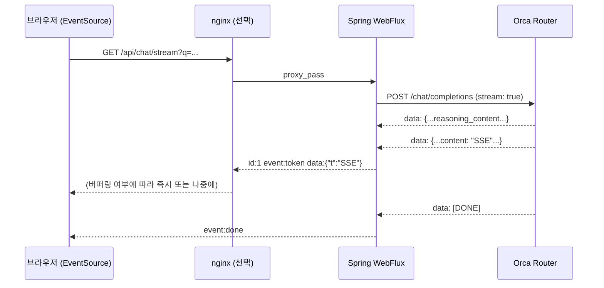

> WebSocket에 밀려 잊혔던 SSE(Server-Sent Events)가 왜 LLM 토큰 스트리밍의 표준이 되었는지,
> 그리고 실제로 nginx 뒤에 세웠을 때 무엇이 깨지는지 직접 재현하며 정리해 둡니다.

---

## Sample Code

> 이 시리즈에서 다루는 전체 예제 코드는 GitHub에서 확인할 수 있습니다.
>
> **[spring-sse-sample](https://github.com/rojae/spring-sample/tree/main/spring-sse-sample)**
{: .prompt-info }

---

## 시리즈 목차

- **SSE, LLM 시대에 다시 보기 - (토큰이 한꺼번에 도착하는 이유)** ← 현재 글
- Orca Router 앞에 LiteLLM 한 겹 끼우기 - (게이트웨이, 비용, 폴백) *(작성 예정)*
- "MCP는 결국 JSON이고 웹 통신이잖아"에 답하기 - (stdio와 Streamable HTTP) *(작성 예정)*
- 게이트웨이 뒤에 MCP 서버 세우기 *(작성 예정)*
- MCP 인증과 보안, 백엔드가 가장 잘 아는 자리 *(작성 예정)*

---

## 이 글에서 다룰 내용

- SSE가 무엇이고, 왜 LLM 응답 스트리밍에 다시 쓰이게 됐는지
- Orca Router의 무료 DeepSeek V4 Flash 모델로 실습 환경 만들기 (무료 조건, 제한까지)
- `curl -N`으로 SSE 원문을 받아 프레임 하나하나 뜯어보기
- Spring WebFlux로 스트리밍 프록시 만들기
- 실패 1: 브라우저에서 띄어쓰기가 전부 사라진 이유
- 실패 2: nginx를 앞에 세웠더니 토큰이 응답 끝에 한꺼번에 도착한 이유와 해결

---

## "토큰이 한꺼번에 도착해요"

LLM 기능을 붙인 서비스를 운영하다 보면 이런 이야기를 듣게 됩니다.

*"로컬에서는 글자가 한 자씩 나오는데, 스테이징에 올리니까 3초 동안 아무것도 없다가 답이 통째로 뜹니다."*

서버 로그를 보면 첫 토큰이 1초 남짓에 나갔다고 찍혀 있습니다. 그런데 브라우저는 마지막 토큰이 나올 때까지 아무것도 받지 못합니다.

이 현상을 이해하려면 SSE라는 전송 방식이 무엇인지, 그리고 그 사이에 낀 프록시가 무엇을 하는지 알아야 합니다. 이 글은 그 두 가지를 직접 재현해 보는 기록입니다.

---

## SSE, 잊혔던 기술이 왜 돌아왔나

### WebSocket과 무엇이 다른가

| 항목 | SSE | WebSocket |
|------|-----|-----------|
| 방향 | 서버 → 클라이언트 단방향 | 양방향 |
| 프로토콜 | 그냥 HTTP (Content-Type만 다름) | HTTP에서 업그레이드한 별도 프로토콜 |
| 프록시/로드밸런서 | 일반 HTTP 응답으로 통과 | 업그레이드 지원 필요 |
| 재연결 | 브라우저가 자동으로 재접속, `Last-Event-ID` 전달 | 직접 구현 |
| 브라우저 API | `EventSource` 한 줄 | `WebSocket` + 프로토콜 설계 |

LLM 응답은 "서버가 토큰을 밀어주는" 단방향 흐름입니다. 사용자의 입력은 요청 한 번으로 끝나고, 그 뒤로는 서버가 계속 말합니다. 양방향 채널이 필요 없으니 WebSocket은 과했고, HTTP 그대로인 SSE가 딱 맞았습니다.

> OpenAI 호환 API의 `stream: true` 응답이 `text/event-stream`으로 오기 때문에, 사실상 업계 표준이 SSE로 굳어졌습니다.
{: .prompt-tip }

### 와이어 포맷은 단순합니다

SSE는 텍스트 프로토콜입니다. 줄 단위로 필드가 오고, 빈 줄이 이벤트 하나의 끝입니다.

```
id: 1
event: token
data: {"t":"SSE"}

id: 2
event: token
data: {"t":"는"}

```

| 필드 | 의미 |
|------|------|
| `data:` | 페이로드. 여러 줄이면 `\n`으로 이어 붙임 |
| `event:` | 이벤트 이름. 없으면 `message` |
| `id:` | 마지막으로 받은 id. 재연결 시 `Last-Event-ID` 헤더로 서버에 전달 |
| `retry:` | 재연결 대기 시간(ms) |
| 빈 줄 | 이벤트 하나 끝 (dispatch) |

여기서 나중에 저를 괴롭힐 규칙이 하나 있습니다. **`data:` 바로 뒤에 공백이 한 칸 있으면, 그 공백은 값이 아니라 구분자로 취급되어 버려집니다.** 이건 뒤에서 다시 보겠습니다.

---

## 실습 준비: Orca Router의 무료 DeepSeek V4 Flash

### 왜 이 모델인가

실습에 돈이 들면 따라 하기 어렵습니다. 저는 [Orca Router](https://www.orcarouter.ai)에서 제공하는 무료 모델 `deepseek/deepseek-v4-flash-free`를 썼습니다.

<figure style="text-align: center;">
  
  <figcaption style="margin-top: 0.5rem; font-size: 0.95rem; color: #666;">
    DeepSeek V4 Flash (Free): 1M 컨텍스트, 384K 최대 출력, 요청당 $0
  </figcaption>
</figure>

| 항목 | 값 |
|------|-----|
| 모델 ID | `deepseek/deepseek-v4-flash-free` |
| 가격 | 요청당 $0 (`pricing.request: "0.000000"`) |
| 컨텍스트 | 1M 토큰 |
| 최대 출력 | 384K 토큰 |
| 지원 | Tools, JSON, Reasoning (`reasoning_content`가 따로 옴) |
| 유료 쌍둥이 | `deepseek/deepseek-v4-flash` (입력 $0.22 / 출력 $0.66 per 1M 토큰) |

같은 가중치를 무료 별칭과 유료 ID 두 개로 내놓고, 무료 쪽에만 호출 제한을 거는 구조입니다.

### 키 발급과 환경변수

1. [orcarouter.ai](https://www.orcarouter.ai) 가입 후 콘솔에서 API 키를 만듭니다. (무료 플랜 "Hacker"는 키 10개까지)
2. 환경변수로 등록합니다.

```bash
# ~/.zshrc
export ORCA_ROUTER_API_KEY=sk-or-...
```

> `export` 없이 `ORCA_ROUTER_API_KEY=...`로만 적으면 셸 변수라서 Java, Python 같은 자식 프로세스에서는 보이지 않습니다.
> 저도 처음에 이걸로 10분을 날렸습니다. `curl`은 되는데 Spring이 401을 받으면 이 문제입니다.
{: .prompt-warning }

### 무료 티어 조건, 직접 확인하기

무료 모델 제한은 문서에 숫자로 박혀 있지 않고 공개 API로 내려옵니다. 직접 찍어 봤습니다.

<figure style="text-align: center;">
  
  <figcaption style="margin-top: 0.5rem; font-size: 0.95rem; color: #666;">
    /api/free-package/public 과 /v1/models 로 확인한 무료 티어 (2026-09 기준)
  </figcaption>
</figure>

| 누적 결제 | 분당 요청(RPM) | 일일 요청(RPD) |
|-----------|----------------|----------------|
| $0 (한 번도 충전 안 함) | 10 | 50 |
| $20 이상 | 20 | 800 |

무료 모델을 쓸 때 알아 둘 점을 정리하면 다음과 같습니다.

- 무료 모델은 ID 뒤에 `-free`가 붙습니다. 목록은 수시로 바뀌므로 `/v1/models`에서 확인하는 편이 안전합니다.
- 제한을 넘기면 `429`, 프롬프트 길이 상한을 넘기면 `400`이 옵니다. **무료 트래픽에는 `X-RateLimit-*` 헤더가 오지 않습니다.**
- 일일 카운터는 UTC 00:00에 초기화됩니다. 한국 시간으로 오전 9시입니다.
- 무료 모델은 유료 모델로 자동 폴백되지 않습니다. 폴백 체인의 대상으로도 넣을 수 없습니다.
- 이 글의 실험 전체(약 20회 호출)는 하루 50회 안에서 끝났습니다. 하루 한도가 작으니 실험은 계획적으로 하는 게 좋습니다.

---

## 1. 패킷부터 보자: curl -N으로 원문 받기

설명보다 원문이 빠릅니다. `stream: true`로 직접 호출해 봤습니다.

```bash
curl -sN https://api.orcarouter.ai/v1/chat/completions \
  -H "Authorization: Bearer $ORCA_ROUTER_API_KEY" \
  -H "Content-Type: application/json" \
  -d '{"model":"deepseek/deepseek-v4-flash-free",
       "messages":[{"role":"user","content":"SSE가 무엇인지 한 문장으로 설명해줘."}],
       "stream":true,"stream_options":{"include_usage":true}}'
```

<figure style="text-align: center;">
  
  <figcaption style="margin-top: 0.5rem; font-size: 0.95rem; color: #666;">
    업스트림이 보내는 SSE 원문. 앞부분은 reasoning_content, 뒤에 usage 와 [DONE]
  </figcaption>
</figure>

원문에서 눈에 띄는 것들을 짚어 보겠습니다.

- **`curl -N`이 필수입니다.** curl은 기본적으로 출력을 버퍼링하기 때문에 `-N`(`--no-buffer`)이 없으면 curl 자체가 "한꺼번에 도착"을 만들어 냅니다.
- 모든 이벤트가 `data:` 한 줄과 빈 줄로만 되어 있습니다. `event:`도 `id:`도 없습니다. OpenAI 호환 API는 SSE의 가장 단순한 형태만 씁니다.
- 앞쪽 청크들은 `content`가 비어 있고 `reasoning_content`만 채워져 있습니다. 모델이 생각하는 동안에도 프레임은 계속 옵니다. 이걸 화면에 그대로 붙이면 "We need answer in Korean." 같은 영어 사고 과정이 사용자에게 노출됩니다.
- `stream_options.include_usage: true`를 주면 마지막에 `usage`가 옵니다. 그런데 **두 번 옵니다.** `finish_reason: "stop"` 청크와 `choices: []`인 마지막 청크 양쪽에 같은 값이 들어 있습니다. 비용 집계를 이벤트 개수로 하면 두 배로 잡힙니다.
- 종료는 JSON이 아니라 문자열 `[DONE]`입니다. 파서가 이걸 JSON으로 읽으려 하면 마지막에 예외가 납니다.

curl의 `-w` 옵션으로 찍은 시간도 의미가 있습니다.

```
[time_total=1.84s  starttransfer=1.27s]
```

`starttransfer`가 첫 바이트 도착 시각, 즉 TTFT(Time To First Token)입니다. 전체 1.84초 중 1.27초가 첫 토큰을 기다리는 시간이었습니다. 스트리밍이 체감상 빠른 이유는 총 시간이 줄어서가 아니라 이 1.27초 뒤부터는 계속 무언가가 보이기 때문입니다.

---

## 2. Spring WebFlux로 스트리밍 프록시 만들기

브라우저에 API 키를 노출할 수는 없으니 중간에 서버가 하나 필요합니다. 업스트림 SSE를 받아 브라우저에 SSE로 다시 내보내는 프록시입니다.



### 의존성

```gradle
dependencies {
    implementation 'org.springframework.boot:spring-boot-starter-webflux'

    compileOnly 'org.projectlombok:lombok'
    annotationProcessor 'org.projectlombok:lombok'
    annotationProcessor 'org.springframework.boot:spring-boot-configuration-processor'

    testImplementation 'org.springframework.boot:spring-boot-starter-test'
}
```

WebFlux를 고른 이유는 하나입니다. 업스트림 응답을 `Flux<String>`으로 받아 `Flux<ServerSentEvent>`로 흘려보내면 스레드를 붙잡지 않고 중계할 수 있기 때문입니다. Spring MVC의 `SseEmitter`로도 됩니다만, 업스트림을 읽는 쪽에서 블로킹이 생깁니다.

### 설정

```yaml
orca:
  base-url: ${ORCA_BASE_URL:https://api.orcarouter.ai/v1}
  model: ${ORCA_MODEL:deepseek/deepseek-v4-flash-free}
  api-key: ${ORCA_ROUTER_API_KEY}
  response-timeout: ${ORCA_RESPONSE_TIMEOUT:60s}
```

### WebClient: 압축을 끕니다

```java
@Bean
public WebClient orcaWebClient(WebClient.Builder builder, OrcaProperties props) {
    HttpClient httpClient = HttpClient.create()
            .compress(false)          // gzip 응답을 받지 않는다
            .responseTimeout(props.responseTimeout())
            .keepAlive(true);

    return builder
            .baseUrl(props.baseUrl())
            .clientConnector(new ReactorClientHttpConnector(httpClient))
            .defaultHeader(HttpHeaders.AUTHORIZATION, "Bearer " + props.apiKey())
            .defaultHeader(HttpHeaders.ACCEPT, MediaType.TEXT_EVENT_STREAM_VALUE)
            .defaultHeader(HttpHeaders.CONTENT_TYPE, MediaType.APPLICATION_JSON_VALUE)
            .build();
}
```

`compress(false)`가 왜 중요한지는 5번 절에서 nginx로 재현하며 설명합니다. 압축은 곧 버퍼입니다.

### 핵심: 업스트림 청크를 이벤트로 바꾸기

```java
public Flux<ServerSentEvent<String>> stream(String prompt) {
    Stats stats = new Stats();

    return upstreamPayloads(prompt)
            .doOnNext(payload -> stats.markChunk())
            .filter(payload -> !ChunkParser.isDone(payload))      // "[DONE]" 은 JSON 이 아니다
            .concatMap(payload -> Flux.fromIterable(toEvents(payload, stats)))
            .concatWith(Flux.defer(() -> Flux.just(
                    ServerSentEvent.<String>builder().event("done").data("[DONE]").build())))
            .onErrorResume(error -> {
                // 스트림 도중 500 을 던질 수 없다. 이미 200 헤더가 나갔다.
                return Flux.just(ServerSentEvent.<String>builder()
                        .event("error").data(String.valueOf(error.getMessage())).build());
            })
            .doFinally(signal -> stats.log("stream", prompt));
}

private Flux<String> upstreamPayloads(String prompt) {
    return orcaWebClient.post()
            .uri("/chat/completions")
            .accept(MediaType.TEXT_EVENT_STREAM)
            .body(BodyInserters.fromValue(requestBody(prompt)))
            .retrieve()
            // text/event-stream 이면 WebClient 가 "data:" 접두어를 떼고 payload 만 준다.
            .bodyToFlux(String.class);
}
```

```java
private List<ServerSentEvent<String>> toEvents(String payload, Stats stats) {
    List<ServerSentEvent<String>> events = new ArrayList<>(2);

    ChunkParser.extractContent(payload).ifPresent(content ->
        events.add(ServerSentEvent.<String>builder()
                .id(String.valueOf(stats.seq.incrementAndGet()))
                .event("token")
                .data(SseEvents.encodeToken(content))   // 3번 절에서 설명
                .build()));

    ChunkParser.extractUsage(payload).ifPresent(usage -> {
        // 업스트림은 usage 를 두 번 보낸다. 한 번만 내보낸다.
        if (stats.usageSent.compareAndSet(false, true)) {
            events.add(ServerSentEvent.<String>builder().event("usage").data(usage).build());
        }
    });
    return events;
}
```

세 가지 결정이 들어 있습니다.

| 결정 | 이유 |
|------|------|
| `reasoning_content`는 내보내지 않고 개수만 센다 | 사고 과정이 사용자에게 노출되면 안 됨 |
| `usage`는 스트림당 한 번만 | 업스트림이 두 번 보내므로 |
| 에러는 `event: error`로 보내고 정상 종료 | 이미 200 OK 헤더와 본문 일부가 나간 뒤라 상태 코드를 바꿀 수 없음 |

> 스트리밍 응답에서는 "헤더가 나간 뒤의 실패"를 반드시 본문 안에서 표현해야 합니다.
> 클라이언트가 `[DONE]` 없이 연결이 끊긴 것과 서버가 명시적으로 실패를 알린 것을 구분할 수 있어야 재시도 정책을 세울 수 있습니다.
{: .prompt-warning }

### 컨트롤러

```java
@GetMapping(value = "/stream", produces = MediaType.TEXT_EVENT_STREAM_VALUE)
public Flux<ServerSentEvent<String>> stream(
        @RequestParam("q") String q,
        @RequestParam(value = "accel", defaultValue = "false") boolean accel,
        ServerHttpResponse response) {

    response.getHeaders().setCacheControl("no-cache");
    if (accel) {
        response.getHeaders().add("X-Accel-Buffering", "no");   // 5번 절에서 설명
    }
    return chatStreamService.stream(q);
}
```

`GET`에 쿼리 파라미터를 쓴 이유는 브라우저의 `EventSource`가 GET만 지원하기 때문입니다. `POST`로 SSE를 받으려면 `fetch` + `ReadableStream`으로 직접 파싱해야 합니다.

### 실행해 보기

```bash
export ORCA_ROUTER_API_KEY=...
SERVER_PORT=8090 ./gradlew :spring-sse-sample:bootRun
```

> 제 로컬은 8080에 다른 서비스가 떠 있어서 8090으로 띄웠습니다. 이 글의 캡처에 8090이 보이는 이유입니다.
{: .prompt-info }

```bash
curl -N -G --data-urlencode "q=SSE가 무엇인지 한 문장으로 설명해줘." \
  http://localhost:8090/api/chat/stream
```

<figure style="text-align: center;">
  
  <figcaption style="margin-top: 0.5rem; font-size: 0.95rem; color: #666;">
    id / event / data 세 필드로 정리된 이벤트. usage 는 한 번, 마지막은 event:done
  </figcaption>
</figure>

서버 로그에는 요청 한 건당 한 줄이 남습니다.

```
[stream] ttft=1243ms elapsed=2462ms chunks=142 content=121 reasoning=18 error=-
```

업스트림 청크 142개 중 실제 글자가 담긴 건 121개, 18개는 사고 과정이었습니다. 이 로그가 나중에 "서버는 빠른데 브라우저가 느리다"를 증명하는 근거가 됩니다.

---

## 3. 첫 번째 실패: 띄어쓰기가 전부 사라졌다

브라우저 데모 페이지를 만들어 붙였습니다. `EventSource`로 연결하고 `token` 이벤트를 화면에 이어 붙이는 단순한 페이지입니다. 그런데 결과가 이랬습니다.

<figure style="text-align: center;">
  
  <figcaption style="margin-top: 0.5rem; font-size: 0.95rem; color: #666;">
    "SSE(Server-SentEvents)는서버가클라이언트에게..." 공백이 하나도 없다
  </figcaption>
</figure>

curl로 볼 때는 멀쩡했습니다. 원인은 앞에서 예고한 SSE 규칙입니다.

```
서버가 보낸 것:      data: 서버가
                         ^ 토큰 " 서버가" 의 앞 공백
브라우저가 받은 것:  "서버가"
```

SSE 명세는 `data:` 뒤에 공백이 정확히 한 칸 있으면 그것을 구분자로 보고 버립니다. `data: hello`와 `data:hello`가 같은 값이 되도록 만든 규칙인데, LLM 토큰은 대부분 **앞에 공백이 붙은 채로** 옵니다(`" 서버가"`, `" Events"`). 토크나이저가 단어 앞 공백을 토큰에 포함시키기 때문입니다. 그래서 모든 단어의 앞 공백이 전부 잘려 나갔습니다.

Spring의 `ServerSentEvent`는 `data:` 뒤에 공백 없이 값을 붙입니다. 그러니 `" 서버가"`를 그대로 넣으면 `data: 서버가`가 되고, 정확히 규칙에 걸립니다.

### 해결: 토큰을 JSON으로 감싼다

```java
public final class SseEvents {
    private static final ObjectMapper MAPPER = new ObjectMapper();

    /** 토큰 이벤트의 data 를 {"t":"<content>"} 로 인코딩한다. */
    public static String encodeToken(String content) {
        return MAPPER.writeValueAsString(Map.of("t", content));
    }
}
```

```
data:{"t":" 서버가"}
```

`data:` 바로 뒤가 공백이 아니라 여는 중괄호이므로 아무것도 잘리지 않습니다. 클라이언트는 `JSON.parse(e.data).t`로 원래 문자열을 그대로 꺼냅니다.

```javascript
es.addEventListener('token', function (e) {
  const text = JSON.parse(e.data).t;   // 앞 공백 보존
  appendToken(text);
  logLine(elapsed(), e.lastEventId, JSON.stringify(text));  // 타임라인엔 " 서버가" 로 표시
});
```

<figure style="text-align: center;">
  
  <figcaption style="margin-top: 0.5rem; font-size: 0.95rem; color: #666;">
    수정 후. 오른쪽 타임라인에 " 재", " 연결" 처럼 앞 공백이 보인다
  </figcaption>
</figure>

> 토큰을 날것 문자열로 SSE에 싣지 마세요. JSON으로 한 번 감싸는 것이 가장 싸고 확실합니다.
> OpenAI 호환 API가 `data:` 뒤에 항상 JSON 객체를 두는 이유이기도 합니다.
{: .prompt-tip }

---

## 4. 도착 시각을 재 보자

"한꺼번에 도착한다"를 눈이 아니라 숫자로 보고 싶었습니다. 요청 시작부터 각 이벤트가 도착한 시각을 ms 단위로 찍는 작은 파이썬 스크립트를 만들었습니다. (예제 저장소에 `stream_timing.py`로 포함)

<figure style="text-align: center;">
  
  <figcaption style="margin-top: 0.5rem; font-size: 0.95rem; color: #666;">
    Spring 직접(8090). 첫 토큰 1604ms, 마지막 2462ms, 121개 토큰이 20개 시점에 나눠 도착
  </figcaption>
</figure>

여기서 하나 배운 게 있습니다. 토큰이 정확히 하나씩 따로 오지 않습니다. 1667ms에 3개, 1735ms에 4개처럼 **업스트림이 애초에 몇 개씩 묶어서 보냅니다.** 121개 토큰이 20번에 나눠 도착했습니다. 이건 프록시 탓이 아니라 모델 서빙 쪽의 배치입니다. 그러니 "뭉쳐서 온다"를 판단할 때는 "몇 번에 나눠 왔는가"를 봐야지, "토큰마다 따로 왔는가"를 기준으로 삼으면 안 됩니다.

---

## 5. 두 번째 실패: nginx를 앞에 세웠더니

실제 배포에서는 Spring 앞에 nginx나 로드밸런서가 있습니다. docker compose로 nginx를 세 가지 설정으로 띄워 비교했습니다. (아래 설정은 핵심만 남긴 것이고, 전체 파일은 예제 저장소의 `docker/` 폴더에 있습니다.)

```yaml
services:
  nginx:
    image: nginx:1.27-alpine
    ports: ["8081:8081", "8082:8082", "8083:8083"]
    environment:
      UPSTREAM_PORT: ${UPSTREAM_PORT:-8080}
    volumes:
      - ./templates:/etc/nginx/templates:ro
    extra_hosts:
      - "host.docker.internal:host-gateway"
```

```nginx
# 8081 : nginx 기본값. 버퍼링 관련 지시어를 하나도 주지 않는다.
server {
    listen 8081;
    location / {
        proxy_pass http://host.docker.internal:${UPSTREAM_PORT};
        proxy_http_version 1.1;
        # proxy_buffering on (기본값), proxy_read_timeout 60s (기본값)
    }
}

# 8082 : SSE 권장 설정
server {
    listen 8082;
    location / {
        proxy_pass http://host.docker.internal:${UPSTREAM_PORT};
        proxy_http_version 1.1;
        proxy_buffering off;
        proxy_cache off;
        proxy_read_timeout 300s;
        proxy_set_header Connection '';
    }
}

# 8083 : gzip 만 켠다. 버퍼링은 기본값 그대로.
server {
    listen 8083;
    gzip on;
    gzip_types text/event-stream application/json text/plain;
    gzip_min_length 0;
    gzip_proxied any;
    location / {
        proxy_pass http://host.docker.internal:${UPSTREAM_PORT};
        proxy_http_version 1.1;
    }
}
```

```bash
UPSTREAM_PORT=8090 docker compose -f spring-sse-sample/docker/docker-compose.yml up -d
```

### 실측 결과

같은 프롬프트로 각 경로를 측정 스크립트로 한 번씩 돌렸습니다. TTFT는 업스트림 편차가 커서(모델 페이지 기준 p50 2.85초) 경로 간 비교 의미가 없고, **"도착 시점 수"** 열이 핵심입니다. 아래 브라우저 캡처는 스크립트와 별개로 실행한 회차라 숫자가 표와 다릅니다.

| 경로 | 첫 토큰 | 마지막 토큰 | 토큰 수 | 도착 시점 수 |
|------|--------:|-----------:|-------:|------------:|
| Spring 직접 (8090) | 1604ms | 2462ms | 121 | 20 |
| nginx 기본 설정 (8081) | 2056ms | 2601ms | 125 | 28 |
| nginx `proxy_buffering off` (8082) | 1651ms | 2214ms | 125 | 29 |
| **nginx `gzip on` (8083)** | **2434ms** | **2434ms** | 144 | **1** |
| nginx `gzip on` + `X-Accel-Buffering: no` | 1611ms | 2328ms | 122 | 22 |

### 예상과 달랐던 것: proxy_buffering on만으로는 재현이 안 됐다

솔직히 8081에서 뭉칠 줄 알았습니다. "nginx가 SSE를 버퍼링한다"는 말을 워낙 많이 들었기 때문입니다. 그런데 로컬의 빠른 클라이언트에서는 차이가 없었습니다.

이유를 찾아보니, `proxy_buffering on`은 "응답을 다 모았다가 보낸다"가 아니라 "업스트림에서 받은 만큼 버퍼에 넣고, 클라이언트 소켓이 쓸 수 있으면 바로 보낸다"입니다. 클라이언트가 업스트림보다 느릴 때 그 차이를 버퍼(그리고 디스크)로 흡수하는 게 목적이고, 클라이언트가 빠르면 사실상 즉시 흘러갑니다. 그러니 로컬에서는 재현이 안 되고, 느린 모바일 회선이나 큰 응답에서만 간헐적으로 나타납니다.

### 진짜 범인: gzip

8083은 달랐습니다. 144개 토큰이 **한 시점에** 도착했습니다.

<figure style="text-align: center;">
  
  <figcaption style="margin-top: 0.5rem; font-size: 0.95rem; color: #666;">
    8083(gzip on)을 브라우저에서 따로 실행한 회차. 첫 토큰 2070ms, 마지막 토큰 2094ms. 103개가 24ms 안에 다 왔다 = 사실상 한꺼번에
  </figcaption>
</figure>

<figure style="text-align: center;">
  
  <figcaption style="margin-top: 0.5rem; font-size: 0.95rem; color: #666;">
    위: gzip on, 도착 시점 1개. 아래: 같은 8083에 X-Accel-Buffering: no 를 붙이자 22개 시점으로 분산
  </figcaption>
</figure>

왜 gzip이 문제일까요. nginx의 gzip 필터는 deflate 출력을 자체 버퍼에 모읍니다. 그리고 **입력 버퍼에 flush 표시가 붙어 있을 때만** 모아둔 것을 내보냅니다. `proxy_buffering on`으로 들어온 업스트림 데이터에는 flush 표시가 없습니다. 그래서 gzip 필터는 스트림이 끝날 때까지(또는 gzip 버퍼가 찰 때까지) 아무것도 내보내지 않습니다. 앞에서 `proxy_buffering on`이 무해했던 이유와 정확히 반대 조건입니다.

정리하면 **"proxy_buffering on + gzip on"** 조합이 SSE를 죽입니다. 그리고 이 조합은 흔합니다. `gzip on`은 대부분의 nginx 템플릿에 기본으로 들어 있고, `gzip_types`에 `text/event-stream`이 없어도 `application/json`이 있다면 JSON 스트리밍 API에서 같은 일이 벌어집니다.

### 해결 방법 세 가지

| 방법 | 어디를 고치나 | 비고 |
|------|--------------|------|
| `proxy_buffering off` | nginx | 가장 확실. 8082 설정 |
| `gzip_types`에서 `text/event-stream` 제외 | nginx | SSE는 어차피 작은 텍스트라 압축 이득이 없음 |
| 응답 헤더 `X-Accel-Buffering: no` | **애플리케이션** | nginx 설정을 못 건드릴 때 |

세 번째가 재밌습니다. nginx는 업스트림 응답에 `X-Accel-Buffering: no` 헤더가 있으면 **그 응답에 한해** 버퍼링을 끕니다. 버퍼링이 꺼지면 각 청크에 flush 표시가 붙고, gzip 필터도 청크마다 내보냅니다. 그래서 8083에 `accel=true`를 주자 22개 시점으로 풀렸습니다.

<figure style="text-align: center;">
  
  <figcaption style="margin-top: 0.5rem; font-size: 0.95rem; color: #666;">
    같은 8083을 브라우저에서 헤더를 붙여 실행한 회차. 첫 토큰 1992ms, 마지막 2195ms 로 다시 흘러나온다
  </figcaption>
</figure>

```java
response.getHeaders().add("X-Accel-Buffering", "no");
```

> 이 헤더는 nginx가 소비하고 클라이언트에는 전달하지 않습니다. 측정 스크립트에서 `x-accel-buffering=None`으로 찍힌 이유입니다.
> "헤더를 붙였는데 브라우저 개발자 도구에 안 보인다"고 당황하지 않아도 됩니다.
{: .prompt-info }

인프라를 직접 만지지 못하는 팀이라면 이 헤더가 가장 현실적인 답입니다. 스트리밍 엔드포인트에는 그냥 항상 붙이는 것을 권합니다.

### 하나 더: proxy_read_timeout 60초

8081 설정에는 함정이 하나 더 있습니다. nginx의 `proxy_read_timeout` 기본값은 60초이고, 이건 전체 시간이 아니라 **연속된 두 읽기 사이의 간격**입니다. 모델이 60초 동안 토큰을 하나도 내지 않으면(긴 사고 과정, 큐 대기) nginx가 연결을 끊습니다. 브라우저의 `EventSource`는 자동 재연결하므로 같은 프롬프트가 다시 날아가고, 사용자는 답이 처음부터 다시 시작되는 걸 보게 됩니다. LLM 엔드포인트에는 넉넉히 늘려 두어야 합니다.

---

## 6. 정리: SSE 스트리밍 체크리스트

| 구간 | 확인할 것 |
|------|-----------|
| 클라이언트 | `curl -N` 없이 판단하지 않기. 브라우저 `EventSource`는 GET만 지원 |
| 애플리케이션 | 토큰은 JSON으로 감싸기 (`data:` 뒤 공백 규칙) |
| 애플리케이션 | `X-Accel-Buffering: no`, `Cache-Control: no-cache` 헤더 |
| 애플리케이션 | 에러는 `event: error`로. `[DONE]`은 JSON이 아님. `usage`는 두 번 옴 |
| 애플리케이션 | 업스트림 WebClient의 압축 끄기 (`compress(false)`) |
| nginx | `proxy_buffering off` 또는 `gzip_types`에서 `text/event-stream` 제외 |
| nginx | `proxy_read_timeout`은 토큰 간 간격 기준. LLM은 길게 |
| 업스트림 | `reasoning_content`는 사용자에게 숨기기. 무료 모델은 RPM/RPD 한도 확인 |

---

## 참고 자료

- [Server-Sent Events 명세 (WHATWG)](https://html.spec.whatwg.org/multipage/server-sent-events.html) - `data:` 뒤 공백 처리 규칙
- [nginx proxy_buffering](https://nginx.org/en/docs/http/ngx_http_proxy_module.html#proxy_buffering)
- [nginx X-Accel-Buffering](https://nginx.org/en/docs/http/ngx_http_proxy_module.html#proxy_buffering)
- [Orca Router Free Models](https://docs.orcarouter.ai/routing/free-models)
- [DeepSeek V4 Flash (Free) on Orca Router](https://www.orcarouter.ai/models/deepseek/deepseek-v4-flash-free)
- [Spring WebFlux ServerSentEvent](https://docs.spring.io/spring-framework/reference/web/webflux/reactive-spring.html#webflux-codecs-streaming)

---

## 마치며

1편에서는 SSE 원문을 직접 뜯어보고, Spring WebFlux 프록시를 만들고, 두 가지 실패를 재현했습니다.

- 띄어쓰기가 사라진 건 SSE 명세의 공백 규칙 때문이었고, JSON으로 감싸서 해결했습니다.
- 토큰이 한꺼번에 도착한 건 `proxy_buffering on` 단독이 아니라 **gzip과의 조합** 때문이었고, `X-Accel-Buffering: no` 헤더 하나로 애플리케이션 쪽에서 풀 수 있었습니다.

다음 편에서는 이 Spring 프록시의 base URL만 바꿔서 LiteLLM 게이트웨이를 사이에 끼웁니다. 키 관리, 비용 집계, 무료 모델이 429를 맞았을 때 유료 모델로 넘기는 폴백까지 실측으로 다루겠습니다.

> "로컬에서는 되는데 배포하면 안 된다"는 말의 절반은 중간에 낀 무언가가 버퍼링을 하고 있다는 뜻입니다.
> 스트리밍을 붙일 때는 애플리케이션 코드보다 그 앞뒤에 무엇이 서 있는지부터 그려 보시길 권합니다.
{: .prompt-tip }
