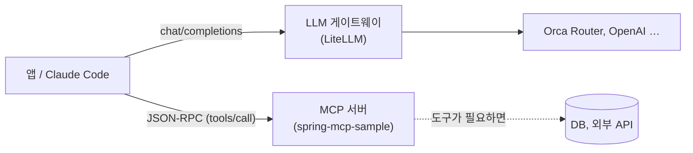
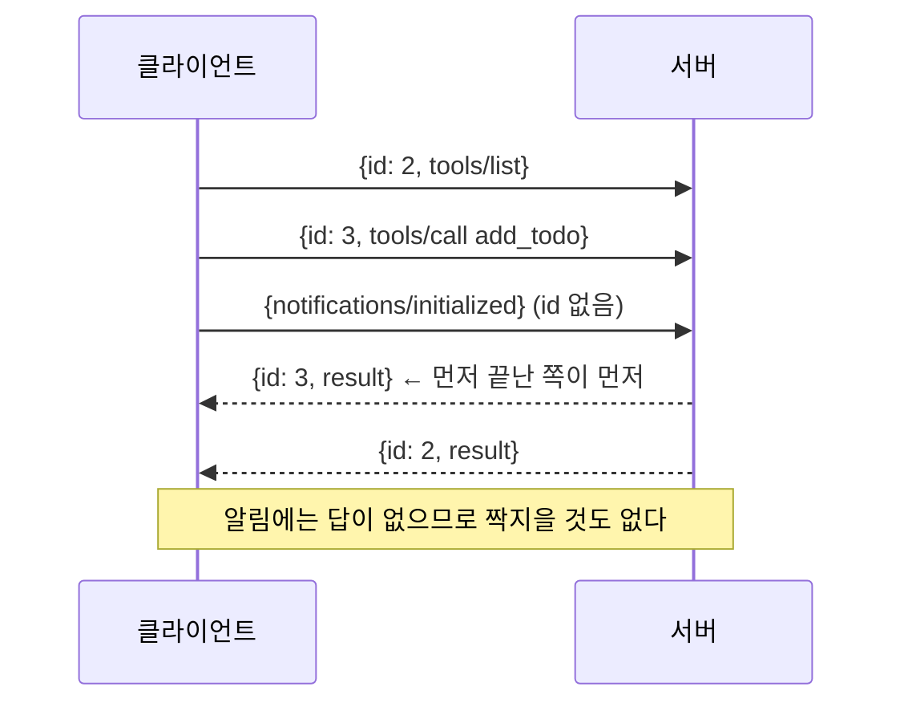

> 1편(SSE), 2편(게이트웨이), 3편(MCP)을 쓰고 나니 답 하나가 다음 질문을 불렀습니다. 그 질문들을 순서대로 따라가며 세 글을 한 줄로 잇는 문답입니다. 새로 주장하는 두 가지(세션 없는 MCP, 게이트웨이 키별 분당 한도)는 실제로 돌려서 캡처했습니다.
> + 샘플코드는 [spring-sse-sample](https://github.com/rojae/spring-sample/tree/main/spring-sse-sample), [litellm-gateway-sample](https://github.com/rojae/spring-sample/tree/main/litellm-gateway-sample), [spring-mcp-sample](https://github.com/rojae/spring-sample/tree/main/spring-mcp-sample)에서 확인할 수 있습니다.
> + 이 글은 "LLM 통신 스택" 시리즈의 4편입니다. 1편은 [SSE, LLM 시대에 다시 보기](/posts/sse-revisited-for-llm-streaming), 2편은 [Orca Router 앞에 LiteLLM 한 겹 끼우기](/posts/litellm-gateway-in-front-of-orca-router), 3편은 [MCP란 무엇인가](/posts/mcp-jsonrpc-and-transports)이고, 다음 편은 게이트웨이 뒤의 MCP와 인증·보안을 다룰 예정입니다.
{: .prompt-info }
<!-- post-check: tone=polite -->

---

## 이 글을 읽는 법

세 편을 쓰는 동안 이런 순간이 여러 번 있었습니다. 답을 적고 나면 그 답 때문에 새 질문이 생기는데, 그 글의 주제가 아니라서 접어 두는 것입니다.

> "gzip이 SSE를 뭉치게 한다고요? 그럼 MCP 응답도 SSE니까 똑같이 뭉치는 거 아니에요?"

이 글은 그렇게 접어 둔 질문들을 꺼내 순서대로 답합니다. 규칙은 하나입니다. **질문 하나에 답 하나, 그 답에서 다음 질문.** 사슬은 셋입니다.

| 사슬 | 출발 | 도착 |
|------|------|------|
| A. 스트림 | 1편의 gzip | 3편의 Streamable HTTP, 그리고 stdio |
| B. 게이트웨이 | 2편의 429 세 가지 | 다음 편의 "게이트웨이 뒤의 MCP" |
| C. 메시지와 세션 | 3편의 JSON-RPC `id` | 1편의 "중간에 무엇이 서 있는가" |

근거는 세 편의 캡처를 그대로 가리키고(👉), 새로 확인한 것 네 가지는 이 글에 캡처를 실었습니다. 환경은 앞 편들과 같습니다.

| 항목 | 값 |
|------|-----|
| MCP 서버 | spring-mcp-sample, Spring Boot 3.2.2, Spring AI 1.1.8 (MCP Java SDK 0.18.3) |
| 게이트웨이 | LiteLLM `main-latest` 이미지, 포트 4400, 모델 `deepseek-flash-free` (Orca Router 무료) |
| 손 도구 | Python 3.9, curl 8.7.1. 이 글의 작은 서버·클라이언트는 각 샘플의 `scripts/` 폴더에 있습니다 |
| 리버스 프록시 | nginx 1.27 (1편의 docker 설정) |

---

## A1. gzip 필터는 왜 이벤트 경계를 모르나요

1편에서 SSE 이벤트의 경계는 **빈 줄**이라고 했습니다. 그런데 nginx의 gzip 필터는 빈 줄이 와도 내보내지 않고 스트림 끝까지 모았습니다. 왜일까요.

필터가 보는 것이 **이벤트가 아니라 바이트**이기 때문입니다. nginx 안에서 응답은 버퍼 체인으로 흐르고, 각 버퍼에는 "여기까지 내보내라"는 flush 표시가 있거나 없습니다. gzip 필터는 표시가 있는 버퍼가 올 때만 압축 결과를 뱉습니다. `data:`가 뭔지, 빈 줄이 뭔지는 모릅니다.

| 층 | 누가 아나 | 무엇을 기준으로 자르나 |
|----|-----------|------------------------|
| 애플리케이션 (SSE) | 브라우저 `EventSource`, Spring | 빈 줄 = 이벤트 하나 |
| 전송 (HTTP 본문) | nginx, 로드밸런서 | 버퍼와 flush 표시 |
| 압축 (gzip) | nginx 필터 | flush 표시 있는 버퍼만 |

그래서 해결책이 전부 **flush 표시를 붙이는 방법**이었습니다. `proxy_buffering off`는 모든 버퍼에 표시를 붙이고, `X-Accel-Buffering: no`는 그 응답 하나에만 붙입니다. 이벤트 형식을 바꾸는 방법이 하나도 없었던 이유입니다.

👉 1편 "nginx 내부 경로 – 갈림길 두 번" 의 다이어그램이 이 두 갈림길입니다.

> **쉽게 말하면** 택배 상자에 "깨지기 쉬움"이라고 써 놓아도 컨베이어 벨트는 글씨를 못 읽습니다. 벨트는 상자 크기와 "지금 내보내" 버튼만 압니다. 벨트를 멈추지 않으려면 상자에 버튼을 달아야지, 글씨를 크게 써 봐야 소용이 없습니다.
{: .prompt-tip }

---

## A2. 그럼 뭉침이 어디서 생겼는지는 어떻게 가려내나요

A1의 답은 "뭉침은 이벤트가 아니라 버퍼 층에서 생긴다"였습니다. 그런데 버퍼는 curl에도, nginx에도, 브라우저에도 있습니다. 어디서 뭉쳤는지 어떻게 압니까.

**지점을 하나씩 늘려 가며 "도착 시점 수"를 셉니다.** 1편의 측정 스크립트가 한 일이 정확히 이것입니다. 토큰 수가 아니라 토큰이 몇 번에 나눠 도착했는지를 세면, 업스트림의 배치와 중간 장비의 버퍼링이 구분됩니다.

| 경로 | 도착 시점 수 | 해석 |
|------|-------------:|------|
| Spring 직접 (8090) | 20 | 121개 토큰이 20번에 나눠 옴. 업스트림 배치 |
| nginx 기본 (8081) | 28 | 직접과 비슷. 버퍼링은 있지만 흘러감 |
| nginx gzip on (8083) | **1** | 응답 끝에 한꺼번에. 여기가 범인 |
| gzip on + `X-Accel-Buffering: no` | 22 | 복구 |

순서가 중요합니다. `curl -N`으로 업스트림을 직접 받아 기준을 만들고, 그다음 앱, 그다음 nginx를 끼웁니다. 기준 없이 브라우저만 보면 "원래 그런지" "뭉친 건지" 알 수 없습니다.

👉 1편 "실측 결과" 표와 `stream_timing.py`.

📌 이 방법은 LLM 스트리밍만이 아니라 뒤에 나올 MCP 응답, 로그 스트리밍, 어떤 chunked 응답에도 그대로 씁니다. 세는 것은 언제나 "몇 번에 나눠 왔는가"입니다.

---

## A3. Streamable HTTP 응답도 SSE인데, MCP 서버도 nginx 뒤에서 뭉치나요

A2까지는 LLM 토큰 이야기였습니다. 그런데 3편에서 Streamable HTTP의 `tools/list` 응답이 `text/event-stream`으로 오는 걸 봤습니다. 같은 형식이면 같은 필터를 타지 않을까요.

**탑니다.** nginx는 그 응답이 LLM 토큰인지 MCP 메시지인지 모릅니다. `Content-Type: text/event-stream`이고 `gzip_types`에 걸리면 A1과 똑같이 flush 표시를 기다립니다.

다만 티가 나는 조건이 다릅니다.

| MCP 응답 | 이벤트 수 | nginx gzip 뒤에서 |
|----------|----------:|-------------------|
| `tools/list`, 짧은 `tools/call` | 1 | 티가 안 납니다. 어차피 한 덩어리 |
| 긴 도구 실행 + 진행 알림(`notifications/progress`) | 여러 개 | 진행 알림이 끝에 한꺼번에 옵니다 |
| `GET /mcp`로 열어 둔 서버→클라이언트 스트림 | 계속 | 서버가 보낸 알림이 클라이언트에 안 보입니다 |

그리고 1편의 다른 함정 하나가 MCP에서는 더 자주 걸립니다. `proxy_read_timeout` 60초입니다. LLM은 토큰이 계속 오지만, MCP 도구는 DB 조회나 외부 API 호출 동안 **아무것도 보내지 않을 수** 있습니다. 60초 넘게 조용하면 nginx가 연결을 끊고, 클라이언트는 도구가 실패한 줄 압니다.

그래서 MCP 서버를 nginx 뒤에 둘 때의 설정은 1편의 SSE 설정과 같습니다.

```nginx
location /mcp {
    proxy_pass http://mcp-server:8091;
    proxy_http_version 1.1;
    proxy_buffering off;          # 또는 앱에서 X-Accel-Buffering: no
    proxy_read_timeout 300s;      # 도구 실행 시간에 맞게
    proxy_set_header Connection '';
}
```

👉 3편 실험 2 캡처에서 `tools/list` 응답의 `Content-Type: text/event-stream`을 다시 보면 됩니다.

> Streamable HTTP를 "그냥 HTTP니까 로드밸런서 뒤에 두기 쉽다"고 소개하는 글이 많습니다. 반은 맞습니다. 레거시 SSE 전송처럼 연결 두 개를 같은 서버로 묶을 필요는 없어졌습니다. 하지만 응답 하나하나는 여전히 스트림이라 1편의 버퍼링·타임아웃 규칙이 그대로 적용됩니다.
{: .prompt-warning }

---

## A4. stdio는 중간 장비가 없으니 이런 걱정이 없나요

A3의 답은 "HTTP 통로에는 중간 장비가 있어서 버퍼링을 신경 써야 한다"였습니다. 그러면 stdio는 파이프 하나뿐이니 자유로울까요.

nginx는 없습니다. 대신 **프로세스 자기 자신의 stdout 버퍼**가 있습니다. 파이프에 물린 stdout은 많은 언어 런타임에서 줄 단위가 아니라 **블록 단위**로 버퍼링합니다. 터미널에 찍을 때는 줄마다 나가던 출력이, 파이프로 연결되면 4KB나 8KB가 찰 때까지 안 나갑니다.

| 상황 | stdout 버퍼링 | 결과 |
|------|---------------|------|
| 터미널에서 직접 실행 | 줄 단위 | 한 줄 쓰면 바로 보임 |
| 클라이언트가 파이프로 띄움 (MCP stdio) | 블록 단위 (C, Python 기본값) | JSON 한 줄을 써도 클라이언트에 안 감. 핸드셰이크가 멈춘 것처럼 보임 |
| 매 메시지 뒤 `flush()` | - | 정상 |

말로만 하면 믿기 어려우니 40줄짜리 파이썬 JSON-RPC 서버를 만들어 `flush()` 한 줄만 빼고 돌려 봤습니다.

```bash
cd spring-mcp-sample/scripts
python3 noflush_probe.py --no-flush   # 서버가 응답을 쓰고 flush 하지 않음
python3 noflush_probe.py              # 서버가 응답마다 flush
```

<figure style="text-align: center;">
  
  <figcaption style="margin-top: 0.5rem; font-size: 0.95rem; color: #666;">
    같은 서버, flush 한 줄 차이. 위: 5초 timeout, 서버는 살아 있음(exit=None), stdin 을 닫자 5006ms 에 답이 쏟아짐. 아래: 22ms 에 답.
  </figcaption>
</figure>

서버는 답을 **썼습니다.** 다만 파이프 버퍼 안에 있었고, 프로세스가 끝나면서 버퍼가 비워지는 순간에야 클라이언트에 도착했습니다. MCP SDK들은 메시지를 쓸 때마다 flush 하고 Spring AI의 stdio 전송도 그렇습니다. 직접 만든 서버에서 "initialize를 보냈는데 답이 안 온다"면 로그 오염(3편 원인 1)보다 먼저 이걸 의심해야 합니다.

그러니 stdio에도 "버퍼" 문제는 있습니다. 위치가 다를 뿐입니다. HTTP는 **밖의** 버퍼(nginx)를, stdio는 **안의** 버퍼(런타임)를 봐야 합니다.

👉 3편 실험 1의 파이썬 클라이언트도 `proc.stdin.write(...)` 뒤에 `flush()`를 부릅니다. 그 한 줄이 없으면 서버가 요청을 못 받습니다.

> **쉽게 말하면** 우편(HTTP)은 우체국이 모아 두고, 쪽지(stdio)는 내 주머니에서 안 꺼낸 채 잊습니다. 둘 다 "보냈는데 안 갔다"이지만 확인할 곳이 다릅니다.
{: .prompt-tip }

---

## B1. 2편의 429는 결국 몇 종류였나요

사슬을 바꿉니다. 2편에서 429가 여러 번 나왔는데, 전부 같은 429가 아니었습니다. 이번에 하나를 더 확인해서 세 종류가 됐습니다.

| 누가 만드나 | 언제 | 응답 시간 | 구분법 |
|-------------|------|----------:|--------|
| 업스트림 (Orca Router) | 계정 무료 한도(10 RPM) 초과 | 업스트림 왕복만큼 (수백 ms 이상) | 메시지에 "Free model capacity…", `x-litellm-model-id` 있음 |
| 게이트웨이 쿨다운 | 직전 실패로 배포가 쉬는 중 | 몇 ms | `type: all_deployments_in_cooldown` |
| 게이트웨이 키 한도 | 가상 키의 `rpm_limit` 초과 | 몇 ms | `type: throttling_error`, "Limit type: requests" |

세 번째를 실제로 걸어 봤습니다. `rpm_limit: 2`인 가상 키로 세 번 연속 호출했습니다.

```bash
LITELLM_PORT=4400 docker compose -f litellm-gateway-sample/docker-compose.yml up -d
bash litellm-gateway-sample/scripts/rpm_limit.sh     # 키 발급 + 3회 호출
```

<figure style="text-align: center;">
  
  <figcaption style="margin-top: 0.5rem; font-size: 0.95rem; color: #666;">
    LiteLLM 가상 키 rpm_limit=2. #1, #2 는 200 (2.2s, 2.0s). #3 은 429 throttling_error 가 7ms 만에 돌아왔다. 업스트림에는 요청이 나가지 않았다.
  </figcaption>
</figure>

응답 시간이 결정적입니다. 업스트림이 만든 429는 업스트림까지 갔다 와야 하니 느리고, 게이트웨이가 만든 429는 나가기 전에 막으니 몇 ms입니다. 2편 "실패 1"의 쿨다운 429도 그래서 빨랐습니다.

👉 2편 "이 글에서 만난 에러" 표에 이 줄을 하나 더 얹으면 됩니다.

> 429를 받으면 상태 코드보다 **응답 시간과 `error.type`**을 먼저 보세요. 몇 ms면 게이트웨이, 그 이상이면 업스트림입니다.
{: .prompt-tip }

---

## B2. 무료 한도가 계정 단위면, 앱이 여럿일 때 게이트웨이가 할 수 있는 건 뭔가요

B1에서 "게이트웨이가 키별로 429를 만들 수 있다"는 걸 봤습니다. 그러면 2편에서 막막했던 문제, 즉 무료 한도 10 RPM이 계정 하나에 붙어 있어서 앱 하나가 다 써 버리면 나머지가 굶는 문제에 답이 생깁니다.

**계정 한도를 키별로 쪼개 주는 것**입니다.

| 앱 (가상 키) | `rpm_limit` | 합계 |
|--------------|------------:|-----:|
| Spring SSE 프록시 | 4 | |
| 배치 요약 잡 | 3 | |
| 사내 챗봇 | 3 | 10 = 계정 한도 |

이렇게 하면 어느 앱이 폭주해도 업스트림 429는 나지 않습니다. 대신 그 앱만 게이트웨이 429를 받습니다. 업스트림 429는 계정 전체를 멈추지만, 게이트웨이 429는 그 키 하나만 멈춥니다. 2편의 폴백이 소용없었던 이유(같은 지갑)를 게이트웨이가 **지갑을 나눠 주는 것**으로 우회하는 셈입니다.

```bash
curl http://localhost:4400/key/generate \
  -H "Authorization: Bearer $LITELLM_MASTER_KEY" -H "Content-Type: application/json" \
  -d '{"key_alias": "spring-sse-sample", "models": ["deepseek-flash-free"], "rpm_limit": 4}'
```

📌 `tpm_limit`(분당 토큰)과 `max_budget`(누적 달러)도 같은 자리에 겁니다. 2편에서 본 예산 검사와 마찬가지로, 한도 판정은 게이트웨이 메모리에서 하고 DB 반영은 뒤따라옵니다.

> **쉽게 말하면** 집 전체의 수도 계량기(계정 한도)는 하나지만, 방마다 밸브(키 한도)를 달아 두면 한 방이 물을 다 써서 다른 방이 마르는 일은 없습니다. 밸브가 잠긴 방만 "물 안 나옴"(게이트웨이 429)을 겪습니다.
{: .prompt-tip }

---

## B3. 스트리밍이면 비용은 언제 확정되나요

B2의 한도는 요청 수라서 즉시 셉니다. 그런데 2편의 예산(`max_budget`)은 달러이고, 달러는 토큰 수를 알아야 나옵니다. 스트리밍 응답에서 토큰 수는 언제 알 수 있을까요.

**마지막 청크입니다.** 1편에서 본 것처럼 `usage`는 스트림 끝에 옵니다. 게이트웨이도 그걸 받아야 비용을 계산합니다. 2편 "스트리밍은 그대로 통과하나" 캡처에서 `usage.cost`가 마지막 청크에만 붙어 있던 이유입니다.

여기서 따져 볼 것이 둘 있습니다.

- **예산 검사는 요청 전, 비용 확정은 응답 후.** 그래서 2편에서 "한 번은 넘긴다"였습니다. 스트리밍이면 그 한 번이 몇 초 동안 열려 있는 요청입니다.
- **스트림이 중간에 끊기면** `usage` 청크가 오지 않습니다. 클라이언트가 브라우저 탭을 닫거나 nginx가 타임아웃으로 끊으면(A3), 게이트웨이가 무엇을 기록하는지는 버전마다 다릅니다. 스팬드 로그에 0으로 남거나, 추정값이 남거나, 빠질 수 있습니다.

두 번째는 이 글에서 확인하지 않았습니다. 운영에 넣기 전에 일부러 끊어 보고 `/spend/logs`를 확인해 볼 항목으로 남깁니다.

👉 2편 "가상 키에 예산 걸기" 캡처의 "예산 초과인데 spend는 0.0"이 같은 계열의 현상입니다.

---

## B4. 게이트웨이 뒤에 MCP 서버를 두면요

B 사슬의 끝입니다. 2편의 게이트웨이는 `chat/completions`를 받는 **LLM API 게이트웨이**였습니다. 3편의 MCP는 **도구 프로토콜**입니다. 둘은 층이 다릅니다.



그래서 "게이트웨이 뒤에 MCP"는 두 가지 뜻이 될 수 있습니다.

| 뜻 | 무엇을 게이트웨이가 하나 | 3편의 어느 통로 |
|----|--------------------------|-----------------|
| MCP 서버를 게이트웨이가 대신 노출 | 인증(가상 키), 서버 목록, 감사 로그를 한 곳에 | Streamable HTTP (stdio는 불가) |
| MCP 서버가 LLM을 부를 때 게이트웨이 경유 | 도구 안에서 쓰는 LLM 호출의 키·비용 | 통로와 무관 |

첫 번째가 다음 편의 주제입니다. LiteLLM 문서에는 MCP 서버를 등록해서 가상 키로 노출하는 기능이 있다고 적혀 있고, 그렇다면 B1·B2의 키 한도가 도구 호출에도 걸릴 것입니다. 이 글에서는 확인하지 않았습니다. 그때 3편의 세션(`Mcp-Session-Id`)이 게이트웨이를 지나며 어떻게 되는지까지가 다음 편에서 직접 돌려 볼 것들입니다.

---

## C1. JSON-RPC의 id로 답을 짝짓는다면, 요청을 동시에 여러 개 보내도 되나요

사슬을 다시 바꿉니다. 3편에서 요청에는 `id`가 있고 답에 같은 `id`가 온다고 했습니다. 왜 굳이 번호가 필요할까요. 하나 보내고 하나 받으면 될 텐데요.

**동시에 여러 개 보내도 되기 때문**입니다. 그리고 답이 **보낸 순서대로 오지 않아도 되기 때문**입니다. 클라이언트가 `tools/list`(id 2)와 `tools/call`(id 3)을 연달아 보내면, 서버는 빠른 쪽을 먼저 답할 수 있습니다. 번호가 없으면 어느 답이 어느 요청 것인지 모릅니다.



실제로 그렇게 되는지 A4의 작은 서버로 확인했습니다. 요청마다 스레드를 띄우는 서버에 800ms 걸리는 요청(id 2)을 먼저, 100ms 걸리는 요청(id 3)을 나중에 보냈습니다.

```bash
cd spring-mcp-sample/scripts
python3 concurrent_client.py python3 tiny_stdio_server.py
```

<figure style="text-align: center;">
  
  <figcaption style="margin-top: 0.5rem; font-size: 0.95rem; color: #666;">
    31ms 에 id 2, id 3 을 연달아 보냄. 답은 id 3 이 135ms, id 2 가 838ms. 보낸 순서와 온 순서가 다르고, id 가 있어서 짝을 찾는다.
  </figcaption>
</figure>

이 규칙은 통로와 무관합니다. stdio의 파이프 하나에서도, Streamable HTTP의 POST 여러 개에서도 같습니다. 다만 Streamable HTTP는 요청마다 HTTP 연결이라 답이 그 연결로 돌아오니 헷갈릴 일이 적고, stdio는 stdout 한 줄기로 모든 답이 섞여 오니 `id`가 전부입니다.

👉 3편 실험 1 캡처에서 `id: 1, 2, 3`이 각각 짝지어 돌아오는 것을 볼 수 있습니다.

> **쉽게 말하면** 식당에서 주문표 번호를 부르는 이유와 같습니다. 주문 순서와 나오는 순서가 다를 수 있으니, 접시에 번호를 붙여야 누구 것인지 압니다. "잠깐 확인했어요"(알림)에는 접시가 없으니 번호도 없습니다.
{: .prompt-tip }

---

## C2. 세션이 서버 메모리에 있으면, 인스턴스를 둘로 늘리면 404가 나겠네요

C1에서 Streamable HTTP는 요청마다 연결이라고 했습니다. 3편에서는 그 요청들을 `Mcp-Session-Id`로 묶고, 세션은 서버 메모리에 산다고 했습니다. 그러면 서버를 두 대로 늘리고 로드밸런서를 앞에 두면, `initialize`는 A에서 하고 `tools/call`은 B로 가서 404 `Session not found`가 나지 않을까요.

**납니다.** 해결은 둘입니다.

| 방법 | 어떻게 | 대가 |
|------|--------|------|
| 세션 고정 (sticky) | 로드밸런서가 `Mcp-Session-Id`로 같은 인스턴스에 보냄 | 인스턴스가 죽으면 그 세션 전부 404. 재시작 시 `initialize`부터 |
| 세션 없음 (stateless) | 서버가 세션 ID를 아예 발급하지 않음 | 서버→클라이언트 알림, 진행 상황 스트림, 재개(resume)를 포기 |

두 번째를 실제로 돌려 봤습니다. Spring AI 1.1의 `protocol: STATELESS`입니다.

```bash
java -jar build/libs/spring-mcp-sample-0.0.1-SNAPSHOT.jar \
  --spring.profiles.active=streamable --spring.ai.mcp.server.protocol=STATELESS --server.port=8095
bash scripts/stateless_curl.sh
```

<figure style="text-align: center;">
  
  <figcaption style="margin-top: 0.5rem; font-size: 0.95rem; color: #666;">
    protocol=STATELESS. initialize 응답에 Mcp-Session-Id 가 없고, initialize 도 하지 않은 새 연결에서 보낸 tools/list · tools/call 이 그대로 200. 3편의 400 Session ID missing 이 여기서는 나지 않는다.
  </figcaption>
</figure>

3편에서 세션 헤더 없이 보내면 400이 났던 서버가, 모드 하나 바꾸니 헤더 없이도 도구를 실행합니다. 요청마다 완결이니 어느 인스턴스로 가든 같고, 로드밸런서 설정이 필요 없습니다.

그러면 언제 stateless를 고를까요. **도구가 순수 함수에 가까울 때**입니다. "할 일 추가", "문서 검색"처럼 요청 하나에 결과 하나면 세션이 필요 없습니다. 반대로 긴 작업의 진행률을 보내거나, 서버가 먼저 클라이언트에 알림을 보내야 하면 세션이 있어야 합니다.

📌 스펙도 세션 ID 발급을 서버의 선택(MAY)으로 둡니다. 3편 원인 2의 400·404는 "세션을 쓰기로 한 서버"의 규칙이지 MCP 전체의 규칙이 아닙니다.

> **쉽게 말하면** sticky 세션은 **단골 미용실**입니다. 내 머리를 아는 디자이너에게 계속 가야 하고, 그분이 쉬는 날이면 처음부터 다시 설명해야 합니다. stateless는 **셀프 세차장**입니다. 어느 칸에 들어가도 같고 기억해 줄 것도 없지만, "지난번처럼"은 안 됩니다.
{: .prompt-tip }

---

## C3. stdio 서버가 stderr로 보낸 로그는 어디로 가나요

C2는 HTTP 쪽 세션 이야기였습니다. stdio로 돌아오면, 3편에서 "로그는 stderr로만"이라고 했습니다. 그런데 자식 프로세스의 stderr는 누가 받습니까. 아무도 안 보면 사라지는 것 아닌가요.

**호스트(클라이언트)가 받습니다.** 자식 프로세스를 띄운 쪽이 stderr 파이프도 쥐고 있습니다. 3편의 파이썬 클라이언트는 `stderr=PIPE`로 받아서 `← stderr:` 접두어로 찍었고, Claude Code는 서버별 로그 파일로 모읍니다. `claude --debug`나 디버그 로그 파일에서 `MCP server "이름"` 줄을 찾으면 됩니다.

| 출력 | stdio에서의 역할 | 누가 읽나 |
|------|------------------|-----------|
| stdout | **통로.** JSON-RPC만 | 호스트의 메시지 파서 |
| stderr | 로그 | 호스트의 로그 수집기 (파일, 디버그 화면) |
| 파일 (`logging.file.name`) | 로그 | 사람 |

그래서 3편 원인 1의 해결이 "로그를 끈다"가 아니라 "stdout에서 치운다"였습니다. stderr나 파일로 보내면 로그는 살아 있고 통로만 깨끗합니다. 운영에서는 파일 쪽이 낫습니다. 호스트가 stderr를 어디에 모으는지는 호스트마다 다르지만, 파일은 내가 정한 자리에 있습니다.

👉 3편 실험 4의 디버그 로그 캡처가 Claude Code가 모은 결과입니다.

> **쉽게 말하면** stdout은 **손님에게 나가는 접시**고 stderr는 **주방 안의 메모판**입니다. 메모판은 홀 매니저(호스트)가 가끔 걷어 가서 보관합니다. 메모를 접시에 올리면 손님이 먹다 말고, 메모판에 쓰면 아무도 안 볼 것 같지만 매니저가 챙깁니다.
{: .prompt-tip }

---

## C4. 스펙은 엄격한데 클라이언트는 왜 관대한가요

C3의 답에서 Claude Code가 잘못된 stdout 줄을 버리고 계속 읽는 걸 다시 봤습니다. 스펙은 "stdout에 MCP 메시지 아닌 것을 쓰면 안 된다"인데, 왜 클라이언트는 그걸 봐줄까요.

오래된 설계 원칙 하나가 있습니다. **보낼 때는 엄격하게, 받을 때는 관대하게.** 네트워크 프로토콜 구현에서 흔히 따르는 규칙이고, 덕분에 배너 한 줄 때문에 모든 서버가 안 붙는 사태는 피합니다.

대신 대가가 있습니다.

| 관대함의 결과 | 무엇이 문제인가 |
|---------------|-----------------|
| 문제가 숨는다 | 3편의 "Connected인데 에러 네 번". 개발자는 고칠 이유를 못 느낍니다 |
| 클라이언트마다 다르다 | 엄격한 클라이언트(3편의 파이썬 60줄, 일부 SDK)로 옮기는 순간 깨집니다 |
| 우연히 파싱된다 | 로그 한 줄이 `{`로 시작하면 버려지지 않고 메시지로 읽힙니다. 이때는 조용히 틀린 동작을 합니다 |

그러니 "우리 클라이언트에서는 되는데요"는 근거가 못 됩니다. 스펙대로 stdout을 비우는 것이 맞고, 관대함은 남의 서버를 붙일 때 고마워할 일이지 내 서버를 만들 때 기댈 일이 아닙니다.

👉 3편 원인 1의 세 캡처(SQL 누출, 배너 누출, Claude Code 디버그 로그).

> **쉽게 말하면** 맞춤법이 틀린 편지도 우체부는 배달해 줍니다. 그렇다고 맞춤법을 안 지켜도 되는 건 아닙니다. 다른 우체부는 반송할 수 있고, 잘못 읽힌 주소로 갈 수도 있습니다.
{: .prompt-tip }

---

## C5. 결국 세 편을 한 문장으로 잇는다면

사슬이 한 바퀴 돌았습니다. A는 1편의 gzip에서 출발해 3편의 stdio 버퍼로, B는 2편의 429에서 출발해 다음 편의 게이트웨이로, C는 3편의 `id`에서 출발해 1편의 "중간에 무엇이 서 있는가"로 돌아왔습니다.

세 편이 공통으로 말한 것은 이것입니다.

**메시지는 얇고, 통로와 중간 장비가 두껍습니다.**

- 1편의 SSE 이벤트는 `data:` 한 줄과 빈 줄입니다. 문제는 전부 nginx에 있었습니다.
- 2편의 요청은 `chat/completions` 하나입니다. 문제는 전부 게이트웨이와 업스트림의 한도에 있었습니다.
- 3편의 메시지는 JSON-RPC 한 줄입니다. 문제는 전부 stdout, 세션 헤더, 프로세스 수명에 있었습니다.

그래서 이 시리즈의 디버깅 순서는 늘 같습니다. **메시지 원문을 먼저 보고(curl -N, 파이프에 직접 쓰기), 그다음 앱 앞뒤에 무엇이 서 있는지 그립니다.** 4편의 질문들은 전부 그 그림 위의 한 칸을 가리키고 있었습니다.


---

## 마무리

글 세 편을 쓰고 나서야 질문이 제대로 보였습니다. 쓸 때는 각 편의 주제에 갇혀서 "그럼 MCP도 뭉치나"를 묻지 못했고, "세션이 메모리면 두 대로 늘리면 어떻게 되나"를 묻지 못했습니다. 답을 적어 두면 다음 질문이 생긴다는 것, 그리고 그 질문이 대개 앞 편의 답과 연결된다는 것을 이번에 배웠습니다.

- 새 통로나 새 장비를 만나면 **1편의 질문("중간에 무엇이 서 있나")과 3편의 질문("메시지 층인가 통로 층인가")을 먼저 던지세요.** 대부분 그 둘로 자리가 잡힙니다.
- 429, 404, 뭉침 같은 증상은 **누가 만들었는지**부터 가르세요. 응답 시간과 `error.type`, 도착 시점 수가 그 도구입니다.
- 확인하지 않은 것은 확인하지 않았다고 적어 두세요. B3의 "끊긴 스트림의 비용"과 B4의 "LiteLLM MCP 게이트웨이"가 이 글의 그것입니다.

---

## 결론 요약

- **gzip 필터는 이벤트를 모릅니다.** 바이트와 flush 표시만 봅니다. 그래서 SSE든 MCP Streamable HTTP든 nginx 뒤에서는 같은 설정(`proxy_buffering off` 또는 `X-Accel-Buffering: no`, 넉넉한 `proxy_read_timeout`)이 필요합니다.
- **stdio에도 버퍼가 있습니다.** 밖(nginx)이 아니라 안(런타임 stdout)입니다. 메시지마다 flush 해야 합니다.
- **429는 세 종류입니다.** 업스트림, 게이트웨이 쿨다운, 게이트웨이 키 한도. 응답 시간과 `error.type`으로 가릅니다. 키별 `rpm_limit`으로 계정 한도를 앱마다 나눠 줄 수 있습니다.
- **JSON-RPC `id`는 동시 요청과 순서 없는 응답을 위한 것**이고, 세션은 서버의 선택입니다. stateless 모드면 세션 헤더 없이 어느 인스턴스로든 갑니다.
- **메시지는 얇고 통로와 중간 장비가 두껍습니다.** 원문을 먼저 보고, 앱 앞뒤를 그리세요.

---

## 샘플 코드

이 글의 캡처 네 장은 아래 샘플의 `scripts/` 폴더로 재현할 수 있습니다. `tiny_stdio_server.py`(40줄 JSON-RPC 서버), `noflush_probe.py`(A4), `concurrent_client.py`(C1), `stateless_curl.sh`(C2), `rpm_limit.sh`(B1)입니다.
> [spring-sse-sample](https://github.com/rojae/spring-sample/tree/main/spring-sse-sample) (1편)
> [litellm-gateway-sample](https://github.com/rojae/spring-sample/tree/main/litellm-gateway-sample) (2편, B1·B2)
> [spring-mcp-sample](https://github.com/rojae/spring-sample/tree/main/spring-mcp-sample) (3편, C2)

---

## 참고한 내용들

### 이 글에서 새로 쓴 설정

| 항목 | 위치 | 기본값 | 이 글에서의 의미 |
|------|------|--------|------------------|
| `spring.ai.mcp.server.protocol` | yml | `SSE` | `STATELESS`면 세션 ID를 발급하지 않고 요청마다 완결 (Spring AI 1.1.x) |
| `rpm_limit`, `tpm_limit` | LiteLLM `/key/generate` | 없음 | 가상 키별 분당 요청·토큰 한도. 초과하면 게이트웨이가 429 `throttling_error` |
| `proxy_read_timeout` | nginx | `60s` | 연속된 두 읽기 사이 간격. 조용한 MCP 도구 실행에서 끊길 수 있음 |
| `X-Accel-Buffering: no` | 응답 헤더 | - | 그 응답만 버퍼링 해제. MCP Streamable HTTP 응답에도 그대로 유효 |

### Reference Links

- [MCP Specification 2025-03-26 · Transports](https://modelcontextprotocol.io/specification/2025-03-26/basic/transports) - 세션 ID 발급은 서버의 선택(MAY), stdout 규칙
- [JSON-RPC 2.0 Specification · Batch, id](https://www.jsonrpc.org/specification)
- [nginx ngx_http_gzip_module](https://nginx.org/en/docs/http/ngx_http_gzip_module.html), [ngx_http_proxy_module](https://nginx.org/en/docs/http/ngx_http_proxy_module.html)
- [LiteLLM · Virtual keys, rate limits](https://docs.litellm.ai/docs/proxy/users)
- [Spring AI · MCP Server Boot Starter](https://docs.spring.io/spring-ai/reference/api/mcp/mcp-server-boot-starter-docs.html) - `protocol` 값
- [RFC 1122 §1.2.2 Robustness Principle](https://www.rfc-editor.org/rfc/rfc1122#section-1.2.2) - "보낼 때는 엄격하게, 받을 때는 관대하게"
- 👉 [1편](/posts/sse-revisited-for-llm-streaming) · [2편](/posts/litellm-gateway-in-front-of-orca-router) · [3편](/posts/mcp-jsonrpc-and-transports)
