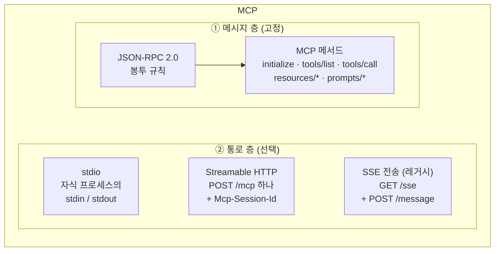
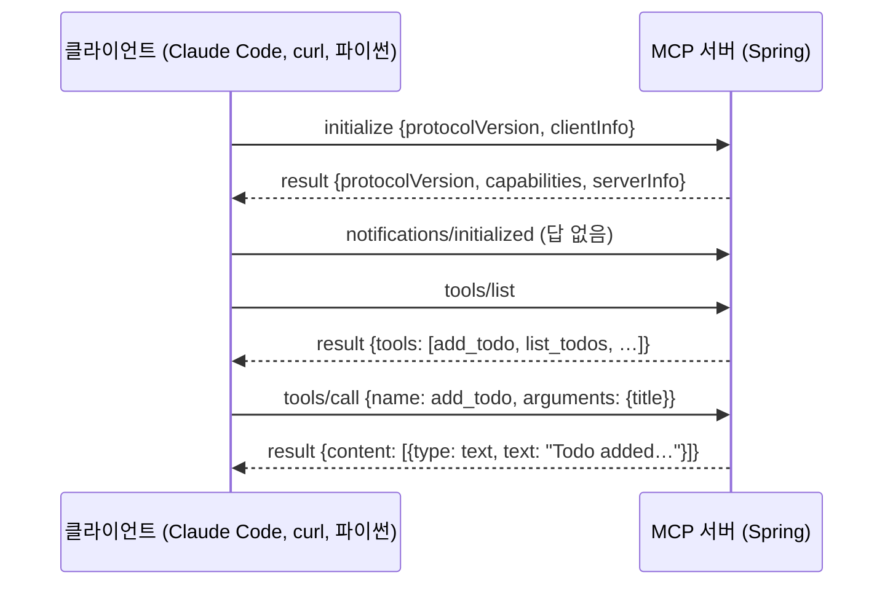
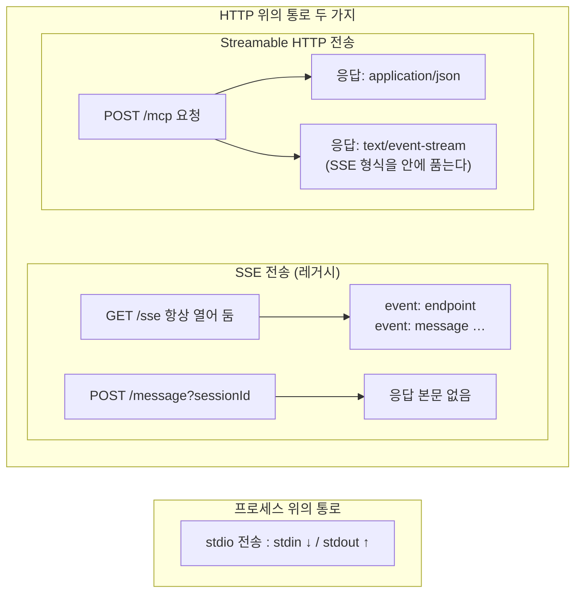

> "MCP가 뭐예요?"라는 질문에 답하기 위해, Spring으로 만든 MCP 서버를 stdio·Streamable HTTP·SSE 세 통로로 직접 붙여 보고 일부러 깨뜨려 본 기록입니다. 어느 통로로 보내도 메시지는 JSON-RPC 하나라는 것, 그리고 통로마다 깨지는 자리가 다르다는 것을 정리합니다.
> + 샘플코드는 [spring-mcp-sample](https://github.com/rojae/spring-sample/tree/main/spring-mcp-sample)에서 확인할 수 있습니다.
> + 이 글은 "LLM 통신 스택" 시리즈의 3편입니다. 1편은 [SSE, LLM 시대에 다시 보기](/posts/sse-revisited-for-llm-streaming), 2편은 [Orca Router 앞에 LiteLLM 한 겹 끼우기](/posts/litellm-gateway-in-front-of-orca-router), 4편은 [꼬리에 꼬리를 무는 질문](/posts/llm-stack-deep-dive-qna)이고, 다음 편은 게이트웨이 뒤의 MCP와 인증·보안을 다룰 예정입니다.
{: .prompt-info }
<!-- post-check: tone=polite -->

---

## Connected인데, 로그에는 에러가 네 번

당신은 사내 할 일 서비스의 백엔드 개발자입니다. 어느 날 이런 요청이 옵니다.

> "로재님! Claude에서 우리 할 일 목록을 바로 읽고 추가하게 하고 싶어요. MCP 서버 하나 만들어 주세요."

Spring AI 스타터를 넣고 `@Tool` 메서드 네 개를 붙이니 30분 만에 됐습니다. Claude Code에 등록하고 `claude mcp list`를 치니 이렇게 나옵니다.

```
todo-stdio-broken: java -jar spring-mcp-sample.jar ... - ✔ Connected
```

그런데 같은 서버의 디버그 로그에는 이런 줄이 네 번 찍혀 있습니다.

```
[ERROR] MCP server "todo-stdio-broken" Ignoring non-JSON line on stdout: JSON Parse error
```

연결은 됐다는데 파싱 에러가 납니다. 그리고 곧이어 두 번째 질문이 옵니다.

> "근데 MCP가 정확히 뭐예요? REST API랑 뭐가 달라요? 결국 JSON 주고받는 거잖아요."

저는 "LLM용 플러그인 규격"이라고 답했고, 그 답이 마음에 안 들었습니다. 그 말로는 stdio가 뭔지, 회사에서 붙였다는 SSE와 Streamable HTTP가 왜 따로 있는지, 위의 로그가 왜 에러이면서 동시에 Connected인지 설명이 안 됩니다.

그래서 프레임워크가 감춰 주는 부분을 걷어 내고 직접 해 봤습니다. 파이프에 JSON을 한 줄씩 밀어 넣고, curl로 세션 헤더를 빼먹어 보고, 서버 프로세스를 죽여 봤습니다. 결론은 한 줄입니다.

**메시지는 JSON-RPC 하나고, 다른 건 통로뿐입니다.**

---

## MCP는 두 층입니다 – 메시지와 통로

MCP(Model Context Protocol)는 LLM 애플리케이션(Claude Code 같은 호스트)이 바깥의 도구와 데이터에 접근하는 **약속**입니다. 이 약속은 두 층으로 나뉩니다.



| 층 | 무엇을 정하나 | 정해진 것 | 바꿀 수 있나 |
|----|---------------|-----------|--------------|
| ① 메시지 | 봉투 모양과 메서드 이름 | JSON-RPC 2.0, `initialize`, `tools/list`, `tools/call` … | 없습니다. 이게 MCP입니다 |
| ② 통로 | 그 봉투를 어디로 나르나 | stdio, Streamable HTTP, (레거시) SSE | 있습니다. 상황에 맞게 고릅니다 |

REST API와의 차이가 여기서 나옵니다. REST는 자원마다 URL이 다르고 동사는 HTTP 메서드입니다. MCP는 **주소가 하나**고, 무엇을 할지는 JSON 안의 `method` 필드가 정합니다. 그래서 통로가 HTTP가 아니어도 됩니다.

> **쉽게 말하면** MCP는 **택배 규격**입니다. 송장(JSON-RPC 봉투)에 무엇을 적을지는 정해져 있고, 그 상자를 오토바이(stdio)로 보내든 트럭(HTTP)으로 보내든 받는 쪽은 송장만 봅니다. REST가 "물건마다 다른 창구"라면 MCP는 "창구 하나에 송장으로 용건을 적는" 방식입니다.
{: .prompt-tip }

---

## 메시지 층 – JSON-RPC 2.0 한 장

"결국 JSON이잖아요"는 맞습니다. 다만 아무 JSON이 아니라 **JSON-RPC 2.0**이라는 오래된 규격입니다. 봉투는 세 종류뿐입니다.

| 종류 | 필수 필드 | 예 | 답이 오나 |
|------|-----------|-----|-----------|
| 요청 (request) | `jsonrpc`, `id`, `method`, `params` | `{"jsonrpc":"2.0","id":2,"method":"tools/list"}` | 옵니다. 같은 `id`로 |
| 응답 (response) | `jsonrpc`, `id`, `result` 또는 `error` | `{"jsonrpc":"2.0","id":2,"result":{"tools":[…]}}` | - |
| 알림 (notification) | `jsonrpc`, `method` (`id` 없음) | `{"jsonrpc":"2.0","method":"notifications/initialized"}` | 안 옵니다 |

`id`가 있으면 답을 기다리는 요청이고, 없으면 "알려만 주는" 알림입니다. 이 규칙은 통로와 무관합니다. 뒤의 실험에서 stdio로 보낸 `tools/list`와 curl로 보낸 `tools/list`는 **글자 하나 다르지 않습니다.**

> **쉽게 말하면** JSON-RPC는 **번호를 적은 편지**입니다. 편지(요청)에 번호(`id`)를 적어 보내면 답장에도 같은 번호가 적혀 옵니다. 번호 없는 편지(알림)는 답장을 기대하지 않는 안내문입니다.
{: .prompt-tip }

MCP가 여기에 얹는 것은 메서드 이름뿐입니다. 이 글에서 쓰는 것은 네 개입니다.

| 메서드 | 누가 보내나 | 뜻 |
|--------|-------------|-----|
| `initialize` | 클라이언트 → 서버 | 프로토콜 버전과 서로의 기능(capabilities)을 교환합니다 |
| `notifications/initialized` | 클라이언트 → 서버 | "준비 끝" 알림. 답이 없습니다 |
| `tools/list` | 클라이언트 → 서버 | 서버가 가진 도구 목록과 입력 스키마를 받습니다 |
| `tools/call` | 클라이언트 → 서버 | 도구 하나를 인자와 함께 실행합니다 |



> **쉽게 말하면** 이 첫 인사 절차(핸드셰이크)는 **명함 교환**입니다. `initialize`로 "저는 이런 걸 할 줄 압니다"를 서로 밝히고, `initialized`로 "그럼 시작하죠"를 알린 뒤에야 본론(`tools/list`, `tools/call`)이 시작됩니다.
{: .prompt-tip }

---

## 통로 층 – stdio, Streamable HTTP, 레거시 SSE

회사에서 "stdio로 붙였다"는 말과 "SSE로 붙였다"는 말은 **같은 서버를 다른 통로로 열었다**는 뜻입니다.

| 항목 | stdio | Streamable HTTP | SSE 전송 (레거시) |
|------|-------|-----------------|-------------------|
| 스펙 버전 | 처음부터 | 2025-03-26 | 2024-11-05 (지금은 대체됨) |
| 어디서 쓰나 | 같은 컴퓨터. 클라이언트가 서버를 **자식 프로세스**로 띄웁니다 | 네트워크 너머. 서버가 HTTP 포트를 엽니다 | 네트워크 너머. 옛 클라이언트 호환 |
| 요청 보내는 곳 | 서버의 **stdin**에 한 줄 | `POST /mcp` | `POST /message?sessionId=…` |
| 응답 오는 곳 | 서버의 **stdout**에 한 줄 | 그 POST의 응답 (JSON 또는 SSE) | `GET /sse`로 열어 둔 스트림 |
| 세션 구분 | 프로세스 자체가 세션 | `Mcp-Session-Id` 헤더 | URL의 `sessionId` |
| 서버가 죽으면 | 파이프가 끊깁니다 (EOF) | 연결 거부, 세션 소멸 | 스트림이 끊깁니다 |
| 로그는 어디에 | **stderr만**. stdout은 통로입니다 | 아무 데나 | 아무 데나 |

이름이 헷갈리는 이유는 **SSE라는 단어가 두 층에 걸쳐 있기 때문**입니다. 1편에서 본 SSE(Server-Sent Events)는 HTTP 응답의 한 형식입니다. Streamable HTTP는 이 형식을 응답 **안에 품고** 씁니다. 반면 "SSE 전송"은 통로 이름이고, `GET /sse`를 항상 열어 두는 옛 방식입니다.



> **쉽게 말하면** 통로는 **배달 방법**입니다. stdio는 옆자리 동료에게 쪽지 건네기(같은 방, 빠르고 단순), Streamable HTTP는 우편(어디든 가고, 봉투에 회원번호 스티커를 붙입니다), 레거시 SSE는 "전화기를 켜 두고 우편으로 질문만 보내면 답은 전화로 오는" 방식입니다. 마지막 것이 번거로워서 우편 하나로 합친 게 Streamable HTTP입니다.
{: .prompt-tip }

---

## 그래서 어느 통로를 쓰나요

셋을 다 외울 필요는 없습니다. 고르는 질문은 하나입니다. **서버가 어디서 도나.**

| | stdio | Streamable HTTP | SSE 전송 (레거시) |
|---|-------|-----------------|-------------------|
| 언제 | 서버가 **내 컴퓨터**에서 돕니다. 로컬 파일, 로컬 DB, CLI 도구를 LLM에 붙일 때 | 서버가 **다른 곳**에서 돕니다. 팀이 같이 쓰는 도구 서버, SaaS가 제공하는 원격 MCP | 새로 만들 때는 쓰지 않습니다. 옛 클라이언트를 지원해야 할 때만 |
| 왜 | 설정이 명령어 한 줄. 포트·인증·네트워크가 없고, 호스트가 띄우고 죽여 줍니다 | 사용자가 여럿이고 로그인(OAuth)이 필요하고, 로드밸런서 뒤에서 늘려야 합니다. 서버 배포가 앱과 분리됩니다 | 2025-03-26 스펙에서 Streamable HTTP로 대체됐습니다 |
| 예 | 공식 filesystem·git 서버, `npx`·`uvx` 한 줄로 까는 대부분의 커뮤니티 서버 | GitHub, Sentry, Atlassian 같은 원격 MCP, 사내 공용 도구 서버 | Spring AI 1.0.x의 기본 전송 같은 옛 프레임워크 |
| 얼마나 흔한가 | **가장 흔합니다.** 스펙도 "클라이언트는 가능하면 stdio를 지원해야 한다"고 적습니다 | 새 원격 서버는 이쪽. "서비스로 제공"이면 이쪽 | **기존 원격 서버에는 아직 많습니다.** 새 서버는 Streamable HTTP로 |

개수로는 stdio가 압도적입니다. MCP 서버 대부분이 "개발자 한 명의 컴퓨터에서 그 사람의 도구를 LLM에 붙이는" 용도라서, 포트를 열고 인증을 붙일 이유가 없습니다.

그런데 이 글의 출발이었던 "우리 **서비스**도 붙여 주세요"는 다른 쪽입니다. 여러 사람이 같은 서버를 쓰고, 누가 호출했는지 알아야 하고, 서버는 우리가 배포합니다. 그러면 Streamable HTTP입니다. 회사에서 stdio로 시작했다가 HTTP로 옮기는 흐름이 흔한 이유입니다.

"대부분의 서비스는 SSE 아니에요?"라는 반문이 나올 수 있습니다. 반은 맞습니다. 2025년 3월 전까지 원격 MCP의 유일한 통로가 HTTP+SSE였기 때문에, 그때 만들어진 원격 서버와 튜토리얼과 프레임워크 기본값(Spring AI 1.0.x)은 전부 SSE 전송입니다. 클라이언트도 아직 받아 줍니다. `claude mcp add --transport sse`가 살아 있고, 스펙에는 "POST /mcp를 먼저 시도하고 405가 오면 `GET /sse`로 폴백하라"는 호환 절차가 있습니다. 다만 새로 만드는 쪽은 다릅니다. 그 뒤 나온 SDK와 새 원격 서버는 Streamable HTTP입니다.

📌 "SSE 쓴다"는 말을 들으면 엔드포인트를 보세요. `GET /sse` + `POST /message?sessionId=`면 레거시 전송, `POST /mcp` + `Mcp-Session-Id`면 Streamable HTTP입니다. Streamable HTTP도 응답은 SSE 형식으로 주기 때문에 이름만으로는 구분이 안 됩니다.

> **쉽게 말하면** stdio는 **개인 비서**고 Streamable HTTP는 **콜센터**입니다. 내 일만 시키면 옆에 앉힌 비서(자식 프로세스)가 제일 빠르고 간단합니다. 여러 사람이 같은 서비스를 써야 하면 대기 번호(세션)와 신분 확인(인증)이 있는 콜센터를 차려야 합니다.
{: .prompt-tip }

---

## 실습 준비

| 항목 | 값 |
|------|-----|
| Spring Boot | 3.2.2 (Java 21.0.10) |
| Spring AI | 1.1.8 (`spring-ai-bom`, 원래 1.0.3이었는데 올렸습니다. 이유는 "4." 에서) |
| MCP Java SDK | 0.18.3 (Spring AI 1.1.8이 끌어옵니다) |
| 서버 프로필 | `stdio`, `streamable`(Tomcat, 8091), `sse`(Netty, 8092) |
| DB | PostgreSQL 15 (docker, 5434) |
| 손 클라이언트 | Python 3.9 파이프 클라이언트 60줄, curl 8.7.1 |
| 진짜 클라이언트 | Claude Code 2.1.267 (`claude mcp add`) |

서버는 [spring-mcp-sample](https://github.com/rojae/spring-sample/tree/main/spring-mcp-sample)입니다. 도구는 넷입니다: `add_todo`, `list_todos`, `complete_todo`, `delete_todo`. 프레임워크가 하는 일은 `@Tool` 메서드를 `tools/list`에 싣고, `tools/call`이 오면 호출해 주는 것뿐입니다.

```java
@Service
public class TodoService {
    @Tool(name = "add_todo", description = "Add a new todo item with the given title")
    public String addTodo(@ToolParam(description = "The title of the todo") String title) { … }
}
```

```bash
cd spring-mcp-sample
docker compose up -d                 # postgres:15 (5434)
./gradlew bootJar
JAR=build/libs/spring-mcp-sample-0.0.1-SNAPSHOT.jar

java -jar $JAR --spring.profiles.active=streamable --server.port=8091   # 통로 2
java -jar $JAR --spring.profiles.active=sse        --server.port=8092   # 통로 3
# 통로 1 (stdio) 은 클라이언트가 직접 띄웁니다. 아래 참고.
```

---

## 실험 1 – stdio를 손으로: 파이프에 JSON 한 줄씩

프레임워크 없이 통로의 맨살을 보려고, 서버를 자식 프로세스로 띄워서 stdin에 JSON을 쓰고 stdout을 읽는 파이썬 60줄을 짰습니다. 핵심은 이게 전부입니다.

```python
proc = subprocess.Popen(cmd, stdin=PIPE, stdout=PIPE, stderr=PIPE, text=True)

def send(obj):                                  # 한 줄 = 메시지 하나
    proc.stdin.write(json.dumps(obj) + "\n"); proc.stdin.flush()

send({"jsonrpc": "2.0", "id": 1, "method": "initialize",
      "params": {"protocolVersion": "2024-11-05", "capabilities": {},
                 "clientInfo": {"name": "tiny-client", "version": "0.1"}}})
send({"jsonrpc": "2.0", "method": "notifications/initialized"})
send({"jsonrpc": "2.0", "id": 2, "method": "tools/list"})
send({"jsonrpc": "2.0", "id": 3, "method": "tools/call",
      "params": {"name": "add_todo", "arguments": {"title": "MCP 3편 쓰기"}}})
# stdout 에서 한 줄씩 읽어 json.loads. 실패하면 [NOT JSON] 으로 표시합니다.
```

<figure style="text-align: center;">
  
  <figcaption style="margin-top: 0.5rem; font-size: 0.95rem; color: #666;">
    stdio 정상 왕복. initialize 응답까지 1871ms(JVM 기동), tools/list 8ms, tools/call 64ms. stdout 에는 JSON 네 줄만 있다.
  </figcaption>
</figure>

여기서 볼 것은 셋입니다.

- 통로가 정말 **"한 줄 = 메시지 하나"**입니다. 줄바꿈이 봉투의 경계입니다.
- `tools/call`의 결과는 `content` 배열이고, 각 항목의 `text`가 그대로 LLM에게 갑니다.
- 첫 응답까지 1.8초는 MCP가 느린 게 아니라 Spring Boot 기동입니다. stdio에서는 이 기동 시간이 곧 **연결 시간**입니다.

---

## 실험 2 – Streamable HTTP를 curl로: 세션 헤더 하나

같은 JSON을 이번엔 HTTP로 보냅니다. 다른 건 딱 둘입니다. `Accept` 헤더에 `application/json, text/event-stream`을 둘 다 적어야 하고, `initialize` 응답 헤더로 받은 `Mcp-Session-Id`를 그 뒤 모든 요청에 붙여야 합니다.

```bash
B=http://localhost:8091/mcp
H='-H Content-Type:application/json -H Accept:application/json,text/event-stream'

curl -s -D /tmp/h1 $H -X POST $B -d '{"jsonrpc":"2.0","id":1,"method":"initialize",
  "params":{"protocolVersion":"2025-03-26","capabilities":{},"clientInfo":{"name":"curl","version":"0"}}}'
SID=$(grep -i '^mcp-session-id' /tmp/h1 | awk '{print $2}' | tr -d '\r')

curl -s $H -H "Mcp-Session-Id: $SID" -X POST $B -d '{"jsonrpc":"2.0","method":"notifications/initialized"}'
curl -s $H -H "Mcp-Session-Id: $SID" -X POST $B -d '{"jsonrpc":"2.0","id":2,"method":"tools/list"}'
curl -s $H                            -X POST $B -d '{"jsonrpc":"2.0","id":2,"method":"tools/list"}'   # 세션 없이
curl -s -H "Mcp-Session-Id: $SID" -X DELETE $B                                                          # 세션 종료
```

<figure style="text-align: center;">
  
  <figcaption style="margin-top: 0.5rem; font-size: 0.95rem; color: #666;">
    Streamable HTTP 한 세션의 일생. initialize 200(+Mcp-Session-Id) → initialized 202 → tools/list 200(text/event-stream) → 세션 없이 400 → 엉터리 세션 404 → tools/call 200 → DELETE 200 → 종료된 세션으로 404.
  </figcaption>
</figure>

여기서 볼 것은 셋입니다.

- `initialize` 응답은 `application/json`인데, `tools/list` 응답은 **`text/event-stream`**으로 왔습니다. 같은 POST인데 서버가 응답 형식을 고릅니다. 이름에 "Streamable"이 붙은 이유입니다.
- 세션 헤더를 빼면 **400 `Session ID missing`**, 엉터리를 넣으면 **404 `Session not found`**입니다. JSON-RPC 오류가 아니라 HTTP 상태 코드로 옵니다. "2." 에서 다룹니다.
- `DELETE`로 세션을 닫으면 같은 ID는 그 즉시 404가 됩니다.

---

## 실험 3 – 레거시 SSE 전송: 통로가 두 개

1편의 SSE가 여기서 어떻게 쓰였는지 보려고 `sse` 프로필도 열어 봤습니다. 이쪽은 응답이 **요청을 보낸 연결로 오지 않습니다.**

```bash
java -jar $JAR --spring.profiles.active=sse --server.port=8092
bash scripts/sse_curl.sh      # GET /sse 를 열어 둔 채 POST 두 번, 스트림에 쌓인 것을 출력
```

<figure style="text-align: center;">
  
  <figcaption style="margin-top: 0.5rem; font-size: 0.95rem; color: #666;">
    레거시 SSE 전송 (Spring AI 1.0.3, 별도 실행한 회차). GET /sse 의 첫 이벤트가 endpoint(요청 보낼 URL) 를 알려 주고, POST 두 번의 응답 본문은 모두 0 bytes, 답 두 개는 스트림에 event: message 로 도착했다.
  </figcaption>
</figure>

- `GET /sse`를 열면 첫 이벤트로 **어디에 POST 하라는 주소**(`/mcp/message?sessionId=…`)가 옵니다.
- 그 주소로 `initialize`를 POST 하면 HTTP 응답은 200인데 **본문이 비어 있습니다.** 진짜 답은 스트림 쪽에 `event: message`로 옵니다.
- 요청과 응답이 다른 연결로 오가니, 로드밸런서 뒤에서는 두 연결이 같은 서버로 가야 합니다. Streamable HTTP가 이걸 하나로 합친 이유입니다.

---

## 실험 4 – Claude Code에 붙이기

손으로 다 해 봤으니 이제 진짜 클라이언트에 등록합니다. 정상 stdio, 일부러 stdout에 배너와 INFO 로그를 흘리는 stdio, 그리고 Streamable HTTP 세 가지입니다.

```bash
claude mcp add -s local todo-stdio -- java -jar $JAR --spring.profiles.active=stdio
claude mcp add -s local todo-stdio-broken -- java -jar $JAR --spring.profiles.active=stdio \
      --spring.main.banner-mode=console --logging.level.root=INFO
claude mcp add -s local --transport http todo-http http://localhost:8091/mcp
claude mcp list
```

<figure style="text-align: center;">
  
  <figcaption style="margin-top: 0.5rem; font-size: 0.95rem; color: #666;">
    claude mcp list. 정상 stdio, 로그를 흘리는 stdio, Streamable HTTP 셋 다 "✔ Connected". 로그를 흘리는 쪽이 통과한 게 첫 번째 의문이다.
  </figcaption>
</figure>

---

## 일부러 깨뜨려 보기 – 네 번 갸웃한 것

여기까지는 다 됐습니다. 일부러 망가뜨리기 시작하자 네 번 갸웃했습니다.

1. stdio 서버의 첫 인사는 멀쩡한데, 첫 `tools/call`에서 제 손 클라이언트가 깨졌습니다. 그런데 같은 서버를 Claude Code는 "Connected"라고 했습니다.
2. Streamable HTTP에서 세션 헤더를 빼먹으면 JSON-RPC `error`가 아니라 HTTP 400이 왔습니다. 엉터리 ID는 404였습니다.
3. stdio 서버 프로세스를 죽였더니 클라이언트가 본 것은 에러 메시지가 아니라 `BrokenPipeError`와 EOF였습니다.
4. README에는 Streamable HTTP라고 써 있는데 `/mcp`가 404였습니다. 심지어 `/sse`도 404였습니다.

넷 다 "MCP가 안 돼요" 한 문장으로 보고될 일입니다. 그런데 자리가 전부 다릅니다. 하나는 통로가 오염된 것, 하나는 통로 층의 세션 규칙, 하나는 통로의 수명, 하나는 통로가 아예 안 열린 것입니다. 메시지 층(JSON-RPC)의 문제는 하나도 없었습니다.

---

## 1. stdout은 통로입니다, 로그 통로가 아닙니다

수정 전 서버로 실험 1을 처음 돌렸을 때의 원문입니다. `initialize`와 `tools/list`까지는 깨끗했습니다. DB를 건드리지 않으니까요. 첫 `tools/call`에서 INSERT가 나가는 순간, stdout에 SQL이 쏟아졌습니다.

<figure style="text-align: center;">
  
  <figcaption style="margin-top: 0.5rem; font-size: 0.95rem; color: #666;">
    수정 전. tools/call 한 번에 stdout 으로 JSON 이 아닌 줄이 16줄 나왔다. 포맷된 insert 문과 Hibernate DEBUG 로그다. 클라이언트는 이 줄들을 메시지로 읽으려다 깨진다.
  </figcaption>
</figure>

stdio 통로에서 **stdout은 곧 메시지 채널**입니다. 한 줄이 곧 봉투입니다. 그런데 Spring의 `spring.jpa.show-sql: true`는 로거가 아니라 `System.out`으로 SQL을 찍습니다. 배너도 마찬가지입니다. 로그 레벨을 아무리 낮춰도 이 둘은 stdout으로 갑니다. 첫 인사에서는 안 보이니 "붙었다"고 착각하기 딱 좋습니다.

일부러 더 세게 망가뜨려 봤습니다. 배너를 켜고 root 로그를 INFO로 stdout에 흘리면 `initialize` 응답이 오기도 전에 깨집니다.

<figure style="text-align: center;">
  
  <figcaption style="margin-top: 0.5rem; font-size: 0.95rem; color: #666;">
    배너 + INFO 로그를 stdout 으로. 397ms 부터 JSON 이 아닌 줄이 29줄. 첫 JSON 응답은 그 뒤에 온다.
  </figcaption>
</figure>

그런데 같은 망가진 서버를 Claude Code는 "Connected"라고 했습니다. 실제로 도구를 호출해 보고 디버그 로그를 열어 봤습니다.

<figure style="text-align: center;">
  
  <figcaption style="margin-top: 0.5rem; font-size: 0.95rem; color: #666;">
    claude -p --debug-file. 결과는 정상(12개)인데 로그에 "Ignoring non-JSON line on stdout: JSON Parse error" 가 4번 찍혔다. 버틴 것이지 괜찮은 게 아니다.
  </figcaption>
</figure>

Claude Code가 쓰는 TypeScript SDK는 JSON으로 안 읽히는 줄을 **에러로 기록하고 버린 뒤 계속 읽습니다.** 그래서 겉으로는 됩니다. 하지만 스펙은 stdio 서버가 stdout에 MCP 메시지 아닌 것을 쓰면 안 된다고 못 박습니다. 엄격한 클라이언트는 깨지고, 로그 한 줄이 `{`로 시작하는 순간에는 관대한 클라이언트도 엉뚱한 메시지를 파싱하게 됩니다.

해결은 stdio 프로필에서 stdout으로 가는 것을 전부 끄는 것입니다. 로그는 stderr로 보내거나 파일로 보냅니다.

```yaml
# application-stdio.yml
spring:
  main:
    banner-mode: off          # 배너는 System.out 으로 갑니다
    web-application-type: none
  ai:
    mcp:
      server:
        stdio: true
  jpa:
    show-sql: false           # 이것도 System.out 입니다. 로거가 아닙니다
logging:
  level:
    root: OFF                 # 필요하면 logging.file.name 으로 파일에
    org.hibernate.SQL: OFF
    org.hibernate.orm.jdbc.bind: OFF
```

이렇게 고친 뒤의 결과가 실험 1의 캡처입니다. JSON이 아닌 줄이 0이 됩니다.

> **쉽게 말하면** stdio 서버에게 stdout은 **전화선**입니다. 통화 중에 옆에서 라디오(로그)를 틀면, 상대가 눈치껏 걸러 듣거나(Claude Code) 못 알아듣고 끊습니다(엄격한 클라이언트). 라디오는 다른 방(stderr, 파일)에서 틀어야 합니다.
{: .prompt-tip }

> Spring Boot에서 stdout으로 가는 것은 로거만이 아닙니다. `banner-mode`, `spring.jpa.show-sql`, `System.out.println`, 그리고 Hibernate의 `hibernate.show_sql`이 다 해당합니다. stdio 프로필을 만들면 `java -jar … | head`로 첫 줄이 `{`인지 눈으로 확인하세요.
{: .prompt-warning }

---

## 2. 세션은 헤더 하나로 이어집니다

Streamable HTTP는 요청마다 새 HTTP 연결입니다. 서버는 "이 요청이 아까 `initialize`한 그 클라이언트인가"를 알 방법이 헤더뿐입니다. 그래서 `initialize` 응답에 `Mcp-Session-Id`를 실어 주고, 그 뒤 모든 요청에 되돌려 받기를 요구합니다.

실험 2의 4·5·8번이 이 규칙의 세 얼굴입니다.

| 상황 | 어느 층의 오류 | 응답 | 뜻 |
|------|----------------|------|-----|
| 헤더 자체가 없다 | 통로 (HTTP) | 400 `Session ID missing` | 봉투를 열기 전에 반려 |
| 헤더는 있는데 모르는 값 | 통로 (HTTP) | 404 `Session not found` | 그 세션이 없다. 만료·재시작·DELETE 뒤 |
| 세션은 맞는데 없는 도구 이름 | 메시지 (JSON-RPC) | 200 + `{"error":{"code":…}}` 또는 `isError: true` | 봉투는 열렸고, 내용이 틀렸다 |

세 번째 줄이 핵심입니다. **통로 층의 오류는 HTTP 상태 코드로, 메시지 층의 오류는 JSON-RPC `error`로 옵니다.** 클라이언트를 만든다면 400·404를 받았을 때 JSON을 파싱하려 들면 안 되고, `initialize`부터 다시 해야 합니다. 서버가 재시작되면 메모리의 세션은 사라지니, 멀쩡히 붙어 있던 클라이언트가 어느 날 갑자기 404를 받는 것도 이 경우입니다.

> **쉽게 말하면** `Mcp-Session-Id`는 **놀이공원 손목 밴드**입니다. 입장(`initialize`)할 때 받고, 놀이기구(`POST /mcp`)마다 보여 줘야 합니다. 밴드 없이 가면 "입장부터 하세요"(400), 어제 밴드를 차고 가면 "오늘 것이 아닙니다"(404)입니다. 밴드가 맞아야 비로소 용건(JSON-RPC)을 들어 줍니다.
{: .prompt-tip }

stdio에는 이 규칙이 없습니다. 프로세스 하나가 곧 세션 하나라서 세션 ID를 잃어버릴 방법이 없습니다. 대신 프로세스가 죽으면 세션도 같이 죽습니다. 그게 세 번째입니다.

---

## 3. 프로세스가 죽으면 파이프도 죽습니다

`tools/list`까지 마친 뒤 서버에 `SIGKILL`을 보내고, 그다음 `tools/call`을 써 봤습니다.

<figure style="text-align: center;">
  
  <figcaption style="margin-top: 0.5rem; font-size: 0.95rem; color: #666;">
    1654ms 에 SIGKILL. 2159ms 의 tools/call 은 stdin 쓰기에서 BrokenPipeError, stdout 은 EOF, 서버 exit code -9. 어디에도 "에러" 라는 JSON 은 없다.
  </figcaption>
</figure>

메시지 층에서는 아무 일도 일어나지 않습니다. `{"error": …}` 같은 응답이 올 리가 없습니다. 답을 써 줄 프로세스가 없으니까요. 클라이언트가 보는 것은 운영체제 수준의 신호뿐입니다. 읽던 stdout이 EOF가 되고, 쓰던 stdin이 `BrokenPipe`가 됩니다. 그래서 stdio 클라이언트는 **EOF를 "세션 종료"로 해석하고 프로세스를 다시 띄우는** 책임을 집니다. 실험 4의 디버그 로그에 `connection closed … Cleared connection cache for reconnection`이라고 적힌 게 그 일입니다.

| 서버가 죽었을 때 | stdio | Streamable HTTP |
|------------------|-------|-----------------|
| 클라이언트가 보는 것 | stdout EOF, stdin `BrokenPipe` | `connection refused`, 살아난 뒤엔 404 `Session not found` |
| 누가 다시 띄우나 | **클라이언트** (자식 프로세스니까) | 서버 운영자 (systemd, k8s …) |
| 다시 붙는 법 | 프로세스 재실행 → `initialize`부터 | 연결 재시도 → `initialize`부터 |
| 죽기 전 상태 | 프로세스와 함께 사라집니다 | 서버 메모리의 세션이 사라집니다 |

> **쉽게 말하면** stdio 서버는 **내가 켠 계산기 앱**입니다. 앱을 끄면 계산 중이던 것도 사라지고, 다시 켜는 것도 저입니다. HTTP 서버는 **동네 가게**입니다. 가게가 문을 닫으면 손님은 기다렸다가 다시 가서 입구부터 들어갑니다.
{: .prompt-tip }

---

## 4. 스타터 세 개를 다 넣으면 통로가 안 열립니다

이건 MCP의 문제가 아니라 제 샘플의 문제였는데, 통로가 "안 열리는" 모양을 잘 보여 줘서 남깁니다. 샘플은 처음에 Spring AI 1.0.3이었고, `streamable` 프로필에 `protocol: STREAMABLE`이라고 적어 뒀습니다. 그런데 curl은 404였습니다.

<figure style="text-align: center;">
  
  <figcaption style="margin-top: 0.5rem; font-size: 0.95rem; color: #666;">
    404 의 정체를 세 단계로 파헤친 기록. ① SDK 0.10.0 에 Streamable 전송 클래스가 없다 ② servlet 앱인데 WebFlux 전송 빈이 먼저 만들어져 WebMvc 쪽이 조용히 빠졌다 ③ 1.1.8 로 올리자 둘 다 만들어져 충돌.
  </figcaption>
</figure>

세 겹이었습니다.

1. **Spring AI 1.0.3에는 Streamable HTTP가 없습니다.** 1.0.x가 쓰는 MCP Java SDK 0.10.0에는 `Stdio…`와 `…Sse…` 전송 클래스뿐입니다. `protocol: STREAMABLE`은 아무도 읽지 않는 설정이라 **경고 한 줄 없이 무시**됐습니다. Streamable HTTP는 Spring AI 1.1부터입니다.
2. **스타터 세 개(`mcp-server`, `-webflux`, `-webmvc`)가 다 있으면** servlet(Tomcat) 앱인데도 WebFlux 전송 빈이 먼저 만들어지고, WebMvc 자동설정은 건너뛰어집니다. 그래서 `/sse`마저 404였습니다. `--debug`로 켜는 조건 평가 보고서가 이걸 그대로 말해 줍니다.
3. **1.1.8로 올리니** 이번엔 WebFlux와 WebMvc 양쪽 전송 빈이 **둘 다** 만들어져서 `required a single bean, but 2 were found`로 기동이 실패했습니다.

해결은 프로필마다 쓰지 않는 쪽 자동설정을 `spring.autoconfigure.exclude`로 빼는 것입니다. 정확한 설정은 샘플 저장소의 `application-streamable.yml`에 있습니다.

📌 깔끔한 답은 프로젝트 하나에 스타터 하나만 두는 것입니다. 이 샘플은 세 통로를 한 jar로 보여 주려고 셋을 다 넣은 것뿐입니다.

> "설정은 있는데 아무 일도 안 일어난다"면 그 설정을 읽는 코드가 이 버전에 있는지부터 확인하세요. `unzip -l`로 jar 안의 클래스 이름을 훑는 게 문서보다 빠를 때가 있습니다.
{: .prompt-warning }

---

## MCP 서버를 붙일 때 – 체크리스트

이번에 확인한 것을 통로별로 나눠 적어 둡니다.

| 구간 | 확인할 것 |
|------|-----------|
| 선택 | 서버가 내 컴퓨터에서 돌면 stdio, 다른 곳에서 돌면 Streamable HTTP. SSE 전송은 새로 만들지 않되, 기존 서버에 붙일 땐 둘 다 지원 |
| 구분 | "SSE"라는 말을 들으면 엔드포인트 확인. `GET /sse` + `POST /message`면 레거시, `POST /mcp` + `Mcp-Session-Id`면 Streamable HTTP |
| 메시지 | 어느 통로든 JSON-RPC 2.0 한 줄. `initialize` → `initialized` → `tools/list` 순서를 건너뛰지 말 것 |
| stdio | stdout에 JSON 외엔 아무것도 쓰지 말 것. 배너·`show-sql`·`System.out` 전부. 로그는 stderr나 파일 |
| stdio | EOF·BrokenPipe = 세션 종료. 클라이언트가 재실행하고 `initialize`부터 |
| Streamable HTTP | `Accept`에 `application/json, text/event-stream` 둘 다. `Mcp-Session-Id`는 모든 요청에 |
| Streamable HTTP | 통로 오류는 HTTP 상태(400 헤더 누락, 404 세션 소멸), 메시지 오류는 JSON-RPC `error` |
| Spring AI | Streamable HTTP는 1.1부터. 스타터는 통로당 하나만. 안 열리면 `--debug` 조건 평가 보고서 |
| 클라이언트 | "Connected"는 첫 인사 통과일 뿐. 디버그 로그의 `Ignoring non-JSON line`까지 볼 것 |

**결론적으로,** MCP를 이해하는 가장 짧은 길은 메시지 층과 통로 층을 갈라서 보는 것입니다. 메시지는 하나라서 배울 게 적고, 깨지는 자리는 전부 통로에 있어서 통로마다 확인할 것만 알면 됩니다.

---

## 마무리

`@Tool` 하나로 서버가 만들어지니 "MCP가 뭐예요"에 답을 못 했고, 파이프에 JSON을 손으로 밀어 넣고 나서야 "이게 전부구나" 싶었습니다. 이번에 고친 건 yml 세 줄과 헤더 하나, 버전 하나였습니다. 메시지 형식은 한 글자도 안 고쳤습니다.

- MCP 서버를 만들면 **한 번은 손으로 첫 인사를 해 보세요.** 60줄이면 되고, 그 뒤로는 어떤 오류든 층을 짚을 수 있습니다.
- stdio 프로필은 **stdout이 비어 있는지** 기동 직후에 확인하세요. 첫 인사가 통과해도 첫 DB 호출에서 깨질 수 있습니다.
- "Connected"를 믿지 말고 **디버그 로그**를 보세요. 관대한 클라이언트는 문제를 숨깁니다.

처음의 두 줄로 돌아가면 이제는 설명이 됩니다. Connected는 첫 인사가 JSON-RPC로 통과했다는 뜻이고, 에러 네 번은 그 통로에 JSON이 아닌 것이 섞였다는 뜻입니다. 둘은 다른 층의 이야기라 동시에 참일 수 있습니다.

---

## 결론 요약

- **MCP = JSON-RPC 2.0 메시지 규칙 + 통로.** 메시지는 고정이고 통로(stdio, Streamable HTTP, 레거시 SSE)는 선택입니다. stdio로 보낸 `tools/list`와 curl로 보낸 `tools/list`는 글자 하나 다르지 않습니다.
- **고르는 기준은 하나, 서버가 어디서 도나.** 내 컴퓨터면 stdio(가장 흔합니다), 남의 서버면 Streamable HTTP. SSE 전송은 기존 원격 서버에 아직 많지만 새로 만들지는 않습니다.
- **stdio에서 stdout은 통로입니다.** 배너, `show-sql`, `System.out` 한 줄이면 엄격한 클라이언트는 깨집니다. Claude Code는 버리고 넘어가지만 스펙 위반입니다.
- **Streamable HTTP는 `POST /mcp` 하나에 `Mcp-Session-Id` 헤더로 세션을 잇습니다.** 헤더가 없으면 400, 세션이 없으면 404. 이건 HTTP 층의 오류고, JSON-RPC `error`는 그 안쪽 층의 오류입니다.
- **stdio 서버가 죽으면 EOF와 BrokenPipe만 남습니다.** 재실행과 `initialize` 재시작은 클라이언트 책임입니다.

---

## 샘플 코드

테스트 편의를 위해 작성된 샘플입니다. `@Tool` 네 개짜리 할 일 서버와 stdio·streamable·sse 프로필, 그리고 이 글의 손 클라이언트(파이썬 파이프 클라이언트, curl 스크립트)가 들어 있습니다.
> [spring-mcp-sample](https://github.com/rojae/spring-sample/tree/main/spring-mcp-sample)

---

## 참고한 내용들

### 이 글에서 쓴 설정과 헤더

| 항목 | 위치 | 기본값 | 이 글에서의 의미 |
|------|------|--------|------------------|
| `spring.ai.mcp.server.stdio` | yml | `false` | `true`면 stdin/stdout 전송. 웹 서버는 `web-application-type: none` |
| `spring.ai.mcp.server.protocol` | yml | `SSE` | 1.1.x부터. `STREAMABLE`이면 `POST /mcp`, 1.0.x는 무시 |
| `spring.autoconfigure.exclude` | yml | - | 프로필마다 안 쓰는 전송(WebFlux/WebMvc) 자동설정 제거 |
| `spring.main.banner-mode`, `spring.jpa.show-sql` | yml | `console`, `false` | 둘 다 stdout으로 갑니다. stdio에서는 `off`, `false` |
| `logging.level.root` | yml | `INFO` | stdio에서는 `OFF` 또는 `logging.file.name`으로 파일 |
| `Mcp-Session-Id` | HTTP 헤더 | - | `initialize` 응답에서 받아 이후 모든 요청에 되돌려 줍니다 |
| `Accept` | HTTP 헤더 | - | `application/json, text/event-stream` 둘 다 적어야 합니다 |

### Reference Links

- [MCP Specification 2025-03-26 · Transports](https://modelcontextprotocol.io/specification/2025-03-26/basic/transports) - stdio, Streamable HTTP, 세션 헤더, stdout 규칙
- [MCP Specification 2024-11-05 · Transports](https://modelcontextprotocol.io/specification/2024-11-05/basic/transports) - 레거시 HTTP+SSE 전송
- [JSON-RPC 2.0 Specification](https://www.jsonrpc.org/specification)
- [Spring AI · MCP Server Boot Starter](https://docs.spring.io/spring-ai/reference/api/mcp/mcp-server-boot-starter-docs.html) - `protocol`, 스타터 종류, 자동설정
- [MCP Java SDK](https://github.com/modelcontextprotocol/java-sdk) - 전송 구현 클래스 이름들
- [Claude Code · MCP 서버 연결하기](https://docs.anthropic.com/en/docs/claude-code/mcp) - `claude mcp add`, `--transport http`, `--mcp-config`
- 👉 [SSE, LLM 시대에 다시 보기](/posts/sse-revisited-for-llm-streaming) - 1편. SSE 응답 형식 자체
