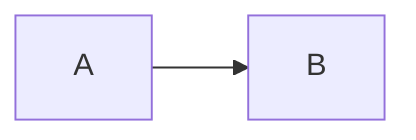

> 한 줄 요약이다.
{: .prompt-info }

## **"문제"**

이런 일이 있었다.

*A: "이거 되는 거 아니에요? 확인해 보세요."*

```java
// 주석에는 합니다 가 있어도 됩니다
String s = "입니다";
```



<figure style="text-align: center;">
  
  <figcaption>
    캡션은 명사형으로 끝난다. 두 줄로 이어집니다
  </figcaption>
</figure>

> **쉽게 말하면** 비유다.
{: .prompt-tip }
